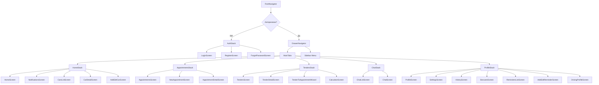
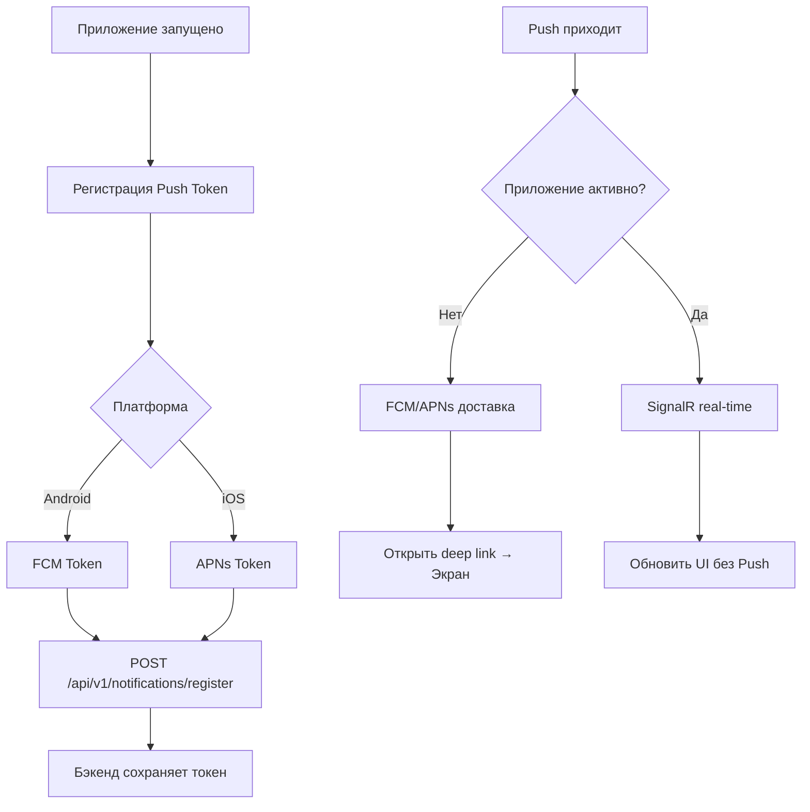
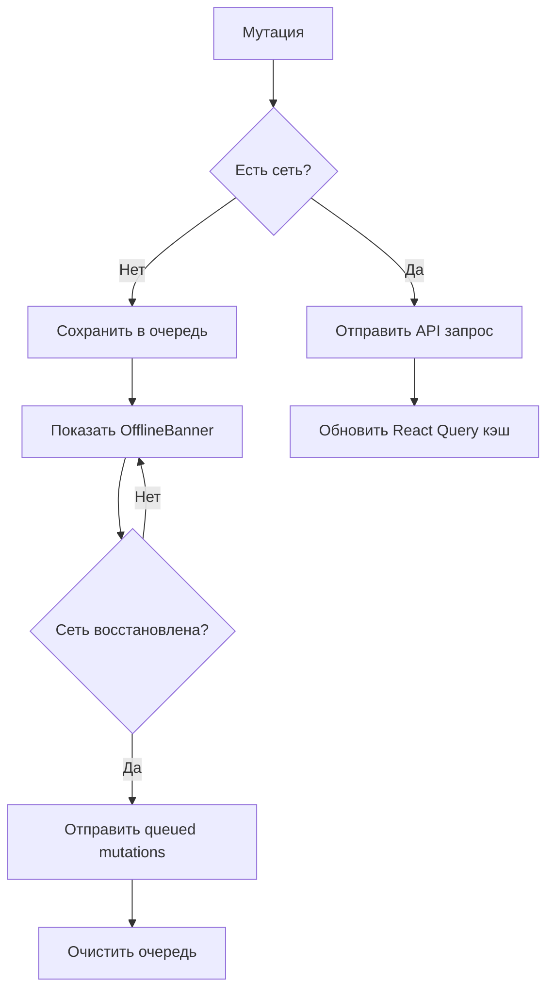
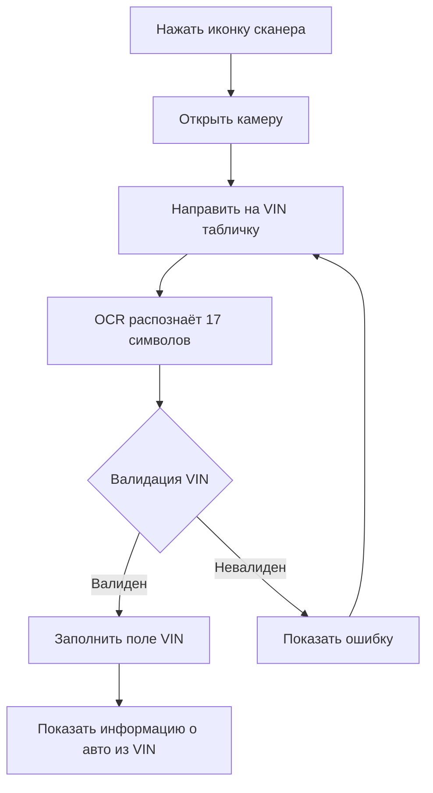
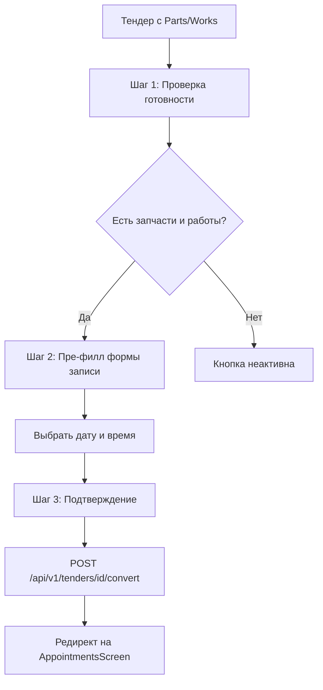
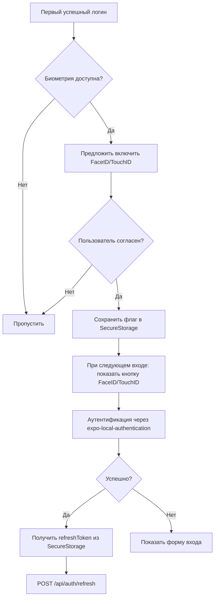
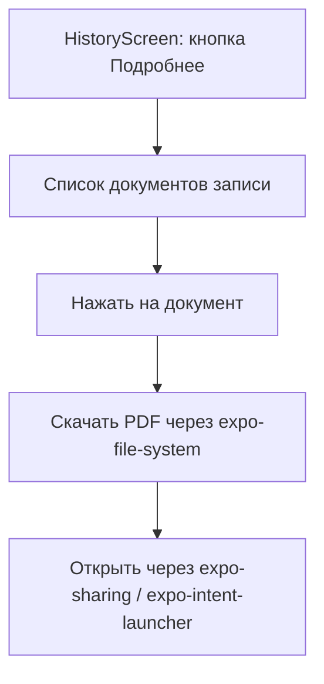
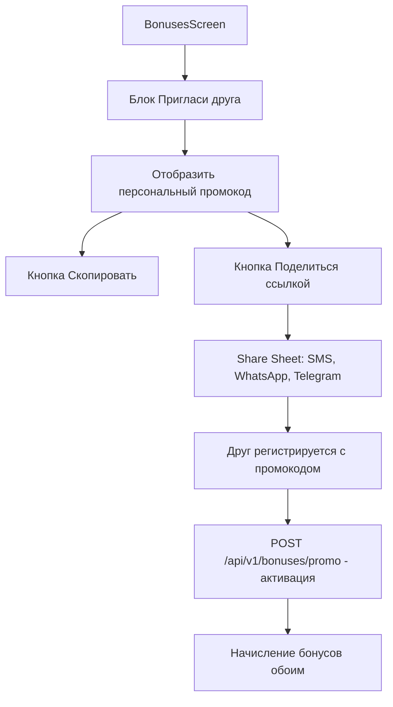
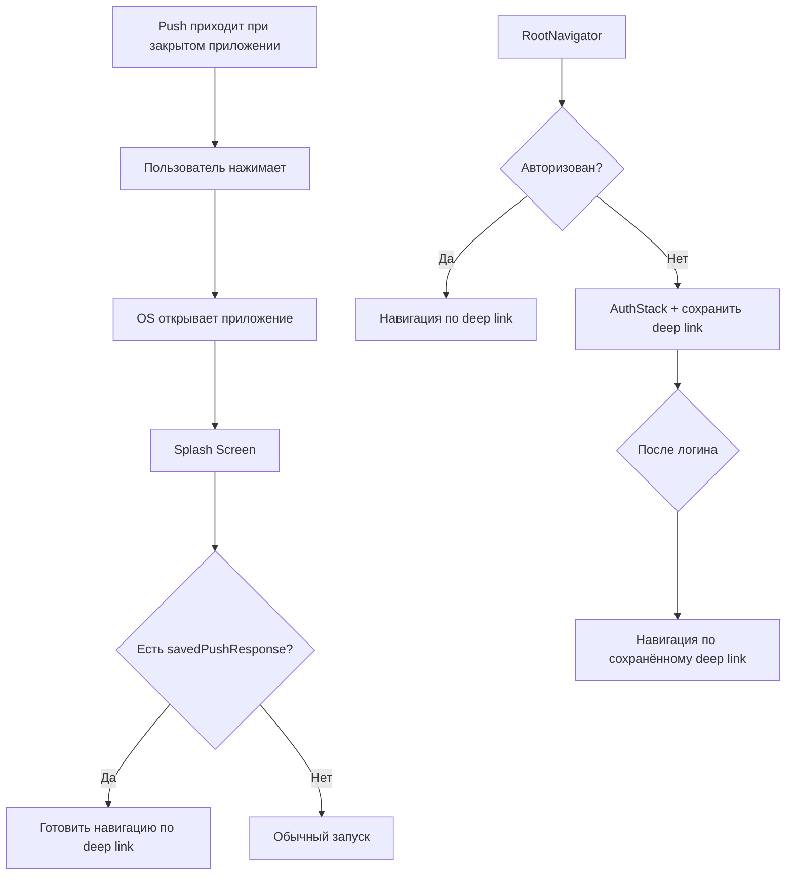

# 📱 Архитектура React Native приложения «Автосервис»

**Версия:** 3.2 | **Обновлено:** 14.05.2026 | **GAP-анализ:** [GAP_ANALYSIS.md](plans/GAP_ANALYSIS.md)

---

## 1. Обзор архитектуры

```
┌─────────────────────────────────────────────────────────────┐
│                        UI Layer                              │
│  ┌─────────┐ ┌─────────┐ ┌─────────┐ ┌─────────┐          │
│  │  Auth   │ │  Home   │ │  Cars   │ │ Appts   │   ...    │
│  └────┬────┘ └────┬────┘ └────┬────┘ └────┬────┘          │
│       │           │           │           │                 │
│  ┌────┴───────────┴───────────┴───────────┴────┐            │
│  │            Navigation (React Navigation)    │            │
│  │     Bottom Tabs + Stack + Modal Screens     │            │
│  └─────────────────────┬───────────────────────┘            │
└────────────────────────┼─────────────────────────────────────┘
                         │
┌────────────────────────┼─────────────────────────────────────┐
│                        │         Presentation Layer          │
│  ┌─────────────────────┴───────────────────────┐          │
│  │              State Management                  │          │
│  │  ┌─────────────┐  ┌─────────────────────────┐│          │
│  │  │   Zustand   │  │   @tanstack/react-query  ││          │
│  │  │ (UI State)  │  │    (Server State/Cache)  ││          │
│  │  └─────────────┘  └─────────────────────────┘│          │
│  └─────────────────────┬───────────────────────┘          │
└────────────────────────┼─────────────────────────────────────┘
                         │
┌────────────────────────┼─────────────────────────────────────┐
│                        │            Domain Layer              │
│  │   Use Cases / Services / Entities / Types   │            │
│  └─────────────────────┬───────────────────────┘            │
└────────────────────────┼─────────────────────────────────────┘
                         │
┌────────────────────────┼─────────────────────────────────────┐
│                        │             Data Layer               │
│  ┌─────────────────────┴───────────────────────┐          │
│  │                  API Client                   │          │
│  │  Axios + Interceptors + SignalR Hub          │          │
│  └─────────────────────┬───────────────────────┘          │
│  ┌─────────────────────┴───────────────────────┐          │
│  │              Local Storage                    │          │
│  │  MMKV (tokens) + SQLite (cache)             │          │
│  └─────────────────────────────────────────────┘          │
└─────────────────────────────────────────────────────────────┘
```

---

## 2. Структура проекта (Clean Architecture)

```
src/
├── app/                      # App entry point
│   ├── App.tsx
│   └── providers.tsx
│
├── presentation/             # UI Layer
│   ├── screens/
│   │   ├── auth/
│   │   │   ├── LoginScreen.tsx
│   │   │   ├── RegisterScreen.tsx          # ← ДОБАВЛЕНО (gap: регистрация)
│   │   │   └── ForgotPasswordScreen.tsx
│   │   ├── home/
│   │   │   └── HomeScreen.tsx
│   │   ├── cars/
│   │   │   ├── CarsListScreen.tsx
│   │   │   ├── CarDetailScreen.tsx
│   │   │   └── AddEditCarScreen.tsx
│   │   ├── appointments/
│   │   │   ├── AppointmentsScreen.tsx
│   │   │   ├── NewAppointmentScreen.tsx
│   │   │   ├── AppointmentDetailScreen.tsx
│   │   │   ├── RescheduleModal.tsx
│   │   │   └── CancelModal.tsx
│   │   ├── tenders/
│   │   │   ├── TendersScreen.tsx
│   │   │   ├── TenderDetailScreen.tsx
│   │   │   ├── CalculatorScreen.tsx
│   │   │   └── TenderToAppointmentWizard.tsx  # ← ДОБАВЛЕНО (gap: wizard)
│   │   ├── reminders/                         # ← ДОБАВЛЕНО (gap: модуль напоминаний)
│   │   │   ├── RemindersListScreen.tsx
│   │   │   ├── AddEditReminderScreen.tsx
│   │   │   └── DrivingProfileScreen.tsx
│   │   ├── chat/
│   │   │   ├── ChatListScreen.tsx
│   │   │   └── ChatScreen.tsx
│   │   ├── profile/
│   │   │   ├── ProfileScreen.tsx
│   │   │   ├── SettingsScreen.tsx
│   │   │   └── BonusesScreen.tsx            # ← ДОБАВЛЕНО (gap: бонусы не в навигации)
│   │   └── common/
│   │       ├── NotificationsScreen.tsx
│   │       └── HistoryScreen.tsx
│   │
│   ├── components/
│   │   ├── ui/               # Базовые UI компоненты
│   │   │   ├── Button.tsx
│   │   │   ├── Input.tsx
│   │   │   ├── Card.tsx
│   │   │   ├── Badge.tsx
│   │   │   ├── Avatar.tsx
│   │   │   ├── Header.tsx                 # ← ДОБАВЛЕНО (gap: глобальный header)
│   │   │   ├── Toast.tsx                  # ← ДОБАВЛЕНО (gap: toast уведомления)
│   │   │   ├── EmptyState.tsx
│   │   │   ├── Skeleton.tsx
│   │   │   ├── ErrorView.tsx              # ← ДОБАВЛЕНО (gap: error handling)
│   │   │   ├── OfflineBanner.tsx          # ← ДОБАВЛЕНО (gap: offline индикация)
│   │   │   ├── ConsentModal.tsx           # ← ДОБАВЛЕНО (152-ФЗ Consent)
│   │   │   └── ...
│   │   ├── forms/            # Формы
│   │   │   ├── CarForm.tsx
│   │   │   ├── AppointmentForm.tsx
│   │   │   ├── ReminderForm.tsx           # ← ДОБАВЛЕНО
│   │   │   └── ...
│   │   └── lists/            # Списки
│   │       ├── CarCard.tsx
│   │       ├── AppointmentCard.tsx
│   │       ├── ReminderCard.tsx           # ← ДОБАВЛЕНО
│   │       ├── TenderCard.tsx
│   │       └── ...
│   │
│   └── navigation/
│       ├── RootNavigator.tsx
│       ├── MainTabs.tsx
│       ├── AuthStack.tsx
│       ├── HomeStack.tsx
│       ├── CarsStack.tsx
│       ├── AppointmentsStack.tsx
│       ├── RemindersStack.tsx              # ← ДОБАВЛЕНО (gap: навигация напоминаний)
│       ├── ChatStack.tsx
│       ├── ProfileStack.tsx
│       └── types.ts
│
├── domain/                   # Domain Layer
│   ├── entities/
│   │   ├── User.ts
│   │   ├── Car.ts
│   │   ├── Appointment.ts
│   │   ├── Tender.ts
│   │   ├── Message.ts
│   │   ├── Reminder.ts                    # ← ДОБАВЛЕНО
│   │   ├── DrivingProfile.ts              # ← ДОБАВЛЕНО
│   │   ├── Bonus.ts                       # ← ДОБАВЛЕНО
│   │   └── Notification.ts               # ← ДОБАВЛЕНО
│   │
│   ├── repositories/         # Interfaces
│   │   ├── IAuthRepository.ts
│   │   ├── ICarsRepository.ts
│   │   ├── IAppointmentsRepository.ts
│   │   ├── ITendersRepository.ts
│   │   ├── IChatRepository.ts
│   │   ├── IRemindersRepository.ts        # ← ДОБАВЛЕНО
│   │   ├── IBonusesRepository.ts          # ← ДОБАВЛЕНО
│   │   └── INotificationsRepository.ts    # ← ДОБАВЛЕНО
│   │
│   └── usecases/
│       ├── auth/
│       │   ├── LoginUseCase.ts
│       │   ├── RegisterUseCase.ts         # ← ДОБАВЛЕНО
│       │   ├── RefreshTokenUseCase.ts
│       │   └── ForgotPasswordUseCase.ts   # ← ДОБАВЛЕНО
│       ├── cars/
│       │   ├── GetCarsUseCase.ts
│       │   └── ...
│       ├── reminders/                      # ← ДОБАВЛЕНО
│       │   ├── GetRemindersUseCase.ts
│       │   ├── CreateReminderUseCase.ts
│       │   ├── CalculateReminderDateUseCase.ts
│       │   └── GetDrivingProfileUseCase.ts
│       └── ...
│
├── data/                    # Data Layer
│   ├── api/
│   │   ├── apiClient.ts      # Axios instance
│   │   ├── interceptors/
│   │   │   ├── authInterceptor.ts
│   │   │   └── errorInterceptor.ts
│   │   ├── endpoints/
│   │   │   └── index.ts
│   │   ├── signalr/
│   │   │   └── chatHub.ts
│   │   └── upload/
│   │       └── fileUpload.ts             # ← ДОБАВЛЕНО (gap: загрузка файлов)
│   │
│   ├── repositories/        # Implementations
│   │   ├── AuthRepository.ts
│   │   ├── CarsRepository.ts
│   │   ├── RemindersRepository.ts        # ← ДОБАВЛЕНО
│   │   └── ...
│   │
│   ├── storage/
│   │   ├── tokenStorage.ts   # MMKV
│   │   ├── cacheStorage.ts   # SQLite
│   │   └── offlineQueue.ts   # ← ДОБАВЛЕНО (gap: очередь оффлайн-мутаций)
│   │
│   └── notifications/                        # ← ДОБАВЛЕНО (gap: push архитектура)
│       ├── pushRegistration.ts              # Регистрация FCM/APNs токена
│       └── notificationHandler.ts           # Обработка push → deep link
│
├── shared/                   # Shared
│   ├── constants/
│   │   ├── theme.ts
│   │   ├── colors.ts                        # ← ДОБАВЛЕНО (gap: color tokens)
│   │   └── accessibility.ts                # ← ДОБАВЛЕНО (gap: accessibility)
│   ├── hooks/
│   │   ├── useAuth.ts
│   │   ├── useOffline.ts
│   │   ├── useTheme.ts                     # ← ДОБАВЛЕНО (gap: theme provider)
│   │   └── useNotifications.ts             # ← ДОБАВЛЕНО
│   ├── utils/
│   │   ├── formatDate.ts
│   │   ├── validators.ts
│   │   ├── errorMapper.ts                  # ← ДОБАВЛЕНО (gap: error handling)
│   │   └── haptics.ts                      # ← ДОБАВЛЕНО (gap: haptic feedback)
│   ├── types/
│   │   ├── global.d.ts
│   │   └── api/
│   │       └── generated/                  # ← ДОБАВЛЕНО (gap: API типизация)
│   │           └── types.ts                # Сгенерировано из OpenAPI
│   └── context/
│       ├── ThemeContext.tsx                 # ← ДОБАВЛЕНО
│       └── ToastContext.tsx                 # ← ДОБАВЛЕНО
│
└── assets/
    ├── images/
    └── fonts/
```

---

## 3. Навигация (Unified — по ТЗ + SPEC + GAP_ANALYSIS)

### 3.1 Root Navigator



### 3.2 Bottom Tab Bar (5 вкладок — по ТЗ)

| # | Иконка | Название | Стек | Экран по умолчанию |
|---|--------|----------|------|---------------------|
| 1 | 🏠 | Главная | HomeStack | HomeScreen |
| 2 | 📅 | Записи | AppointmentsStack | AppointmentsScreen |
| 3 | 📋 | Тендеры | TendersStack | TendersScreen |
| 4 | 💬 | Чат | ChatStack | ChatListScreen |
| 5 | 👤 | Профиль | ProfileStack | ProfileScreen |

### 3.3 Sidebar (Drawer Navigator) ← ДОБАВЛЕНО (GAP-002)

Боковое меню реализовано через `@react-navigation/drawer`. Доступно на всех экранах MainTabs.

**Структура Sidebar:**
- Список разделов с иконками и названиями (дублирует Bottom Tabs + доп. экраны)
- Активный раздел подсвечивается фоном
- Кнопка «Клиентский режим / Админ-панель» — отображается только если `user.role === 'admin'` (GAP-003)
- На мобильных: выезжает слева, затемняется фон, кнопка закрытия

### 3.4 Доступ к модулю «Мои Авто» ← УТОЧНЕНО (INC-001, INC-003)

Модуль «Мои Авто» не имеет отдельной вкладки в Bottom Tab Bar. Это осознанное решение. Доступ:
1. **Карточка «Мои авто»** на HomeScreen (Dashboard)
2. **Кнопка «Добавить авто»** в блоке «Быстрые действия» на HomeScreen
3. **CarsStack** — модальный стек, открываемый из HomeScreen или ProfileStack

`CarsStack.tsx` реализован как отдельный навигатор, встраиваемый в HomeStack и ProfileStack через `navigation.navigate('CarsStack', { screen: 'CarsList' })`.

### 3.5 RemindersStack ← УТОЧНЕНО (INC-002)

`RemindersStack.tsx` — вложенный стек внутри ProfileStack. Содержит:
- `RemindersListScreen`
- `AddEditReminderScreen`
- `DrivingProfileScreen`

Это обеспечивает лучшую организацию кода при сохранении навигационной иерархии.

> *Примечание: Навигация унифицирована по ТЗ. Тендеры — отдельная вкладка с собственным стеком. Sidebar и CarsStack добавлены по результатам GAP-анализа.*

---

## 4. State Management

### Zustand (UI State)
```typescript
interface UIStore {
  theme: 'light' | 'dark' | 'system';
  isLoading: boolean;
  activeTab: string;
  isOffline: boolean;                    // ← ДОБАВЛЕНО
  toast: ToastMessage | null;            // ← ДОБАВЛЕНО
}
```

### React Query (Server State)
```typescript
// Auth
useQuery(['auth', 'profile'], fetchProfile)
useMutation(['auth', 'login'], login)
useMutation(['auth', 'register'], register)     // ← ДОБАВЛЕНО

// Cars
useQuery(['cars', 'list'], fetchCars)
useMutation(['cars', 'create'], createCar)

// Appointments
useQuery(['appointments', 'list'], fetchAppointments)
useMutation(['appointments', 'create'], createAppointment)

// Reminders — ← ДОБАВЛЕНО
useQuery(['reminders', 'my'], fetchReminders)
useMutation(['reminders', 'create'], createReminder)
useQuery(['driving-profile', carId], fetchDrivingProfile)
useMutation(['driving-profile', 'update'], updateDrivingProfile)

// Bonuses — ← ДОБАВЛЕНО
useQuery(['bonuses', 'balance'], fetchBalance)
useQuery(['bonuses', 'history'], fetchHistory)
useMutation(['bonuses', 'promo'], activatePromo)

// Notifications — ← ДОБАВЛЕНО
useQuery(['notifications'], fetchNotifications)
useMutation(['notifications', 'markRead'], markAsRead)

// etc.
```

---

## 5. API Client Architecture

```typescript
// apiClient.ts
const apiClient = axios.create({
  baseURL: process.env.EXPO_PUBLIC_API_URL,
  timeout: 10000,
});

// Request interceptor — добавляет JWT
apiClient.interceptors.request.use(authInterceptor);

// Response interceptor — обрабатывает 401 и refresh
apiClient.interceptors.response.use(
  successHandler,
  errorHandlerWithRefresh
);
```

---

## 6. Error Handling Strategy ← ДОБАВЛЕНО

### 6.1 Стандартизированный формат ошибок API
```typescript
interface ApiError {
  error: {
    code: string;      // Например: 'VALIDATION_ERROR', 'NOT_FOUND', 'UNAUTHORIZED'
    message: string;   // Human-readable описание
    details?: Record<string, string[]>;  // Поле → массив ошибок валидации
  };
}
```

### 6.2 Маппинг ошибок → UI
```typescript
// errorMapper.ts
const ERROR_MAP: Record<string, string> = {
  'VALIDATION_ERROR': 'Проверьте правильность заполнения полей',
  'NOT_FOUND': 'Запрашиваемый ресурс не найден',
  'UNAUTHORIZED': 'Сессия истекла. Войдите заново',
  'NETWORK_ERROR': 'Проверьте подключение к интернету',
  'SERVER_ERROR': 'Сервер временно недоступен. Попробуйте позже',
  'DEFAULT': 'Произошла ошибка. Попробуйте ещё раз',
};
```

### 6.3 Retry Policy
| Тип ошибки | Retry | Количество | Задержка |
|-----------|-------|------------|---------|
| Network Error | Да | 3 | exponential backoff |
| 408 Timeout | Да | 2 | 2 сек |
| 5xx Server | Да | 2 | 5 сек |
| 4xx Client | Нет | — | — |
| 401 Unauthorized | Refresh token | 1 | — |

### 6.4 Error Boundary
```typescript
// Каждый основной стек экранов оборачивается в ErrorBoundary
<ErrorBoundary fallback={<ErrorView onRetry={resetError} />}>
  <HomeStack />
</ErrorBoundary>
```

---

## 7. Push Notifications Architecture ← ДОБАВЛЕНО



### 7.1 Deep Link Mapping
| Push Type | Глубина | Экран |
|-----------|---------|-------|
| `appointment_confirmed` | `/appointments/{id}` | AppointmentDetailScreen |
| `tender_offer` | `/tenders/{id}` | TenderDetailScreen |
| `chat_message` | `/chat/{conversationId}` | ChatScreen |
| `reminder_due` | `/reminders/{id}` | RemindersListScreen |
| `bonus_earned` | `/bonuses` | BonusesScreen |

---

## 8. Offline Strategy ← ДОБАВЛЕНО

### 8.1 Кэшируемые данные
| Данные | Время жизни кэша | Приоритет |
|--------|-----------------|-----------|
| Список автомобилей | 15 мин | Высокий |
| Записи | 5 мин | Высокий |
| Тендеры | 5 мин | Высокий |
| Баланс бонусов | 10 мин | Средний |
| Уведомления | 2 мин | Средний |
| Профиль пользователя | 30 мин | Низкий |
| История обслуживания | 10 мин | Средний |

### 8.2 Offline Queue
```typescript
interface OfflineMutation {
  id: string;
  endpoint: string;
  method: 'POST' | 'PUT' | 'PATCH' | 'DELETE';
  body: unknown;
  timestamp: number;
  retryCount: number;
}
```

### 8.3 Offline Queue Flow


### 8.4 Conflict Resolution ← ОБНОВЛЕНО (ETag-based)
- Каждый DTO содержит поле `version: number` (или `etag`)
- При отправке мутации клиент передаёт `If-Match: <version>`
- При `409 Conflict` сервер возвращает обе версии:
  ```json
  {
    "error": {
      "code": "CONFLICT",
      "message": "Данные были изменены другим устройством",
      "serverVersion": { "id": "...", "version": 5, ... },
      "clientVersion": { "id": "...", "version": 4, ... }
    }
  }
  ```
- Клиент показывает модалку: «Данные изменены. Обновить?» с кнопками:
  - «Принять серверную версию»
  - «Перезаписать» (отправить свою версию с `version: 5`)
- Для не-критичных данных (профиль, настройки): Last Write Wins без модалки

### 8.5 Network & Sync Enhancements ← ДОБАВЛЕНО (v3.2)

#### 8.5.1 @react-native-community/netinfo

```typescript
// shared/hooks/useOffline.ts
import NetInfo from '@react-native-community/netinfo';

export function useOffline() {
  const [isOffline, setIsOffline] = useState(false);

  useEffect(() => {
    const unsubscribe = NetInfo.addEventListener(state => {
      setIsOffline(!state.isConnected);
    });
    return () => unsubscribe();
  }, []);

  return isOffline;
}
```

#### 8.5.2 PromiseQueue для Token Refresh

Предотвращает race condition при параллельных запросах с истёкшим токеном.

```typescript
// data/api/interceptors/authInterceptor.ts
class TokenRefreshQueue {
  private refreshPromise: Promise<string> | null = null;

  async getValidToken(): Promise<string> {
    const token = await getAccessToken();
    if (isTokenValid(token)) return token;

    // Если refresh уже в процессе — ждём результат
    if (this.refreshPromise) return this.refreshPromise;

    // Иначе запускаем refresh
    this.refreshPromise = this.doRefresh();
    try {
      return await this.refreshPromise;
    } finally {
      this.refreshPromise = null;
    }
  }

  private async doRefresh(): Promise<string> {
    const refreshToken = await getRefreshToken();
    const response = await refreshApi(refreshToken);
    await saveTokens(response.token, response.refreshToken);
    return response.token;
  }
}

// Использование в interceptor:
apiClient.interceptors.request.use(async (config) => {
  const token = await tokenQueue.getValidToken();
  config.headers.Authorization = `Bearer ${token}`;
  return config;
});
```

#### 8.5.3 ETag/Version в DTO

```typescript
// Добавить во все сущности:
interface BaseEntity {
  id: string;
  version: number;  // ← НОВОЕ: для conflict resolution
  createdAt: string;
  updatedAt: string;
}
```

#### 8.5.4 Зависимости

Добавить в `package.json`:
```json
{
  "dependencies": {
    "@react-native-community/netinfo": "^11.0.0"
  }
}
```

---

## 9. Accessibility Requirements ← ДОБАВЛЕНО

### 9.1 Базовые правила
| Требование | Значение |
|-----------|----------|
| Минимальный тач-таргет | 44×44 pt |
| Контраст текста | ≥ 4.5:1 (WCAG AA) |
| Поддержка VoiceOver | iOS |
| Поддержка TalkBack | Android |
| Reduced Motion | Отключение анимаций через настройки |

### 9.2 Accessibility Labels (обязательные компоненты)
```typescript
// accessibility.ts
const A11Y = {
  screens: {
    home: 'Главная страница',
    cars: 'Мои автомобили',
    appointments: 'Записи на обслуживание',
    chat: 'Чат поддержки',
    profile: 'Профиль пользователя',
  },
  buttons: {
    add: 'Добавить',
    edit: 'Редактировать',
    delete: 'Удалить',
    save: 'Сохранить',
    cancel: 'Отмена',
  },
};
```

### 9.3 Accessibility States
```typescript
// Каждый интерактивный элемент должен иметь:
accessibilityState={{
  disabled: isDisabled,
  selected: isSelected,
  checked: isChecked,     // для чекбоксов
  busy: isLoading,
}}
```

---

## 10. Theme Provider Architecture ← ДОБАВЛЕНО

```typescript
// context/ThemeContext.tsx
import { useColorScheme } from 'react-native';

type ThemeMode = 'light' | 'dark' | 'system';

const ThemeContext = createContext<ThemeContextType>(defaultContext);

export function ThemeProvider({ children }) {
  const systemColor = useColorScheme();
  const [mode, setMode] = useState<ThemeMode>('system');
  const preferences = useMMKVObject<ThemeMode>('theme-mode');

  const resolvedTheme = mode === 'system' ? systemColor : mode;

  const colors = resolvedTheme === 'dark' ? darkColors : lightColors;

  return (
    <ThemeContext.Provider value={{ theme: resolvedTheme, colors, setMode }}>
      {children}
    </ThemeContext.Provider>
  );
}
```

### 10.1 Persistence
- Выбор темы сохраняется в `react-native-mmkv`
- При запуске приложения: сначала `system`, затем значение из MMKV

---

## 11. API Type Generation ← ДОБАВЛЕНО

### 11.1 Процесс
1. Бэкенд предоставляет OpenAPI-спецификацию (`/swagger/v1/swagger.json`)
2. Генерация TypeScript-типов: `npx openapi-typescript https://api.avtoserv.com/swagger/v1/swagger.json -o src/shared/types/api/generated/types.ts`
3. В CI/CD: автоматическая проверка актуальности типов

### 11.2 Script в package.json
```json
{
  "scripts": {
    "generate:api-types": "openapi-typescript ${EXPO_PUBLIC_API_URL}/swagger/v1/swagger.json -o src/shared/types/api/generated/types.ts",
    "type-check": "tsc --noEmit",
    "lint": "eslint src/ --ext .ts,.tsx"
  }
}
```

---

## 12. Haptic Feedback & Animation ← ДОБАВЛЕНО

### 12.1 Haptic Events
| Событие | Haptic Type | Примеры |
|---------|-------------|---------|
| Успешное действие | `notificationSuccess` | Запись создана, платёж прошёл |
| Ошибка | `notificationError` | Ошибка отправки формы |
| Подтверждение | `impactMedium` | Удаление, отмена |
| Навигация | `selection` | Переключение вкладок |
| Pull-to-refresh | `impactLight` | Обновление списка |

### 12.2 Haptic Settings
```typescript
// utils/haptics.ts
import * as Haptics from 'expo-haptics';

export const triggerHaptic = async (type: HapticType) => {
  const storage = new MMKV();
  const isHapticEnabled = storage.getString('haptic_enabled');
  if (isHapticEnabled === 'false') return;
  // ... trigger haptic
};
```

### 12.3 Animation Config
```typescript
// shared/constants/animations.ts
export const ANIMATIONS = {
  screenTransition: {
    duration: 250,     // 200-300ms по ТЗ
    easing: Easing.bezier(0.25, 0.1, 0.25, 1),
  },
  cardPress: {
    scale: 0.98,
    duration: 100,
  },
  skeleton: {
    duration: 1000,
  },
};
```

---

## 13. VIN Scanner Architecture ← ОБНОВЛЕНО (v3.2)

### 13.1 Технология
- Камера: `expo-camera` (Expo SDK)
- OCR: `@react-native-ml-kit/text-recognition` (поддерживает Expo Dev Client)
- Fallback: ручная валидация с авто-форматированием

### 13.2 Установка

```bash
npx expo install @react-native-ml-kit/text-recognition
```

### 13.3 Реализация OCR

```typescript
// shared/utils/vinScanner.ts
import TextRecognition from '@react-native-ml-kit/text-recognition';

const VIN_REGEX = /^[A-HJ-NPR-Z0-9]{17}$/;

export async function scanVinFromImage(imageUri: string): Promise<string | null> {
  const result = await TextRecognition.recognize(imageUri);
  const text = result.text.replace(/\s/g, '');

  // Поиск 17-символьной строки в распознанном тексте
  const match = text.match(/[A-HJ-NPR-Z0-9]{17}/i);
  if (match) {
    const vin = match[0].toUpperCase();
    if (VIN_REGEX.test(vin)) return vin;
  }
  return null;
}

export function validateVin(vin: string): { valid: boolean; error?: string } {
  if (vin.length !== 17) return { valid: false, error: 'VIN должен содержать 17 символов' };
  if (!VIN_REGEX.test(vin)) return { valid: false, error: 'Допустимы символы A-H, J-N, P-R, Z, 0-9' };
  return { valid: true };
}

export function formatVinDisplay(vin: string): string {
  // Разбить на группы для читаемости: WP1ZZZ92ZMLA12345
  return vin.replace(/^(.{4})(.{4})(.{4})(.{5})$/, '$1 $2 $3 $4');
}
```

### 13.4 Fallback: ручной ввод

Если OCR не удался или камера недоступна:
- Поле VIN с подсветкой ошибок в реальном времени
- Авто-форматирование при вводе (upper-case, удаление пробелов)
- Визуальная индикация валидности (зелёная/красная рамка)

### 13.2 Flow


---

## 14. Global UI Components ← ДОБАВЛЕНО

### 14.1 Header Component
```typescript
interface HeaderProps {
  title: string;
  showBack?: boolean;
  showNotifications?: boolean;
  showAvatar?: boolean;
  unreadCount?: number;
}
```

### 14.2 Toast System
```typescript
type ToastType = 'success' | 'error' | 'info';

interface ToastMessage {
  type: ToastType;
  title: string;
  message?: string;
  duration?: number;  // default 3000ms
}

// Использование:
showToast({ type: 'success', title: 'Запись создана' });
showToast({ type: 'error', title: 'Ошибка', message: 'Проверьте подключение' });
```

### 14.3 Empty States
| Экран | Иконка | Текст | CTA |
|-------|--------|-------|-----|
| Cars (пусто) | 🚗 | «Добавьте свой первый автомобиль» | «Добавить авто» |
| Appointments (пусто) | 📅 | «Нет записей» | «Создать запись» |
| Chat (пусто) | 💬 | «Нет сообщений» | «Написать менеджеру» |
| Reminders (пусто) | 🔔 | «Напоминания не настроены» | «Добавить напоминание» |
| History (пусто) | 📜 | «История пуста» | — |

### 14.4 Loading Skeletons
```typescript
// Каждый экран имеет скелетон-состояние:
<SkeletonCard height={120} count={3} />
```

---

## 15. Tender → Appointment Wizard ← ДОБАВЛЕНО

### 15.1 Multi-step Flow


---

## 16. SignalR Chat Architecture

```typescript
// chatHub.ts
class ChatHub {
  private connection: HubConnection;
  
  async start() { /* ... */ }
  async sendMessage(conversationId: string, text: string) { /* ... */ }
  async sendTypingIndicator(conversationId: string) { /* ... */ }
  onMessageReceived(callback: (msg: Message) => void) { /* ... */ }
  onTypingIndicator(callback: (userId: string) => void) { /* ... */ }
  onMessageStatusUpdate(callback: (msgId: string, status: string) => void) { /* ... */ }
}
```

---

## 17. Screens State Map (обновлено)

| Экран | States | Ключевые данные | Offline |
|-------|--------|-----------------|---------|
| Login | idle, loading, error | email, password | Нет кэша |
| Register | idle, loading, error, success | form data | Нет кэша |
| Home | loading, loaded, error | appointments, cars, bonuses | Кэш 5 мин |
| Cars | loading, loaded, empty, error | cars list | Кэш 15 мин |
| AddCar | idle, loading, error, success | car form | Нет |
| Appointments | loading, loaded, empty, error | appointments | Кэш 5 мин |
| NewAppointment | idle, loading, error, success | form | Нет |
| Tenders | loading, loaded, empty, error | tenders list | Кэш 5 мин |
| Reminders | loading, loaded, empty, error | reminders list | Кэш 10 мин |
| AddReminder | idle, loading, error, success | reminder form | Нет |
| DrivingProfile | idle, loaded, error | driving profile | Кэш 30 мин |
| ChatList | loading, loaded, empty, error | conversations | Кэш 2 мин |
| Chat | loading, loaded, error | messages + SignalR | Кэш сообщений |
| Profile | loading, loaded, error | user data | Кэш 30 мин |
| Settings | loaded, saving, error | settings | Кэш 30 мин |
| Bonuses | loading, loaded, error | balance + history | Кэш 10 мин |
| History | loading, loaded, empty, error | service history | Кэш 10 мин |
| Notifications | loading, loaded, empty, error | notifications | Кэш 2 мин |

---

## 18. CI/CD Pipeline (EAS + GitHub Actions)

```yaml
name: EAS Build & Submit
on:
  push:
    branches: [main, develop]
jobs:
  build:
    runs-on: ubuntu-latest
    steps:
      - uses: actions/checkout@v4
      - uses: actions/setup-node@v4
        with: { node-version: 20 }
      - run: npm ci
      - run: npm run type-check
      - run: npm run lint
      - uses: expo/expo-github-action@v8
        with:
          eas-version: latest
          token: ${{ secrets.EXPO_TOKEN }}
      - run: eas build --platform android --profile production --non-interactive
      - run: eas build --platform ios --profile production --non-interactive
```

---

## 19. Файлы конфигурации

```
app.json                 # Expo config
eas.json                 # EAS build profiles
babel.config.js
tsconfig.json
package.json
.env.example             # ← ДОБАВЛЕНО: BASE_API_URL, SENTRY_DSN, FCM_KEY
.github/workflows/build.yml
```

### .env.example
```bash
EXPO_PUBLIC_API_URL=https://api.avtoserv.com
EXPO_PUBLIC_SENTRY_DSN=
EXPO_PUBLIC_FCM_KEY=
EXPO_PUBLIC_APP_ENV=development
```

---

## 20. Linting & Formatting ← ДОБАВЛЕНО

```json
// .eslintrc.js
{
  "extends": [
    "expo",
    "plugin:@typescript-eslint/recommended",
    "plugin:react-native/all"
  ],
  "rules": {
    "react-native/no-unused-styles": "error",
    "react-native/no-inline-styles": "warn",
    "react-native/no-color-literals": "warn"
  }
}
```

---

## 21. Git Branching Strategy ← ДОБАВЛЕНО

```
main           ← стабильная версия, production
  └── develop  ← основная ветка разработки
       ├── feature/auth-flow
       ├── feature/cars-module
       ├── feature/reminders-module
       ├── bugfix/chat-typing-indicator
       └── release/v1.0.0
```

---

## 22. Biometric Authentication ← ДОБАВЛЕНО (GAP-001)

### 22.1 Технология
- Библиотека: `expo-local-authentication`
- Поддерживаемые методы: FaceID (iOS), TouchID (iOS), Fingerprint (Android)

### 22.2 Flow


### 22.3 Настройки
- В ProfileScreen → SettingsScreen → вкладка «Безопасность»:
  - Переключатель «Вход по FaceID/TouchID»
  - Доступен только если биометрия поддерживается устройством

---

## 23. Role-based UI & Admin Mode ← ДОБАВЛЕНО (GAP-002, GAP-003)

### 23.1 User Entity (расширение)
```typescript
interface User {
  // ... существующие поля
  role: 'client' | 'admin';  // ← mobile app: только клиенты и админы
}
```

### 23.2 Условный рендеринг
```typescript
// Sidebar: кнопка переключения режимов
{user.role === 'admin' && (
  <DrawerItem
    label="Админ-панель"
    icon="shield"
    onPress={() => navigation.navigate('AdminStack')}
  />
)}
```

### 23.3 AdminStack (заглушка)
```
src/presentation/screens/admin/
└── AdminPlaceholderScreen.tsx   // «Админ-панель в разработке»
```
- Полноценная админ-панель — будущая фича (Phase 8+)
- На старте: заглушка с информацией о статусе разработки

---

## 24. Internationalization (i18n) ← ДОБАВЛЕНО (GAP-007)

### 24.1 Технологии
- `expo-localization` — определение языка устройства
- `i18next` + `react-i18next` — управление переводами

### 24.2 Структура переводов
```
src/shared/i18n/
├── index.ts              # Конфигурация i18next
├── locales/
│   ├── ru/
│   │   ├── common.json   # Общие строки
│   │   ├── auth.json     # Авторизация
│   │   ├── cars.json     # Автомобили
│   │   ├── appointments.json
│   │   ├── tenders.json
│   │   ├── chat.json
│   │   ├── profile.json
│   │   └── reminders.json
│   └── en/
│       └── ... (аналогично)
└── useTranslation.ts     # Типизированный хук
```

### 24.3 Поддерживаемые языки
| Код | Язык | Статус |
|-----|------|--------|
| `ru` | Русский | Основной (default) |
| `en` | English | Перевод |

### 24.4 Переключение языка
- SettingsScreen → вкладка «Язык» → переключатель Русский / English
- Выбор сохраняется в MMKV: `i18n-language`
- При изменении: `i18n.changeLanguage(lang)` → перерендер всех экранов

---

## 25. Document Download & Viewing ← ДОБАВЛЕНО (GAP-010)

### 25.1 Скачивание актов/чеков
```typescript
// data/api/endpoints/documents.ts
GET /api/v1/clients/{id}/documents           // Список документов
GET /api/v1/clients/{id}/documents/{docId}   // Метаданные
GET /api/v1/clients/{id}/documents/{docId}/download  // Скачать PDF
```

### 25.2 Flow


### 25.3 Хранение
- Загруженные документы кэшируются в `FileSystem.documentDirectory`
- Автоочистка кэша документов старше 30 дней

---

## 26. Referral System ← ДОБАВЛЕНО (GAP-015)

### 26.1 Flow


### 26.2 API
| Endpoint | Method | Назначение |
|----------|--------|------------|
| `/api/v1/bonuses/referral-code` | GET | Получить свой промокод |
| `/api/v1/bonuses/promo` | POST | Активировать чужой промокод |

---

## 27. Testing Strategy ← ДОБАВЛЕНО (GAP-018)

### 27.1 Уровни тестирования
| Уровень | Инструмент | Что покрывает |
|---------|-----------|---------------|
| Unit | Jest + React Native Testing Library | Use Cases, Repositories, Utils |
| Integration | Jest + MSW (Mock Service Worker) | API Client, React Query hooks |
| E2E | Detox / Maestro | Критические пользовательские сценарии |

### 27.2 Тестовые сценарии (из ТЗ §7)
- [ ] Успешный логин → Dashboard
- [ ] Логин с неверным паролем → ошибка
- [ ] Refresh token flow (401 → refresh → retry)
- [ ] Создание записи (полный flow)
- [ ] Отмена записи с причиной
- [ ] Чат: отправка сообщения (optimistic UI)
- [ ] Чат: получение сообщения через SignalR
- [ ] Offline: создание записи без сети → синхронизация
- [ ] Push: переход по deep link из уведомления

### 27.3 Тестовые учётные данные
- Хранятся в `.env.test` (не в репозитории)
- Передаются вместе с документацией при сдаче проекта

---

## 28. App Store Compliance ← ДОБАВЛЕНО (GAP-019, GAP-021)

### 28.1 Чек-лист
- [ ] Privacy Policy URL (размещён на сайте, ссылка в приложении)
- [ ] App Store Connect: заполнены все метаданные (иконки, скриншоты, описание)
- [ ] Google Play Console: заполнены все метаданные
- [ ] Permissions strings в `app.json`:
  ```json
  {
    "expo": {
      "ios": {
        "infoPlist": {
          "NSCameraUsageDescription": "Доступ к камере для сканирования VIN",
          "NSPhotoLibraryUsageDescription": "Доступ к фото для загрузки в чат",
          "NSFaceIDUsageDescription": "Использование FaceID для быстрого входа"
        }
      },
      "android": {
        "permissions": ["CAMERA", "INTERNET", "POST_NOTIFICATIONS", "READ_EXTERNAL_STORAGE"]
      }
    }
  }
  ```
- [ ] 64-bit совместимость (Android: `arm64-v8a`, iOS: стандартно)
- [ ] Минимальные версии: iOS 14+, Android 8.0+

### 28.2 App Store Review Guidelines
- Приложение не должно падать при запуске
- Все ссылки должны работать
- Аутентификация должна работать без сторонних сервисов (если не заявлены)
- Демо-режим (если реализован) должен быть явно обозначен

---

## 29. Safe Area & Responsive Layout ← ДОБАВЛЕНО (GAP-011, GAP-012)

### 29.1 Safe Area
- Все экраны оборачиваются в `SafeAreaView` из `react-native-safe-area-context`
- Учитываются: notch (iPhone X+), Dynamic Island, вырезы камер (Android)

### 29.2 Поддержка планшетов
- Использовать `useWindowDimensions` для определения ширины экрана
- При ширине >= 768pt: двухколоночная сетка для карточек
- При ширине >= 1024pt: master-detail layout (список слева, детали справа)
- Чат на планшете: список диалогов слева, переписка справа (split view)

---

## 30. Certificate Pinning (Security) ← ДОБАВЛЕНО (GAP-005)

### 30.1 Реализация
- Опционально (Phase 7+)
- Библиотека: `react-native-ssl-pinning` (или нативная реализация)
- Конфигурация: список доверенных сертификатов в `assets/certificates/`

### 30.2 Fallback
- Если cert pinning не настроен — используется стандартная TLS-валидация
- В `.env`: `EXPO_PUBLIC_CERT_PINNING_ENABLED=false` (по умолчанию)

---

## 31. Crash Reporting & Monitoring ← ДОБАВЛЕНО (GAP-006)

### 31.1 Интеграция Sentry
```typescript
// app/App.tsx
import * as Sentry from 'sentry-expo';

Sentry.init({
  dsn: process.env.EXPO_PUBLIC_SENTRY_DSN,
  enableInExpoDevelopment: false,
  debug: __DEV__,
  tracesSampleRate: 0.2,
});
```

### 31.2 Что логируется
| Событие | Уровень |
|---------|---------|
| Необработанные ошибки (JS/Native) | Error |
| Ошибки API (5xx, Network Error) | Warning |
| Критические действия пользователя | Info (breadcrumbs) |
| Навигация между экранами | Info (breadcrumbs) |

### 31.3 Альтернатива
- Firebase Crashlytics — если проект уже использует Firebase для FCM

---

## 32. SwipeableRow Component ← ДОБАВЛЕНО (GAP-014)

### 32.1 Использование
- Экран уведомлений: свайп влево → «Отметить прочитанным», свайп вправо → «Удалить»
- Основан на `react-native-gesture-handler` + `react-native-reanimated`

### 32.2 API компонента
```typescript
interface SwipeableRowProps {
  children: React.ReactNode;
  leftActions?: SwipeAction[];   // Свайп вправо
  rightActions?: SwipeAction[];  // Свайп влево
  onSwipeOpen?: (direction: 'left' | 'right') => void;
}

interface SwipeAction {
  label: string;
  icon: string;
  color: string;
  onPress: () => void;
}
```

---

## 33. Обновлённая Screens State Map ← ДОБАВЛЕНО

| Экран | States | Ключевые данные | Offline | Новое? |
|-------|--------|-----------------|---------|--------|
| Login | idle, loading, error, biometric | email, password, biometric flag | Нет кэша | +biometric |
| Register | idle, loading, error, success | form data | Нет кэша | |
| Home | loading, loaded, error | appointments, cars, bonuses | Кэш 5 мин | |
| Cars | loading, loaded, empty, error | cars list | Кэш 15 мин | |
| AddCar | idle, loading, error, success | car form | Нет | |
| Appointments | loading, loaded, empty, error | appointments | Кэш 5 мин | |
| NewAppointment | idle, loading, error, success | form | Нет | |
| Tenders | loading, loaded, empty, error | tenders list | Кэш 5 мин | |
| Reminders | loading, loaded, empty, error | reminders list | Кэш 10 мин | |
| AddReminder | idle, loading, error, success | reminder form | Нет | |
| DrivingProfile | idle, loaded, error | driving profile | Кэш 30 мин | |
| ChatList | loading, loaded, empty, error | conversations | Кэш 2 мин | |
| Chat | loading, loaded, error | messages + SignalR | Кэш сообщений | |
| Profile | loading, loaded, error | user data | Кэш 30 мин | |
| Settings | loaded, saving, error | settings | Кэш 30 мин | |
| Bonuses | loading, loaded, error | balance + history | Кэш 10 мин | |
| History | loading, loaded, empty, error | service history | Кэш 10 мин | |
| Notifications | loading, loaded, empty, error | notifications | Кэш 2 мин | |
| Documents | loading, loaded, empty, error | documents list | Кэш 30 мин | **NEW** |
| Admin | loaded | placeholder | Нет | **NEW** |

---

## 33. Полная карта ошибок API ← ДОБАВЛЕНО (GAP-C001 из v3.0)

### 33.1 Стандартизированные коды ошибок

```typescript
// shared/utils/errorMapper.ts — расширенная версия
const ERROR_MAP: Record<string, { title: string; message: string; action?: string }> = {
  // Auth ошибки
  'AUTH_INVALID_CREDENTIALS': { title: 'Ошибка входа', message: 'Неверный email или пароль', action: 'Попробовать снова' },
  'AUTH_TOKEN_EXPIRED': { title: 'Сессия истекла', message: 'Войдите заново', action: 'Войти' },
  'AUTH_REFRESH_FAILED': { title: 'Сессия истекла', message: 'Refresh-токен недействителен', action: 'Войти' },
  'AUTH_ACCOUNT_LOCKED': { title: 'Аккаунт заблокирован', message: 'Обратитесь в поддержку' },
  'AUTH_EMAIL_NOT_CONFIRMED': { title: 'Email не подтверждён', message: 'Проверьте почту' },
  
  // Валидация
  'VALIDATION_ERROR': { title: 'Ошибка заполнения', message: 'Проверьте правильность заполнения полей' },
  'VALIDATION_VIN_INVALID': { title: 'Невалидный VIN', message: 'VIN должен содержать 17 символов [A-HJ-NPR-Z0-9]' },
  'VALIDATION_PHONE_FORMAT': { title: 'Неверный формат телефона', message: 'Введите номер в формате +7XXXXXXXXXX' },
  
  // Ресурсы
  'NOT_FOUND': { title: 'Не найдено', message: 'Запрашиваемый ресурс не найден' },
  'NOT_FOUND_CAR': { title: 'Авто не найдено', message: 'Автомобиль не найден или был удалён' },
  'NOT_FOUND_APPOINTMENT': { title: 'Запись не найдена', message: 'Запись не найдена или была отменена' },
  'NOT_FOUND_TENDER': { title: 'Заявка не найдена', message: 'Заявка не найдена' },
  
  // Доступ
  'FORBIDDEN': { title: 'Нет доступа', message: 'У вас нет прав для выполнения этого действия' },
  'UNAUTHORIZED': { title: 'Требуется авторизация', message: 'Сессия истекла. Войдите заново', action: 'Войти' },
  
  // Конфликты
  'CONFLICT_CAR_HAS_APPOINTMENTS': { title: 'Невозможно удалить', message: 'Удаление невозможно: есть активные записи' },
  'CONFLICT_APPOINTMENT_PAST': { title: 'Невозможно изменить', message: 'Нельзя изменить запись в прошлом' },
  'CONFLICT_TENDER_EXPIRED': { title: 'Срок истёк', message: 'Срок действия заявки истёк' },
  
  // Сервер
  'SERVER_ERROR': { title: 'Ошибка сервера', message: 'Сервер временно недоступен. Попробуйте позже' },
  'SERVER_MAINTENANCE': { title: 'Технические работы', message: 'Сервис временно недоступен из-за плановых работ' },
  
  // Сеть
  'NETWORK_ERROR': { title: 'Нет подключения', message: 'Проверьте подключение к интернету' },
  'TIMEOUT': { title: 'Превышено время ожидания', message: 'Сервер не отвечает. Попробуйте ещё раз', action: 'Повторить' },
  
  // По умолчанию
  'DEFAULT': { title: 'Ошибка', message: 'Произошла ошибка. Попробуйте ещё раз', action: 'Повторить' },
};
```

### 33.2 Retry Policy (детализация)

| Тип ошибки | Retry | Макс. попыток | Задержка | Исключение |
|-----------|-------|--------------|---------|------------|
| `NETWORK_ERROR` | Да | 3 | exponential backoff (1с, 2с, 4с) | — |
| `TIMEOUT` | Да | 2 | 2 сек | — |
| `SERVER_ERROR` (5xx) | Да | 2 | 5 сек | Не для 501/503 |
| `4xx Client` | Нет | — | — | 408 → retry |
| `401 UNAUTHORIZED` | Refresh | 1 | — | Если refresh тоже 401 → logout |
| `429 RATE_LIMITED` | Да | 1 | `Retry-After` header | — |

### 33.3 Error Boundary per Stack

```typescript
// Каждый стек экранов оборачивается в ErrorBoundary
// При ошибке: показать ErrorView с кнопкой retry
// Логировать в Sentry: severity = error
// При retry: сбросить ErrorBoundary state
```

---

## 34. SignalR Resilience Strategy ← ДОБАВЛЕНО (GAP-C002 из v3.0)

### 34.1 Экспоненциальный backoff

```typescript
// data/api/signalr/chatHub.ts
import { HubConnectionBuilder, HubConnection, LogLevel, HttpTransportType } from '@microsoft/signalr';

class ChatHub {
  private connection: HubConnection;
  private messageQueue: PendingMessage[] = [];
  private reconnectAttempts = 0;
  private maxReconnectAttempts = 5;

  constructor(baseUrl: string) {
    this.connection = new HubConnectionBuilder()
      .withUrl(`${baseUrl}/hubs/chat`, {
        // Транспорт: WebSockets с fallback на LongPolling
        transport: HttpTransportType.WebSockets | HttpTransportType.LongPolling,
        // Отключить credentials для CORS
        withCredentials: false,
      })
      .withAutomaticReconnect({
        nextRetryDelayInMilliseconds: (retryContext) => {
          // Экспоненциальный backoff: 1с, 2с, 4с, 8с, 16с
          const delay = Math.min(1000 * Math.pow(2, retryContext.previousRetryCount), 16000);
          // Добавляем jitter ±20% для предотвращения thundering herd
          return delay * (0.8 + Math.random() * 0.4);
        }
      })
      .configureLogging(LogLevel.Warning)
      .build();

    // Обработчики событий соединения
    this.connection.onreconnected(() => {
      this.reconnectAttempts = 0;
      this.flushMessageQueue();
      this.resyncConversations();
    });

    this.connection.onreconnecting(() => {
      // Показать баннер «Переподключение...»
    });

    this.connection.onclose((error) => {
      if (this.reconnectAttempts < this.maxReconnectAttempts) {
        this.reconnectAttempts++;
        setTimeout(() => this.connection.start(), 1000);
      }
    });
  }
}
```

### 34.2 Очередь сообщений

```typescript
interface PendingMessage {
  tempId: string;
  conversationId: string;
  text: string;
  status: 'pending' | 'sent' | 'queued' | 'error';
  createdAt: number;
  retryCount: number;
}

// При отправке:
// 1. Добавить в UI (optimistic update) со статусом pending
// 2. Вызвать Hub.invoke('SendMessage')
// 3. При успехе → статус sent
// 4. При ошибке → добавить в messageQueue со статусом queued
// 5. При восстановлении соединения → flushMessageQueue()
```

### 34.3 Resync при восстановлении

```typescript
private async resyncConversations() {
  // 1. Получить последние сообщения с сервера
  // 2. Сравнить с локальным кэшем
  // 3. Обновить UI только если есть расхождения
  // 4. Обновить badge непрочитанных
}
```

### 34.4 Heartbeat

```typescript
// Проверка соединения каждые 30 секунд
setInterval(() => {
  if (this.connection.state !== HubConnection.Connected) {
    this.connection.start().catch(() => {});
  }
}, 30000);
```

---

## 35. Cold Start Push Navigation ← ДОБАВЛЕНО (GAP-C003 из v3.0)

### 35.1 Flow



### 35.2 Реализация

```typescript
// app/App.tsx
import * as Notifications from 'expo-notifications';

function App() {
  const [initialDeepLink, setInitialDeepLink] = useState<string | null>(null);

  useEffect(() => {
    // Обработка push при cold start
    Notifications.getLastNotificationResponse().then((response) => {
      if (response) {
        const data = response.notification.request.content.data;
        if (data.deepLink) {
          setInitialDeepLink(data.deepLink);
        }
      }
    });

    // Обработка push при foreground
    const subscription = Notifications.addNotificationResponseReceivedListener((response) => {
      const data = response.notification.request.content.data;
      if (data.deepLink) {
        navigationRef.current?.navigate(data.deepLink);
      }
    });

    return () => subscription.remove();
  }, []);

  return (
    <NavigationContainer ref={navigationRef}>
      <RootNavigator initialDeepLink={initialDeepLink} />
    </NavigationContainer>
  );
}
```

### 35.3 Deep Link Mapping (расширенный)

| Push Type | Deep Link | Экран | Параметры |
|-----------|-----------|-------|-----------|
| `appointment_confirmed` | `/appointments/{id}` | AppointmentDetailScreen | `{ appointmentId }` |
| `appointment_cancelled` | `/appointments/{id}` | AppointmentDetailScreen | `{ appointmentId }` |
| `tender_offer` | `/tenders/{id}` | TenderDetailScreen | `{ tenderId }` |
| `tender_approved` | `/tenders/{id}` | TenderDetailScreen | `{ tenderId }` |
| `chat_message` | `/chat/{conversationId}` | ChatScreen | `{ conversationId }` |
| `reminder_due` | `/reminders` | RemindersListScreen | `{ reminderId? }` |
| `bonus_earned` | `/bonuses` | BonusesScreen | `{ amount }` |
| `document_ready` | `/history` | HistoryScreen | `{ documentId }` |
| `service_completed` | `/appointments/{id}` | AppointmentDetailScreen | `{ appointmentId }` |

---

## 36. Lazy Loading & Infinite Scroll Patterns ← ДОБАВЛЕНО

### 36.1 React Query Infinite Query

```typescript
// hooks/usePaginatedAppointments.ts
import { useInfiniteQuery } from '@tanstack/react-query';

export function usePaginatedAppointments(filters: AppointmentFilters) {
  return useInfiniteQuery({
    queryKey: ['appointments', 'list', filters],
    queryFn: ({ pageParam = 1 }) => fetchAppointments({ ...filters, page: pageParam }),
    getNextPageParam: (lastPage) => lastPage.hasNextPage ? lastPage.nextPage : undefined,
    staleTime: 5 * 60 * 1000,
    gcTime: 30 * 60 * 1000,
  });
}
```

### 36.2 FlatList с пагинацией

```typescript
// screens/appointments/AppointmentsScreen.tsx
<FlatList
  data={data?.pages.flatMap(p => p.appointments) ?? []}
  renderItem={renderAppointment}
  onEndReached={fetchNextPage}
  onEndReachedThreshold={0.5}
  ListFooterComponent={isFetchingNextPage ? <ActivityIndicator /> : null}
  ListEmptyComponent={<EmptyState icon="📅" text="Нет записей" />}
  refreshControl={
    <RefreshControl refreshing={isRefreshing} onRefresh={refetch} />
  }
  keyExtractor={(item) => item.id}
/>
```

### 36.3 Кэширование изображений

```typescript
// Использовать expo-image вместо react-native Image
import { Image } from 'expo-image';

<Image
  source={{ uri: car.imageUrl }}
  placeholder={blurhashPlaceholder}
  contentFit="cover"
  transition={300}  // Анимация загрузки 300ms
  cachePolicy="memory-disk"  // Кэш в памяти + на диске
/>
```

---

## 37. API Versioning Strategy ← ДОБАВЛЕНО

### 37.1 Текущая версия

- API: `v1` (`/api/v1/...`)
- Минимальная поддерживаемая версия: `v1`

### 37.2 Стратегия

| Сценарий | Действие |
|----------|----------|
| Добавление нового endpoint | Добавить в `/api/v1/`, не удалять старые |
| Изменение response format | Добавить в `/api/v1/` без breaking changes |
| Breaking change | Создать `/api/v2/`, поддерживать `/api/v1/` минимум 6 мес |
| Deprecated endpoint | Добавить `Sunset` header, логировать вызовы, уведомить клиентов за 3 мес |

### 37.3 Клиентская обработка

```typescript
// apiClient.ts — обработка deprecated endpoints
apiClient.interceptors.response.use((response) => {
  const sunset = response.headers['sunset'];
  if (sunset) {
    console.warn(`[API] Endpoint ${response.config.url} deprecated. Sunset: ${sunset}`);
    // Отправить в Sentry: warning
  }
  return response;
});
```

---

## 38. Consent Modal Architecture (152-ФЗ) ← ДОБАВЛЕНО (v3.2)

### 38.1 Технология
- Локальное хранение: `react-native-mmkv`
- UI: модальное окно поверх RootNavigator

### 38.2 Flow

```typescript
// presentation/screens/common/ConsentModal.tsx
import { MMKV } from 'react-native-mmkv';
import { useMMKVString } from 'react-native-mmkv';

export function ConsentModal({ onComplete }: { onComplete: () => void }) {
  const [consentGiven, setConsentGiven] = useMMKVString('consentGiven');
  const [analyticsConsent, setAnalyticsConsent] = useMMKVString('analyticsConsent');
  const [checkboxChecked, setCheckboxChecked] = useState(false);
  const [analyticsChecked, setAnalyticsChecked] = useState(true);

  // Если consent уже дан — не показываем
  if (consentGiven !== null && consentGiven !== 'null') return null;

  const handleAccept = () => {
    setConsentGiven(new Date().toISOString());
    setAnalyticsConsent(analyticsChecked ? 'true' : 'false');
    onComplete();
  };

  const handleLater = () => {
    setConsentGiven('null');
    setAnalyticsConsent('false');
    onComplete();
  };

  return (
    <Modal visible={true} transparent>
      <View style={styles.container}>
        <Text style={styles.title}>Обработка персональных данных</Text>
        <Text style={styles.body}>
          Мы обрабатываем ваши персональные данные для предоставления услуг
          автосервиса. Подробности в Политике конфиденциальности.
        </Text>
        <Checkbox
          checked={checkboxChecked}
          onPress={() => setCheckboxChecked(!checkboxChecked)}
          label="Я согласен на обработку персональных данных"
        />
        <Checkbox
          checked={analyticsChecked}
          onPress={() => setAnalyticsChecked(!analyticsChecked)}
          label="Разрешить сбор аналитики использования"
        />
        <Button
          title="Продолжить"
          disabled={!checkboxChecked}
          onPress={handleAccept}
        />
        <Button title="Позже" variant="ghost" onPress={handleLater} />
      </View>
    </Modal>
  );
}
```

### 38.3 Интеграция в App.tsx

```typescript
// app/App.tsx
function App() {
  const [showConsent, setShowConsent] = useState(false);

  useEffect(() => {
    const consent = MMKV.getString('consentGiven');
    if (consent === null || consent === 'null') {
      setShowConsent(true);
    }
  }, []);

  if (showConsent) {
    return <ConsentModal onComplete={() => setShowConsent(false)} />;
  }

  return (
    <NavigationContainer>
      <RootNavigator />
    </NavigationContainer>
  );
}
```

### 38.4 Влияние на мониторинг

```typescript
// Если analyticsConsent === 'false', отключаем:
// - Sentry.init() — не вызывается
// - Firebase Analytics — не инициализируется
// - Push-регистрация — не выполняется

// Проверка:
const analyticsConsent = MMKV.getString('analyticsConsent');
if (analyticsConsent === 'true') {
  Sentry.init({ dsn: ... });
}
```

---

**Следующий шаг:** Обновить ROADMAP.md и TEST_ENVIRONMENTS.md с учётом gaps v3.2.**
