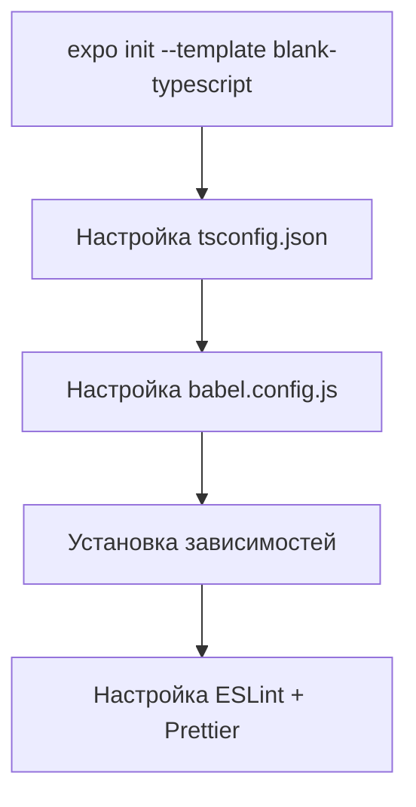
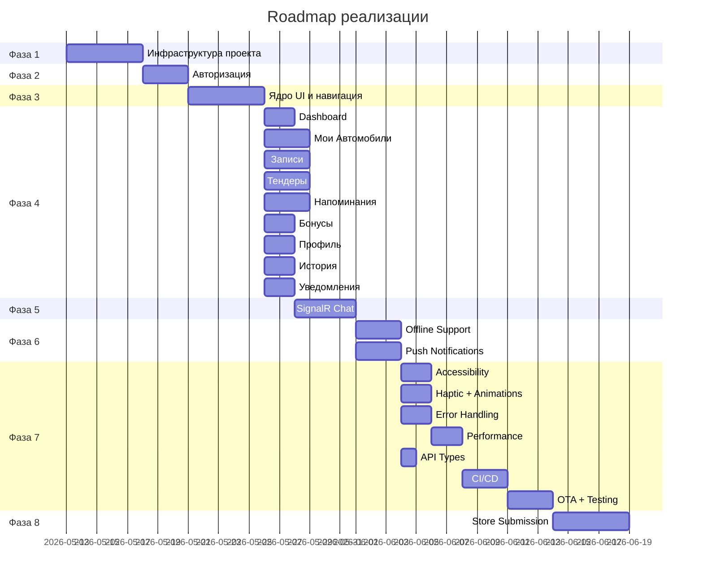

# 📋 Roadmap: Реализация React Native приложения «Автосервис»

**Версия:** 3.2 | **Дата:** 14.05.2026 | **GAP-анализ:** [GAP_ANALYSIS.md](plans/GAP_ANALYSIS.md)

---

## Обзор

Данный roadmap описывает пошаговый план реализации мобильного приложения для автосервиса на React Native + Expo. Задачи разбиты на фазы с чёткими зависимостями между ними.

```mermaid
flowchart LR
    P0[Фаза 0: API-контракты] --> P1[Фаза 1: Инфраструктура]
    P1 --> P2[Фаза 2: Auth]
    P2 --> P3[Фаза 3: Ядро UI]
    P3 --> P4[Фаза 4: Модули]
    P4 --> P5[Фаза 5: Real-time]
    P5 --> P6[Фаза 6: Offline + Push]
    P6 --> P7[Фаза 7: Polish + CI/CD]
    P7 --> P8[Фаза 8: Store Submission]
```



---

## Фаза 0: API-контракты ← ДОБАВЛЕНО (GAP-C001 из v3.0)

> **Цель:** Получить OpenAPI-спецификацию с бэкенда и сгенерировать TypeScript-типы до начала написания кода.

### 0.1 Получение OpenAPI-спецификации

- [ ] Запросить у backend-команды доступ к Swagger: `https://api.avtoserv.com/swagger/v1/swagger.json`
- [ ] Убедиться, что спецификация валидна (OpenAPI 3.0+)
- [ ] Проверить наличие всех endpoints из ТЗ §3:
  - Auth: `/api/auth/login`, `/api/auth/refresh`, `/api/auth/logout`
  - Users: `/api/v1/users/me`
  - Cars: `/api/v1/cars`
  - Appointments: `/api/v1/appointments`
  - Tenders: `/api/v1/tenders`
  - Chat: `/api/v1/chat/conversations`
  - Reminders: `/api/v1/reminders`
  - Driving Profile: `/api/v1/driving-profile`
  - Bonuses: `/api/v1/bonuses/*`
  - Notifications: `/api/v1/notifications`
  - Documents: `/api/v1/clients/{id}/documents`
  - Settings: `/api/v1/clients/{id}/settings`

### 0.2 Генерация TypeScript-типов

- [ ] Установить генератор: `npm i -D openapi-typescript`
- [ ] Создать скрипт в `package.json`:
  ```json
  "generate:api-types": "openapi-typescript ${EXPO_PUBLIC_API_URL}/swagger/v1/swagger.json -o src/shared/types/api/generated/types.ts"
  ```
- [ ] Запустить генерацию и проверить результат
- [ ] Зафиксировать файл `types.ts` в Git

### 0.3 Проверка соответствия

- [ ] Сверить сгенерированные типы с JSON-схемами из ТЗ §3
- [ ] Убедиться, что типы покрывают все экраны из SPEC §7
- [ ] Создать `docs/BACKEND_INTEGRATION.md` с маппингом endpoints → компоненты

### 0.4 Документирование

- [ ] Создать `docs/TEST_ENVIRONMENTS.md` с описанием dev/staging/production сред
- [ ] Создать `docs/TEST_CREDENTIALS.md` (не в Git!) с тестовыми учётными данными
- [ ] Убедиться, что `.env.test` добавлен в `.gitignore`

---

## Фаза 1: Инфраструктура проекта

### 1.1 Инициализация Expo проекта



**Задачи:**
- [ ] Инициализировать Expo SDK 52+ проект с TypeScript шаблоном
- [ ] Настроить `tsconfig.json` с strict mode и path aliases
- [ ] Настроить `babel.config.js` с плагинами Reanimated
- [ ] Установить все зависимости из [`SPEC.md §6`](plans/SPEC.md:651):
  - Core: `@react-navigation/native`, `@react-navigation/bottom-tabs`, `@react-navigation/native-stack`
  - State: `@tanstack/react-query`, `zustand`, `react-hook-form`, `zod`
  - Network: `axios`, `@microsoft/signalr`, `expo-notifications`, `expo-camera`
  - Network enhancements: `@react-native-community/netinfo` ← ДОБАВЛЕНО (v3.2)
  - OCR: `@react-native-ml-kit/text-recognition` ← ДОБАВЛЕНО (v3.2)
  - Storage: `expo-secure-store`, `expo-sqlite`, `react-native-mmkv`
  - UI: `@expo/vector-icons`, `react-native-reanimated`, `react-native-gesture-handler`, `expo-haptics`
  - Dev: `eslint`, `prettier`, `typescript`
- [ ] Настроить `.eslintrc.js` (см. [`ARCHITECTURE_PLAN.md §20`](plans/ARCHITECTURE_PLAN.md:461))
- [ ] Настроить `.prettierrc`
- [ ] Создать `.env.example` с переменными:
  ```
  EXPO_PUBLIC_API_URL=https://api.avtoserv.com
  EXPO_PUBLIC_SENTRY_DSN=
  EXPO_PUBLIC_FCM_KEY=
  EXPO_PUBLIC_APP_ENV=development
  ```

### 1.2 Структура каталогов

- [ ] Создать полную структуру каталогов по [`ARCHITECTURE_PLAN.md §2`](plans/ARCHITECTURE_PLAN.md:22):
  ```
  src/
  ├── app/
  ├── presentation/
  │   ├── screens/
  │   │   ├── auth/
  │   │   ├── home/
  │   │   ├── cars/
  │   │   ├── appointments/
  │   │   ├── tenders/
  │   │   ├── reminders/
  │   │   ├── chat/
  │   │   ├── profile/
  │   │   └── common/
  │   ├── components/
  │   │   ├── ui/
  │   │   ├── forms/
  │   │   └── lists/
  │   └── navigation/
  ├── domain/
  │   ├── entities/
  │   ├── repositories/
  │   └── usecases/
  ├── data/
  │   ├── api/
  │   ├── repositories/
  │   └── storage/
  ├── shared/
  │   ├── constants/
  │   ├── hooks/
  │   ├── utils/
  │   ├── types/
  │   └── context/
  └── assets/
  ```

### 1.3 Дизайн-система (константы)

- [ ] Создать `src/shared/constants/colors.ts` — палитра по [`SPEC.md §2.1`](plans/SPEC.md:18)
- [ ] Создать `src/shared/constants/typography.ts` — типографика по [`SPEC.md §2.2`](plans/SPEC.md:35)
- [ ] Создать `src/shared/constants/spacing.ts` — spacing по [`SPEC.md §2.3`](plans/SPEC.md:66)
- [ ] Создать `src/shared/constants/borderRadius.ts` — по [`SPEC.md §2.4`](plans/SPEC.md:78)
- [ ] Создать `src/shared/constants/shadows.ts` — тени по [`SPEC.md §2.5`](plans/SPEC.md:85)
- [ ] Создать `src/shared/constants/animations.ts` — конфигурация анимаций по [`ARCHITECTURE_PLAN.md §12`](plans/ARCHITECTURE_PLAN.md:360)
- [ ] Создать `src/shared/constants/accessibility.ts` — лейблы по [`ARCHITECTURE_PLAN.md §8`](plans/ARCHITECTURE_PLAN.md:291)

### 1.4 Theme Provider

- [ ] Создать `src/shared/context/ThemeContext.tsx` по [`ARCHITECTURE_PLAN.md §10`](plans/ARCHITECTURE_PLAN.md:323)
- [ ] Реализовать переключение light/dark/system
- [ ] Кэширование выбора темы в MMKV
- [ ] Обернуть приложение в `<ThemeProvider>`

### 1.5 Toast Context

- [ ] Создать `src/shared/context/ToastContext.tsx`
- [ ] Создать компонент `Toast.tsx` с тремя типами (success/error/info)
- [ ] Реализовать автоисчезновение через 3 сек
- [ ] Реализовать haptic feedback при показе toast

### 1.6 API Client

- [ ] Создать `src/data/api/apiClient.ts` — Axios instance по [`ARCHITECTURE_PLAN.md §5`](plans/ARCHITECTURE_PLAN.md:176)
- [ ] Создать `src/data/api/interceptors/authInterceptor.ts` — добавление Bearer токена
- [ ] Создать `src/data/api/interceptors/errorInterceptor.ts` — обработка ошибок по [`ARCHITECTURE_PLAN.md §6`](plans/ARCHITECTURE_PLAN.md:193)
- [ ] Создать `src/shared/utils/errorMapper.ts` — маппинг ошибок на user-friendly тексты
- [ ] Настроить retry policy (network: 3, timeout: 2, 5xx: 2)

### 1.7 Storage

- [ ] Создать `src/data/storage/tokenStorage.ts` — expo-secure-store для JWT токенов
- [ ] Создать `src/data/storage/cacheStorage.ts` — expo-sqlite для кэша
- [ ] Создать `src/data/storage/offlineQueue.ts` — очередь оффлайн-мутаций

### 1.8 Consent Modal (152-ФЗ) ← ДОБАВЛЕНО (v3.2)

- [ ] Создать `ConsentModal.tsx` по [`SPEC.md §35`](plans/SPEC.md)
- [ ] Реализовать проверку `consentGiven` в MMKV при запуске
- [ ] Если consent не дан — показать модальное окно поверх всего UI
- [ ] Реализовать чекбоксы: согласие на обработку данных (обязательный), аналитика (опциональный)
- [ ] Кнопки «Продолжить» (активируется при чекбоксе) и «Позже»
- [ ] Сохранение `consentGiven: ISODate` и `analyticsConsent: boolean` в MMKV
- [ ] При `analyticsConsent === false`: отключить Sentry, Push-регистрацию, Analytics
- [ ] Добавить `@react-native-community/netinfo` в зависимости
- [ ] Реализовать `useOffline.ts` хук по [`ARCHITECTURE_PLAN.md §8.5.1`](plans/ARCHITECTURE_PLAN.md)
- [ ] Реализовать `TokenRefreshQueue` в `authInterceptor.ts` по [`ARCHITECTURE_PLAN.md §8.5.2`](plans/ARCHITECTURE_PLAN.md)

---

## Фаза 2: Авторизация

### 2.1 Auth Repository

- [ ] Создать `src/domain/repositories/IAuthRepository.ts` — интерфейс
- [ ] Создать `src/data/repositories/AuthRepository.ts` — реализация
- [ ] Реализовать `login(email, password)` → `{ token, refreshToken, user }`
- [ ] Реализовать `register(data)` → `{ token, refreshToken, user }`
- [ ] Реализовать `refreshToken(refreshToken)` → `{ token, refreshToken, user }`
- [ ] Реализовать `logout()` → очистка токенов
- [ ] Реализовать `forgotPassword(email)` → `{ message }`

### 2.2 Auth Use Cases

- [ ] Создать `src/domain/usecases/auth/LoginUseCase.ts`
- [ ] Создать `src/domain/usecases/auth/RegisterUseCase.ts`
- [ ] Создать `src/domain/usecases/auth/RefreshTokenUseCase.ts`
- [ ] Создать `src/domain/usecases/auth/ForgotPasswordUseCase.ts`

### 2.3 Auth Entities

- [ ] Создать `src/domain/entities/User.ts` — интерфейс пользователя

### 2.4 Auth UI

- [ ] Создать `LoginScreen.tsx` по [`SPEC.md §3.1`](plans/SPEC.md:117)
  - Поля: email, password
  - Чекбокс «Запомнить меня»
  - Кнопка «Войти»
  - Ссылки «Забыли пароль?» и «Нет аккаунта? Зарегистрироваться»
  - Состояния: idle, loading, error
- [ ] Создать `RegisterScreen.tsx` по [`SPEC.md §3.1.1`](plans/SPEC.md:152)
  - Поля: имя, фамилия, email, телефон, пароль, подтверждение
  - Валидация через react-hook-form + zod
  - Ссылка «Уже есть аккаунт? Войти»
- [ ] Создать `ForgotPasswordScreen.tsx` по [`SPEC.md §3.1.2`](plans/SPEC.md:171)
  - Модальное окно с полем email
  - Кнопка «Отправить ссылку»

### 2.5 Auth Navigation

- [ ] Создать `src/presentation/navigation/AuthStack.tsx`
- [ ] Настроить экраны: Login, Register, ForgotPassword

### 2.6 Биометрическая аутентификация ← ДОБАВЛЕНО (GAP-001)

- [ ] Установить `expo-local-authentication`
- [ ] Реализовать проверку доступности биометрии после первого логина
- [ ] Создать модальное окно «Включить быстрый вход по FaceID/TouchID?»
- [ ] Реализовать сохранение флага биометрии в SecureStorage
- [ ] Добавить кнопку FaceID/TouchID на LoginScreen
- [ ] Реализовать flow: биометрия → refreshToken → профиль
- [ ] Добавить переключатель в SettingsScreen (Безопасность)

### 2.7 Auth State (Zustand)

- [ ] Создать `src/presentation/stores/authStore.ts`:
  ```typescript
  interface AuthStore {
    user: User | null;
    isAuthenticated: boolean;
    setAuth: (user: User) => void;
    logout: () => void;
  }
  ```

### 2.7 Auth Hook

- [ ] Создать `src/shared/hooks/useAuth.ts` — хук для проверки авторизации

---

## Фаза 3: Ядро UI и навигация

### 3.1 Базовые UI-компоненты

- [ ] Создать `Button.tsx` — Primary, Secondary, Danger, Ghost, Small по [`SPEC.md §5.1`](plans/SPEC.md:589)
- [ ] Создать `Input.tsx` — с иконкой, label, валидацией
- [ ] Создать `Card.tsx` — базовая карточка с тенью
- [ ] Создать `Badge.tsx` — цветные бейджи статусов по [`SPEC.md §5.3`](plans/SPEC.md:619)
- [ ] Создать `Avatar.tsx` — круглый аватар с fallback
- [ ] Создать `Header.tsx` — глобальная шапка по [`SPEC.md §5.5`](plans/SPEC.md:625)
- [ ] Создать `EmptyState.tsx` — пустые состояния по [`SPEC.md §5.5`](plans/SPEC.md:645)
- [ ] Создать `Skeleton.tsx` — скелетоны загрузки
- [ ] Создать `ErrorView.tsx` — экран ошибки с кнопкой retry
- [ ] Создать `OfflineBanner.tsx` — баннер оффлайн-режима
- [ ] Создать `Toast.tsx` — всплывающие уведомления
- [ ] Создать `Modal.tsx` — базовое модальное окно

### 3.2 Root Navigation

- [ ] Создать `RootNavigator.tsx`:
  - Если авторизован → `DrawerNavigator` (содержит `MainTabs` + Sidebar)
  - Если не авторизован → `AuthStack`
- [ ] Создать `DrawerNavigator.tsx` — обёртка с боковым меню ← ДОБАВЛЕНО (GAP-002)
  - Sidebar: список разделов, активный подсвечен
  - Кнопка «Админ-панель» (только для `role === 'admin'`)
  - Кнопка «Выйти»
- [ ] Создать `MainTabs.tsx` — 5 вкладок по [`SPEC.md §4`](plans/SPEC.md:552):
  1. 🏠 Главная (HomeStack)
  2. 📅 Записи (AppointmentsStack)
  3. 📋 Тендеры (TendersStack)
  4. 💬 Чат (ChatStack)
  5. 👤 Профиль (ProfileStack)
- [ ] Настроить иконки для каждой вкладки
- [ ] Настроить активную вкладку (синий #2563EB)

### 3.3 Stack Navigation для каждой вкладки

- [ ] Создать `HomeStack.tsx`: HomeScreen → NotificationsScreen, CarsListScreen, CarDetailScreen, AddEditCarScreen
- [ ] Создать `CarsStack.tsx` ← ДОБАВЛЕНО (INC-001): CarsListScreen → CarDetailScreen → AddEditCarScreen (модальный стек из HomeScreen)
- [ ] Создать `AppointmentsStack.tsx`: AppointmentsScreen → NewAppointmentScreen → AppointmentDetailScreen + модалки RescheduleModal, CancelModal
- [ ] Создать `TendersStack.tsx`: TendersScreen → TenderDetailScreen → TenderToAppointmentWizard, CalculatorScreen
- [ ] Создать `ChatStack.tsx`: ChatListScreen → ChatScreen
- [ ] Создать `ProfileStack.tsx`: ProfileScreen → SettingsScreen, HistoryScreen, BonusesScreen, RemindersListScreen, AddEditReminderScreen, DrivingProfileScreen
- [ ] Создать `RemindersStack.tsx` ← ДОБАВЛЕНО (INC-002): RemindersListScreen → AddEditReminderScreen → DrivingProfileScreen (вложен в ProfileStack)

### 3.4 Navigation Types

- [ ] Создать `src/presentation/navigation/types.ts` — типизация всех экранов и параметров

### 3.5 App Entry Point

- [ ] Создать `src/app/App.tsx` — обёртка в ThemeProvider, QueryClientProvider, ToastProvider
- [ ] Создать `src/app/providers.tsx` — провайдеры контекстов

---

## Фаза 4: Основные модули

### 4.1 Dashboard (Главная)

- [ ] Создать `src/domain/entities/` — Car, Appointment, Bonus, Notification
- [ ] Создать `HomeScreen.tsx` по [`SPEC.md §3.2`](plans/SPEC.md:189)
  - Приветствие с именем пользователя
  - 4 информационные карточки в 2x2 сетке
  - Блок «Быстрые действия» — 4 кнопки
  - Блок «Последние активности»
  - Состояния: loading (скелетон), loaded, error
- [ ] Настроить React Query ключи: `['dashboard']`, `['appointments', 'upcoming']`, `['bonuses', 'balance']`
- [ ] Реализовать Pull-to-Refresh

### 4.2 Мои Автомобили

- [ ] Создать `ICarsRepository.ts` и `CarsRepository.ts`
- [ ] Создать `CarsListScreen.tsx` по [`SPEC.md §3.3`](plans/SPEC.md:217)
  - Список карточек авто с фото
  - Кнопки: Записаться, Изменить, Удалить
  - Метка «Основной»
  - Состояния: loading, loaded, empty, error
- [ ] Создать `CarDetailScreen.tsx`
- [ ] Создать `AddEditCarScreen.tsx` по [`SPEC.md §3.4`](plans/SPEC.md:239)
  - Форма с валидацией (zod)
  - VIN поле с иконкой камеры для сканера
  - Чекбокс «Сделать основным»
- [ ] Создать `CarCard.tsx` — карточка автомобиля
- [ ] Создать модальное окно подтверждения удаления по [`SPEC.md §3.5`](plans/SPEC.md:256)
- [ ] Реализовать VIN Scanner по [`ARCHITECTURE_PLAN.md §13`](plans/ARCHITECTURE_PLAN.md:384)

### 4.3 Записи на обслуживание

- [ ] Создать `IAppointmentsRepository.ts` и `AppointmentsRepository.ts`
- [ ] Создать `AppointmentsScreen.tsx` по [`SPEC.md §3.6`](plans/SPEC.md:266)
  - Табы-фильтры: Все, Предстоящие, Завершённые, Отменённые
  - Карточки записей с датой, авто, услугой, ценой, статусом
  - Кнопки: Подробнее, Перенести, Отменить
  - Кнопка «+ Создать запись»
- [ ] Создать `NewAppointmentScreen.tsx` по [`SPEC.md §3.7`](plans/SPEC.md:293)
  - Выбор авто, услуги (с поиском), даты (календарь), времени, мастера
  - Комментарий
- [ ] Создать `AppointmentDetailScreen.tsx`
- [ ] Создать `RescheduleModal.tsx` по [`SPEC.md §3.8`](plans/SPEC.md:320)
- [ ] Создать `CancelModal.tsx` по [`SPEC.md §3.9`](plans/SPEC.md:329)
- [ ] Создать `AppointmentCard.tsx` — карточка записи
- [ ] Реализовать цветные бейджи статусов

### 4.4 Тендеры / Калькулятор

- [ ] Создать `ITendersRepository.ts` и `TendersRepository.ts`
- [ ] Создать `TendersScreen.tsx` по [`SPEC.md §3.11`](plans/SPEC.md:369)
  - Табы: Активные, Архив
  - Список заявок со статусами
  - Кнопка «+ Создать новую заявку»
- [ ] Создать `TenderDetailScreen.tsx` по [`SPEC.md §3.12`](plans/SPEC.md:385)
  - Полное описание, предложения от сервиса
  - Кнопки: Принять, Отклонить, Закрыть
- [ ] Создать `CalculatorScreen.tsx` по [`SPEC.md §3.10`](plans/SPEC.md:337)
  - Выбор авто, услуг, запчастей
  - Предрасчёт итоговой суммы
  - Кнопка «Отправить заявку»
- [ ] Создать `TenderToAppointmentWizard.tsx` по [`SPEC.md §3.12.1`](plans/SPEC.md:400) и [`ARCHITECTURE_PLAN.md §15`](plans/ARCHITECTURE_PLAN.md:397)
  - Шаг 1: Проверка готовности
  - Шаг 2: Пре-филл формы записи из тендера
  - Шаг 3: Подтверждение + вызов API convert
- [ ] Создать `TenderCard.tsx`

### 4.5 Напоминания о ТО

- [ ] Создать `IRemindersRepository.ts` и `RemindersRepository.ts`
- [ ] Создать `Reminder.ts` entity
- [ ] Создать `DrivingProfile.ts` entity
- [ ] Создать `RemindersListScreen.tsx` по [`SPEC.md §3.13`](plans/SPEC.md:412)
  - Табы: Активные, На паузе, Выполненные
  - Карточки с названием, авто, оставшимися км/днями
  - Кнопка «+ Добавить напоминание»
- [ ] Создать `AddEditReminderScreen.tsx` по [`SPEC.md §3.14`](plans/SPEC.md:424)
  - Выбор авто
  - Переключатель: Шаблон / Своё напоминание
  - Загрузка шаблонов с `GET /api/v1/notifications/templates`
  - Триггеры: По дате, По пробегу, Комбинированный
  - Калькулятор расчёта следующего ТО
- [ ] Создать `DrivingProfileScreen.tsx` по [`SPEC.md §3.15`](plans/SPEC.md:445)
  - Упрощённый выбор: Редко/Средне/Часто
  - Точный ввод пробега в месяц
  - API: `PUT /api/v1/driving-profile`
- [ ] Создать `ReminderCard.tsx`

### 4.6 Бонусы

- [ ] Создать `IBonusesRepository.ts` и `BonusesRepository.ts`
- [ ] Создать `Bonus.ts` entity
- [ ] Создать `BonusesScreen.tsx` по [`SPEC.md §3.17`](plans/SPEC.md:461)
  - Баланс, прогресс-бар уровня
  - Статистика: начислено, потрачено, кэшбэк %
  - История операций
  - Поле «Ввести промокод» + «Активировать»
  - Блок «Пригласи друга» — копирование/шаринг

### 4.7 Профиль и Настройки

- [ ] Создать `ProfileScreen.tsx` по [`SPEC.md §3.19`](plans/SPEC.md:512)
  - Аватар с возможностью изменения
  - Поля: имя, фамилия, email, телефон
  - Режим просмотра/редактирования
  - Блок «Безопасность»: смена пароля
  - Статус 2FA (read-only) ← ДОБАВЛЕНО (GAP-009)
  - Опасная зона: удаление аккаунта
- [ ] Реализовать удаление аккаунта ← ДОБАВЛЕНО (GAP-008)
  - Модальное окно: поле «Введите пароль», чекбокс подтверждения
  - API: `DELETE /api/v1/users/me`
  - Очистка токенов, редирект на LoginScreen
- [ ] Создать `SettingsScreen.tsx` по [`SPEC.md §3.20`](plans/SPEC.md:527)
  - Вкладки: Уведомления, Внешний вид, Язык, Конфиденциальность
  - Переключатели настроек
  - Кнопка «Сохранить изменения»

### 4.8 История обслуживания

- [ ] Создать `HistoryScreen.tsx` по [`SPEC.md §3.16`](plans/SPEC.md:452)
  - Фильтры: авто, тип услуги, период
  - Таблица записей
  - Кнопки «Экспорт в PDF» и «Экспорт в CSV»
- [ ] Реализовать экспорт PDF (react-native-html-to-pdf) — **клиентская генерация (v1)**
- [ ] Реализовать экспорт CSV (papaparse) — **клиентская генерация (v1)**
- [ ] Реализовать скачивание документов (акты/чеки) ← ДОБАВЛЕНО (GAP-010)
  - API: `GET /api/v1/clients/{id}/documents`
  - Скачивание PDF: `GET /api/v1/clients/{id}/documents/{docId}/download`
  - Открытие через `expo-sharing` / `expo-file-system`
  - Кэширование документов в `FileSystem.documentDirectory`
  - Автоочистка кэша документов старше 30 дней ← ДОБАВЛЕНО (INC-003)
  - Кэширование: [`ARCHITECTURE_PLAN.md §25.3`](plans/ARCHITECTURE_PLAN.md:986)
- [ ] **Manual Upload** — добавление записей с других СТО ← ДОБАВЛЕНО (v3.2)
  - Создать `AddManualRecordScreen.tsx` по [`SPEC.md §34`](plans/SPEC.md)
  - Реализовать форму: автомобиль, дата, СТО, услуга, стоимость, пробег
  - Загрузка файлов через `expo-image-picker` / `expo-document-picker`
  - API: `POST /api/v1/service-history/manual` (multipart/form-data)
  - Валидация: дата ≤ сегодня, стоимость ≥ 0, до 3 файлов ≤ 10 МБ
  - Статус `pending_review` после отправки
  - Toast: «Запись отправлена на проверку»
  - Интегрировать `AddManualRecordScreen` в `HistoryStack` навигацию

### 4.9 Уведомления

- [ ] Создать `INotificationsRepository.ts` и `NotificationsRepository.ts`
- [ ] Создать `Notification.ts` entity
- [ ] Создать `NotificationsScreen.tsx` по [`SPEC.md §3.21`](plans/SPEC.md:543)
  - Табы: Все, Непрочитанные
  - Иконки по типам: запись (📅), бонус (🎁), система (ℹ️), чат (💬)
  - Клик → deep link на связанную страницу
  - Кнопка «Прочитать все»

---

## Фаза 5: Real-time (SignalR)

### 5.1 SignalR Chat

- [ ] Создать `src/data/api/signalr/chatHub.ts` по [`ARCHITECTURE_PLAN.md §16`](plans/ARCHITECTURE_PLAN.md:419)
  - `start()` — подключение к `/hubs/chat`
  - `sendMessage(conversationId, text)` — отправка сообщения
  - `sendTypingIndicator(conversationId)` — индикатор набора
  - `onMessageReceived(callback)` — получение сообщения
  - `onTypingIndicator(callback)` — индикатор набора
  - `onMessageStatusUpdate(callback)` — обновление статуса

### 5.2 Чат UI

- [ ] Создать `ChatListScreen.tsx` по [`SPEC.md §3.18`](plans/SPEC.md:491)
  - Список диалогов с аватарами, последним сообщением, временем
  - Бейдж непрочитанных
- [ ] Создать `ChatScreen.tsx` по [`SPEC.md §3.18`](plans/SPEC.md:500)
  - Сообщения: свои справа (синий фон), чужие слева (серый фон)
  - Время отправки, галочки статуса (отправлено/доставлено/прочитано)
  - Индикатор «Печатает...»
  - Поле ввода с автоувеличением высоты
  - Кнопка «Скрепка» для прикрепления файлов

### 5.3 Загрузка файлов в чат

- [ ] Создать `src/data/api/upload/fileUpload.ts`
- [ ] Реализовать `expo-image-picker` для фото
- [ ] Реализовать `expo-document-picker` для файлов
- [ ] Интегрировать загрузку через `POST /api/v1/upload`
- [ ] Отправка сообщения с `attachmentIds`

### 5.4 Optimistic UI для чата

- [ ] Реализовать немедленный рендер отправленного сообщения (status: pending)
- [ ] Обновление статуса pending → sent после ответа API
- [ ] При ошибке: статус error + кнопка «Повторить»

---

## Фаза 6: Offline + Push

### 6.1 Offline Support

- [ ] Создать `src/shared/hooks/useOffline.ts` — определение онлайн/офлайн статуса
- [ ] Создать `OfflineBanner.tsx` — баннер «Работает в офлайн-режиме»
- [ ] Реализовать `offlineQueue.ts` — очередь мутаций в MMKV/SQLite
- [ ] Настроить React Query `staleTime` по [`ARCHITECTURE_PLAN.md §8.1`](plans/ARCHITECTURE_PLAN.md:265):
  - Авто: 15 мин, Записи: 5 мин, Тендеры: 5 мин
  - Бонусы: 10 мин, Уведомления: 2 мин, Профиль: 30 мин, История: 10 мин
- [ ] Реализовать offline fallback для каждого экрана
- [ ] Реализовать автоматическую синхронизацию при восстановлении сети

### 6.2 Push Notifications

- [ ] Создать `src/data/notifications/pushRegistration.ts`
  - Регистрация FCM/APNs токена через `expo-notifications`
  - Отправка токена на бэкенд: `POST /api/v1/notifications/register`
- [ ] Создать `src/data/notifications/notificationHandler.ts`
  - Обработка push-событий
  - Deep link mapping по [`ARCHITECTURE_PLAN.md §7.1`](plans/ARCHITECTURE_PLAN.md:258):
    - `appointment_confirmed` → AppointmentDetailScreen
    - `tender_offer` → TenderDetailScreen
    - `chat_message` → ChatScreen
    - `reminder_due` → RemindersListScreen
    - `bonus_earned` → BonusesScreen
- [ ] Настроить `expo-notifications` handler для foreground/background
- [ ] Реализовать badge count для иконки уведомлений

---

## Фаза 7: Polish + CI/CD

### 7.1 Accessibility

- [ ] Добавить `accessibilityLabel` на все экраны по [`ARCHITECTURE_PLAN.md §8.2`](plans/ARCHITECTURE_PLAN.md:299)
- [ ] Добавить `accessibilityRole` на интерактивные элементы
- [ ] Добавить `accessibilityState` для состояний (disabled, selected, checked, busy)
- [ ] Проверить контрастность ≥ 4.5:1
- [ ] Проверить минимальный тач-таргет 44×44 pt
- [ ] Реализовать поддержку Reduced Motion

### 7.2 Haptic Feedback

- [ ] Реализовать `src/shared/utils/haptics.ts` по [`ARCHITECTURE_PLAN.md §12.1`](plans/ARCHITECTURE_PLAN.md:365)
  - `notificationSuccess` — успешное действие
  - `notificationError` — ошибка
  - `impactMedium` — подтверждение
  - `selection` — навигация
  - `impactLight` — pull-to-refresh
- [ ] Добавить haptic на все критичные действия
- [ ] Реализовать настройку вкл/выкл вибрации

### 7.3 Анимации

- [ ] Настроить `react-native-reanimated` для screen transitions
- [ ] Реализовать skeleton-анимации
- [ ] Реализовать анимации карточек при нажатии (scale 0.98)
- [ ] Реализовать pull-to-refresh анимацию
- [ ] Соблюсти 200–300ms длительность переходов

### 7.4 Error Handling

- [ ] Обернуть каждый стек экранов в `ErrorBoundary`
- [ ] Создать `ErrorView.tsx` — экран ошибки с кнопкой retry
- [ ] Интегрировать Crash Reporting (Sentry или Firebase Crashlytics)

### 7.5 Performance

- [ ] Настроить lazy loading списков (FlatList с pagination)
- [ ] Настроить кэширование изображений (`expo-image` или `react-native-fast-image`)
- [ ] Проверить UI 60 FPS
- [ ] Настроить API timeout ≤ 10с

### 7.6 Типизация API

- [ ] Получить OpenAPI-спецификацию с бэкенда
- [ ] Сгенерировать TypeScript-типовый файл: `openapi-typescript`
- [ ] Интегрировать в CI/CD проверку актуальности типов

### 7.7 CI/CD Pipeline

- [ ] Установить `eas-cli`: `npm i -g eas-cli`
- [ ] Авторизоваться в Expo: `eas login`
- [ ] Создать проект: `eas init`
- [ ] Настроить `eas.json` с профилями `development`, `preview`, `production`
- [ ] Настроить `.github/workflows/build.yml` по [`ARCHITECTURE_PLAN.md §18`](plans/ARCHITECTURE_PLAN.md:450):
  - Install & Lint
  - Type Check
  - Test (unit + e2e)
  - Build Android (EAS)
  - Build iOS (EAS)
  - Submit to Stores
- [ ] Настроить секреты в EAS: `EXPO_PUBLIC_API_URL`, `SENTRY_DSN`, `FCM_KEY`
- [ ] Сгенерировать Android Keystore
- [ ] Настроить Apple Team ID

### 7.8 OTA Updates

- [ ] Настроить `expo-updates` для OTA-обновлений
- [ ] Настроить `expo.config.js` (`updates.url`, `fallbackToCacheTimeout`)

### 7.9 Тестирование

- [ ] Установить `@axe-core/react-native` для автоматической проверки accessibility
- [ ] Написать unit-тесты для use cases
- [ ] Написать unit-тесты для repositories
- [ ] Настроить E2E тестирование (`detox` или `maestro`)
- [ ] Создать тестовые учётные данные и сценарии в `docs/TEST_ENVIRONMENTS.md`

### 7.9.1 Ленивая загрузка и кэширование изображений ← ДОБАВЛЕНО

- [ ] Настроить `expo-image` вместо `react-native` Image по [`SPEC.md §30`](plans/SPEC.md)
- [ ] Реализовать `useInfiniteQuery` для списков (записи, тендеры, уведомления, история)
- [ ] Настроить `onEndReachedThreshold` для каждого списка по [`SPEC.md §29.3`](plans/SPEC.md)
- [ ] Настроить `cachePolicy="memory-disk"` для изображений

### 7.10 Git Branching

- [ ] Настроить ветки по [`ARCHITECTURE_PLAN.md §21`](plans/ARCHITECTURE_PLAN.md:473):
  ```
  main ← production
  develop ← основная ветка разработки
  feature/* ← фичи
  bugfix/* ← багфиксы
  release/* ← релизы
  ```

### 7.11 Локализация (i18n) ← ДОБАВЛЕНО (GAP-007)

- [ ] Установить `expo-localization`, `i18next`, `react-i18next`
- [ ] Создать структуру переводов: `src/shared/i18n/locales/{ru,en}/`
- [ ] Перевести все экраны на русский и английский
- [ ] Реализовать переключение языка в SettingsScreen
- [ ] Сохранять выбор языка в MMKV

### 7.12 Certificate Pinning ← ДОБАВЛЕНО (GAP-005)

- [ ] Исследовать `react-native-ssl-pinning` или нативную реализацию
- [ ] Настроить список доверенных сертификатов
- [ ] Добавить `.env` переменную `EXPO_PUBLIC_CERT_PINNING_ENABLED`
- [ ] Реализовать fallback на стандартную TLS-валидацию

### 7.13 Демо-режим ← ДОБАВЛЕНО (GAP-004, расширено GAP-I001)

- [ ] Добавить кнопку «Демо-режим» на LoginScreen
- [ ] Создать `src/data/mock/mockData.ts` с моковыми данными:
  - Пользователь: «Демо Пользователь»
  - 2 автомобиля (Porsche Cayenne, Toyota RAV4)
  - 3 записи (подтверждённая, ожидает, отменена)
  - 2 тендера (активный, завершён)
  - 5 сообщений в чате
  - 3 напоминания
  - Баланс бонусов: 2 450 ₽
- [ ] Реализовать гостевую сессию без бэкенда:
  - Заглушка для всех API-вызовов (возвращать моковые данные)
  - SignalR не подключается
  - Push-уведомления отключены
- [ ] Добавить баннер «Демо-режим» в Header
- [ ] В Demo Mode: `isDemoMode = true` в Zustand store

### 7.14 Safe Area & Responsive Layout ← ДОБАВЛЕНО (GAP-011, GAP-012)

- [ ] Обернуть все экраны в `SafeAreaView` из `react-native-safe-area-context`
- [ ] Реализовать адаптивную вёрстку через `useWindowDimensions`
- [ ] Двухколоночная сетка для планшетов (ширина >= 768pt)
- [ ] Master-detail layout для планшетов (ширина >= 1024pt)
- [ ] Split view для чата на планшетах

### 7.15 SwipeableRow Component ← ДОБАВЛЕНО (GAP-014)

- [ ] Создать `SwipeableRow.tsx` на основе `react-native-gesture-handler` + `react-native-reanimated`
- [ ] Интегрировать в NotificationsScreen: свайп влево → «Прочитано», свайп вправо → «Удалить»

---

## Фаза 8: Store Submission

### 8.1 Подготовка к App Store

- [ ] Создать Privacy Policy страницу
- [ ] Настроить App Store Connect (иконки, скриншоты, описание)
- [ ] Настроить permissions (камера, уведомления)
- [ ] Проверить 64-bit совместимость

### 8.2 Подготовка к Google Play

- [ ] Настроить Google Play Console
- [ ] Загрузить скриншоты и описание
- [ ] Настроить permissions (CAMERA, INTERNET, POST_NOTIFICATIONS)

### 8.3 Финальная проверка

- [ ] Пройти ревью App Store
- [ ] Пройти ревью Google Play
- [ ] Передать артефакты сборки
- [ ] Передать документацию API-клиента
- [ ] Передать тест-кейсы

### 8.4 Future Features (Phase 8+) ← ДОБАВЛЕНО

- [ ] Голосовые сообщения в чате ← GAP-013
  - Запись аудио через `expo-av`
  - Отправка как аудиофайл через `POST /api/v1/upload`
  - Кнопка «Голосовое сообщение» при долгом нажатии
- [ ] Админ-панель (заглушка → полноценная) ← GAP-003
  - `AdminPlaceholderScreen` → полноценный AdminStack
  - Управление записями, клиентами, тендерами
- [ ] Полноценная настройка 2FA ← GAP-009
  - Включение/выключение через приложение
  - Настройка методов: SMS, TOTP

---

## Зависимости между фазами



---

## Сводка по фазам

| Фаза | Описание | Основные файлы |
|------|----------|----------------|
| 1 | Инфраструктура | Expo проект, константы, Theme, API client, Storage |
| 2 | Авторизация | Login, Register, ForgotPassword, Biometric, AuthStack |
| 3 | Ядро UI | Компоненты, навигация, RootNavigator, Drawer, Sidebar |
| 4 | Модули | Dashboard, Авто, Записи, Тендеры, Напоминания, Бонусы, Профиль, История, Уведомления, Документы, Удаление аккаунта |
| 5 | Real-time | SignalR Chat, Optimistic UI, файлы |
| 6 | Offline + Push | Offline queue, кэширование, Push уведомления |
| 7 | Polish | Accessibility, Haptic, Animations, i18n, Cert Pinning, Демо-режим, Safe Area, SwipeableRow, CI/CD, Тесты |
| 8 | Store + Future | App Store, Google Play, Документация, Голосовые сообщения, Админ-панель, 2FA |
