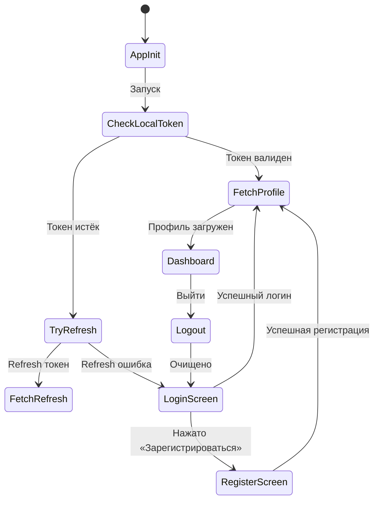
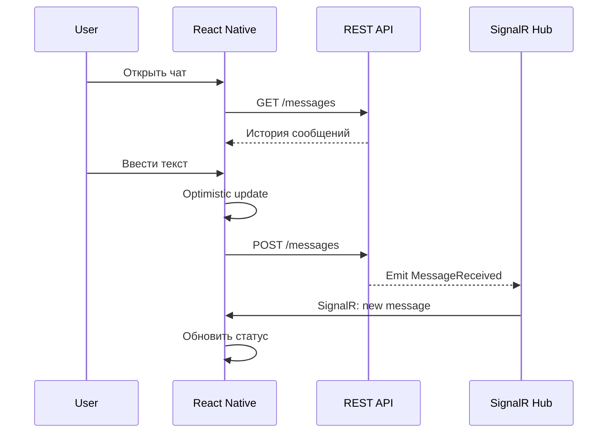
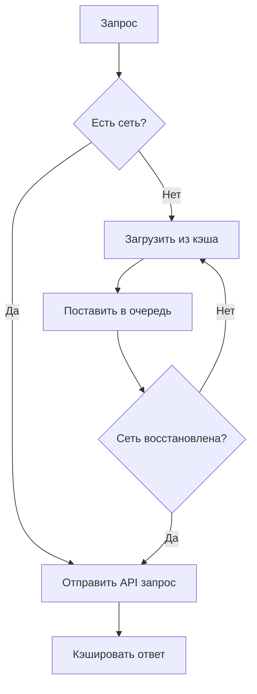
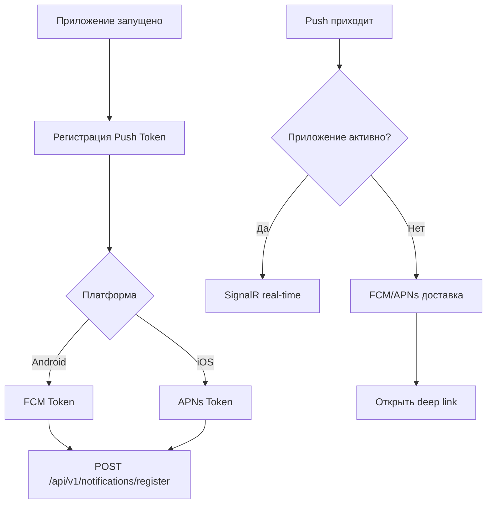
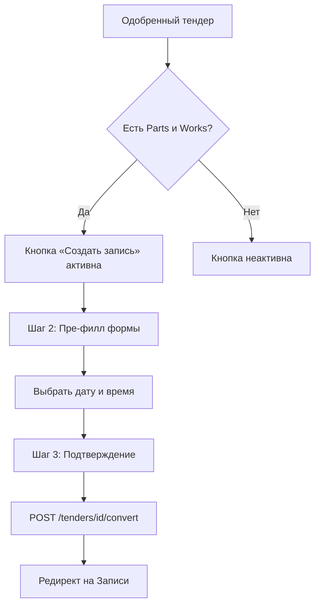
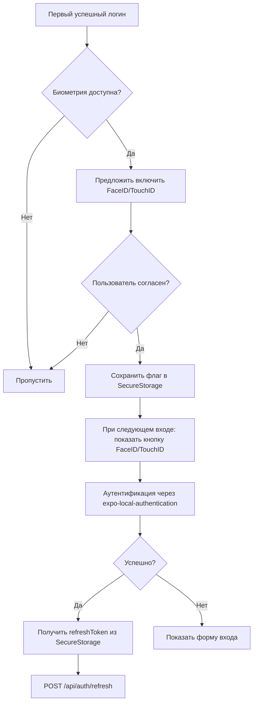
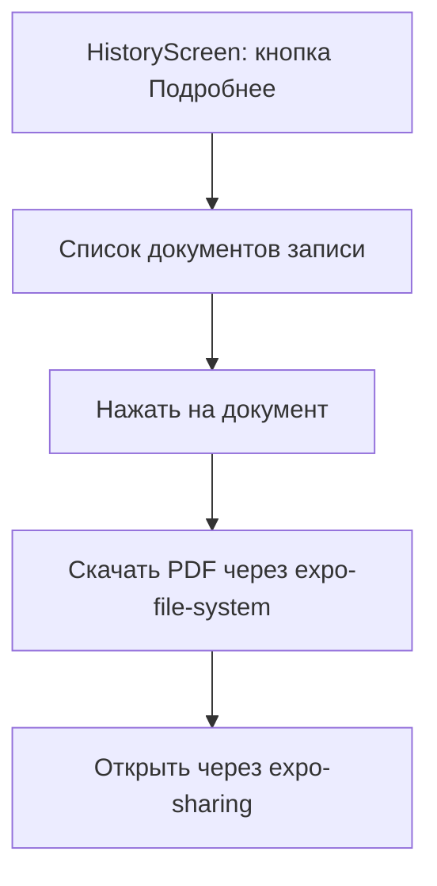
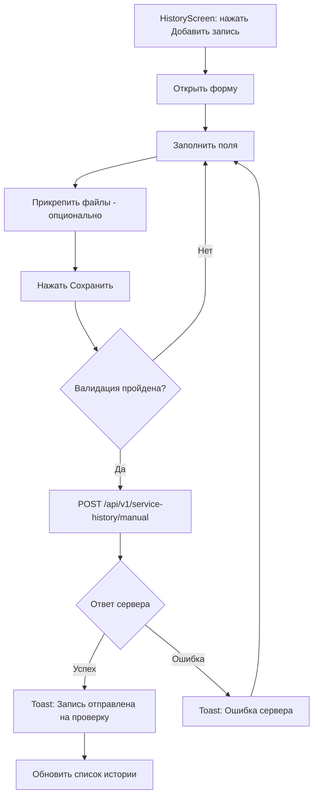
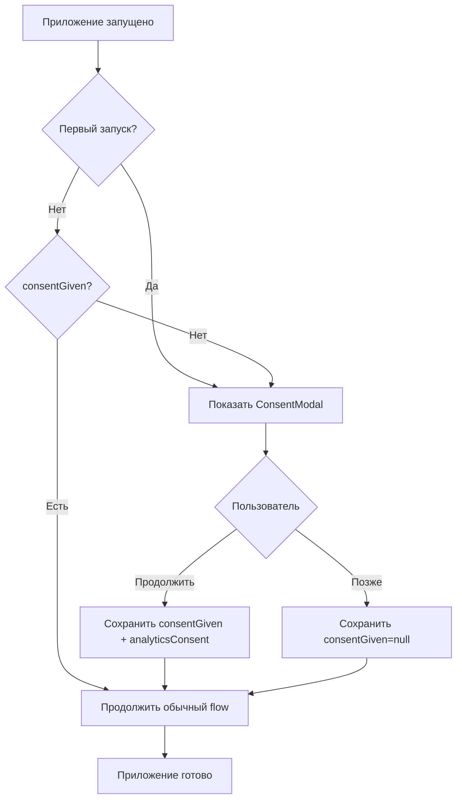

# 📱 Спецификация React Native приложения «Автосервис»

**Версия:** 3.2 | **Обновлено:** 14.05.2026 | **GAP-анализ:** [GAP_ANALYSIS.md](plans/GAP_ANALYSIS.md)

---

## 1. Выбор дизайн-варианта

На основе анализа трёх референсов:

| Референс | Стиль | Решение |
|----------|-------|---------|
| `generated_image_1 (7)` | Тёмная тема с белыми карточками, синий primary | **Основной вариант** |
| `generated_image_1 (8)` | Светлая тема, синий primary, минималистичный | **Светлая тема** |
| `generated_image_2` | Светлая тема, зелёный/синий accents, детальные формы | **Дополнительные экраны** |

**Итог:** Приложение поддерживает **светлую и тёмную темы**. Основной цвет — **синий (#2563EB)**, дополнительный — **зелёный (#22C55E)** для статусов.

---

## 2. Дизайн-система (по референсам)

### 2.1 Цветовая палитра

```typescript
const Colors = {
  // Primary
  primary: '#2563EB',        // Синий — основной акцент
  primaryLight: '#3B82F6',   // Светлый синий
  primaryDark: '#1D4ED8',    // Тёмный синий
  primaryBg: '#EFF6FF',      // Фон primary (светлая тема)

  // Semantic
  success: '#22C55E',        // Зелёный — завершено, онлайн
  warning: '#F59E0B',        // Жёлтый — предупреждение
  error: '#EF4444',          // Красный — ошибка, удаление
  info: '#3B82F6',           // Информация

  // Status badges (по референсам)
  statusConfirmed: '#22C55E',  // Подтверждено
  statusPending: '#F59E0B',    // Ожидает
  statusCompleted: '#22C55E',  // Завершено
  statusCancelled: '#EF4444',  // Отменено
  statusInProgress: '#3B82F6', // В работе

  // Neutral (светлая тема)
  white: '#FFFFFF',
  background: '#F8FAFC',
  surface: '#FFFFFF',
  card: '#FFFFFF',
  border: '#E2E8F0',
  divider: '#F1F5F9',

  // Text
  textPrimary: '#1E293B',
  textSecondary: '#64748B',
  textTertiary: '#94A3B8',
  textInverse: '#FFFFFF',
  textLink: '#2563EB',

  // Dark theme
  darkBackground: '#0F172A',
  darkSurface: '#1E293B',
  darkCard: '#1E293B',
  darkBorder: '#334155',
  darkTextPrimary: '#F8FAFC',
  darkTextSecondary: '#94A3B8',
};
```

### 2.2 Типографика

```typescript
const Typography = {
  // Headings
  h1: { fontSize: 28, fontWeight: '700' as const, lineHeight: 34 },
  h2: { fontSize: 24, fontWeight: '600' as const, lineHeight: 30 },
  h3: { fontSize: 20, fontWeight: '600' as const, lineHeight: 26 },
  h4: { fontSize: 18, fontWeight: '600' as const, lineHeight: 24 },

  // Body
  bodyLarge: { fontSize: 16, fontWeight: '400' as const, lineHeight: 24 },
  body: { fontSize: 14, fontWeight: '400' as const, lineHeight: 20 },
  bodySmall: { fontSize: 12, fontWeight: '400' as const, lineHeight: 16 },

  // Labels
  label: { fontSize: 14, fontWeight: '500' as const, lineHeight: 20 },
  labelSmall: { fontSize: 12, fontWeight: '500' as const, lineHeight: 16 },

  // Captions
  caption: { fontSize: 12, fontWeight: '400' as const, lineHeight: 16 },
  captionBold: { fontSize: 12, fontWeight: '600' as const, lineHeight: 16 },

  // Buttons
  button: { fontSize: 16, fontWeight: '600' as const, lineHeight: 24 },
  buttonSmall: { fontSize: 14, fontWeight: '600' as const, lineHeight: 20 },
};
```

### 2.3 Spacing (8pt grid)

```typescript
const Spacing = {
  xxs: 2,
  xs: 4,
  sm: 8,
  md: 12,
  lg: 16,
  xl: 20,
  xxl: 24,
  xxxl: 32,
  xxxxl: 40,
  section: 48,
};
```

### 2.4 Border Radius

```typescript
const BorderRadius = {
  none: 0,
  sm: 4,
  md: 8,
  lg: 12,
  xl: 16,
  xxl: 20,
  full: 9999,
};
```

### 2.5 Тени

```typescript
const Shadows = {
  sm: {
    shadowColor: '#000',
    shadowOffset: { width: 0, height: 1 },
    shadowOpacity: 0.05,
    shadowRadius: 2,
    elevation: 1,
  },
  md: {
    shadowColor: '#000',
    shadowOffset: { width: 0, height: 2 },
    shadowOpacity: 0.1,
    shadowRadius: 4,
    elevation: 3,
  },
  lg: {
    shadowColor: '#000',
    shadowOffset: { width: 0, height: 4 },
    shadowOpacity: 0.15,
    shadowRadius: 8,
    elevation: 5,
  },
};
```

---

## 3. Экраны приложения (по референсам)

### 3.1 Экран авторизации

**Из [`generated_image_1 (7)`](Maket/generated_image_1%20(7).png):**
- Тёмный фон с фотографией автомобиля
- Белая карточка по центру
- Логотип «АвтоСервис+» сверху
- Поле «Email» с иконкой
- Поле «Пароль» с иконкой и кнопкой показа
- Чекбокс «Запомнить меня»
- Ссылка «Забыли пароль?»
- Кнопка «Войти» (синяя, полная ширина)
- Ссылка «Нет аккаунта? Зарегистрироваться»
- Кнопки соцсетей: Apple, Google (опционально)

**Из [`generated_image_1 (8)`](Maket/generated_image_1%20(8).png):**
- Белый фон
- Логотип «АВТО СЕРВИС» с иконкой
- Заголовок «Добро пожаловать»
- Подзаголовок «Войдите в свой аккаунт»
- Email поле с иконкой
- Пароль поле с иконкой и кнопкой показа
- Чекбокс «Запомнить меня» + «Забыли пароль?»
- Кнопка «Войти» (синяя)
- «или войдите с помощью» — Apple, Google кнопки
- «Нет аккаунта? Зарегистрироваться»

### 3.1.0 Биометрический вход ← ДОБАВЛЕНО (GAP-001)

После первого успешного входа приложение предлагает включить FaceID/TouchID:

**Flow:**
1. Первый успешный логин → проверка доступности биометрии (`expo-local-authentication`)
2. Если доступна → модальное окно «Включить быстрый вход по FaceID/TouchID?»
3. Пользователь соглашается → флаг сохраняется в SecureStorage
4. При следующем запуске: на LoginScreen появляется кнопка «FaceID/TouchID»
5. Нажатие → `LocalAuthentication.authenticateAsync()` → при успехе → `POST /api/auth/refresh` с сохранённым refreshToken
6. При неудаче → показать форму входа

**Настройка:**
- ProfileScreen → SettingsScreen → вкладка «Безопасность» → переключатель «Вход по FaceID/TouchID»
- Доступен только если биометрия поддерживается устройством

### 3.1.1 Экран регистрации ← ДОБАВЛЕНО

- Заголовок «Создать аккаунт»
- Подзаголовок «Заполните данные для регистрации»
- Поля формы:
  - Имя (обязательно)
  - Фамилия (обязательно)
  - Email (обязательно, валидация формата)
  - Телефон (обязательно, маска ввода +7)
  - Пароль (обязательно, индикатор сложности)
  - Подтвердите пароль (обязательно)
- Чекбокс «Я согласен с политикой конфиденциальности» (ссылка)
- Кнопка «Зарегистрироваться» (синяя)
- «Уже есть аккаунт? Войти» (ссылка)

**Валидация:**
| Поле | Правило | Сообщение |
|------|---------|-----------|
| Имя | Не пустое, мин 2 символа | «Введите имя» |
| Email | regex format | «Некорректный email» |
| Телефон | 11 цифр | «Введите номер телефона» |
| Пароль | Минимум 8 символов | «Пароль должен содержать минимум 8 символов» |
| Подтверждение | Совпадает с паролем | «Пароли не совпадают» |

### 3.1.2 Экран восстановления пароля

- Модальное окно «Восстановление пароля»
- Поле «Email»
- Кнопка «Отправить ссылку»
- Кнопка «Назад ко входу»
- После отправки: сообщение «Письмо отправлено», окно закрывается

### 3.2 Главный экран (Dashboard)

**Из [`generated_image_1 (7)`](Maket/generated_image_1%20(7).png):**
- Заголовок «Здравствуйте, Иван Петров 👋»
- 4 информационные карточки в 2x2 сетке:
  - «Мои авто» — 2 автомобиля
  - «Записи на сервис» — 3 записи, ближайшая 24 числа
  - «Баланс бонусов» — 3 450 ₽
  - «Статус аккаунта» — Платиновый
- Блок «Быстрые действия» — 4 кнопки в ряд:
  - Записаться, Добавить авто, Калькулятор, Начать в чат
- Блок «Последние активности» — список событий:
  - Сервисное ТО (24 мая)
  - Диагностика подвески (Ауди Q5)
  - Запись по номеру МР4921

**Из [`generated_image_1 (8)`](Maket/generated_image_1%20(8).png):**
- Заголовок «Доброе утро, Алексей!»
- Карточка «Мои автомобили» — виджет с фото авто (BMW X6 2018)
- Информация: «Ближайшая запись 24 мая, 11:00 — Техобслуживание BMW X6»
- «Бонусный баланс» — 2 450 бонусов, «К статусу Gold не хватает 550»
- Прогресс-бар статуса: Silver → Gold
- «Статус аккаунта» — Silver
- Блок «Быстрые действия» — 4 кнопки:
  - Запись на сервис, Калькулятор услуг, Мои заявки, Связаться с менеджером
- Блок «Последние события»:
  - Запись-заказ МР4921 (24 мая 2024, 11:00) — «Выполнено»

### 3.3 Мои автомобили

**Из [`generated_image_1 (7)`](Maket/generated_image_1%20(7).png):**
- Заголовок «Мои автомобили»
- Список карточек авто:
  - Фото автомобиля (слева)
  - Название: «Porsche Cayenne S»
  - Год, цвет: «2021 · A123BC 777»
  - Пробег: «Пробег: 45 000 км · Чёрный»
  - Метка «Основной» (синий бейдж)
  - 3 кнопки действий: «Записаться», «Изменить», «Удалить»
  - Второй авто: «Toyota RAV4» (2019, пробег 67 300)

**Из [`generated_image_1 (8)`](Maket/generated_image_1%20(8).png):**
- Заголовок «Мои автомобили» + кнопка «+ Добавить»
- Карточки с фотографиями:
  - BMW X6 2018 (А777АА 77, 34 560 км)
  - Mercedes-Benz E200 2020 (В555ББ 77, 28 900 км)
  - Audi Q5 2019 (С333СС 77, 41 200 км)
- Метка «Основной» на первом авто
- Кнопки: «Запись», «Редактировать», «Удалить»

### 3.4 Добавление/редактирование автомобиля

**Из [`generated_image_1 (7)`](Maket/generated_image_1%20(7).png):**
- Заголовок «Добавить автомобиль» + иконка QR/сканера
- Поля формы:
  - Марка (выпадающий список с поиском): Porsche
  - Модель: Cayenne S
  - Год выпуска: 2021
  - Гос. номер: А123BC 777
  - VIN: WP1ZZZ92ZMLA12345 (с иконкой камеры для скана)
  - Пробег, км: 45 000
  - Цвет: Чёрный (выпадающий список)
  - Номер СТС: 77 12 123456
  - Номер ПТС: 77 12 123456
  - Чекбокс: «Сделать основным автомобилем»
- Кнопки: «Сохранить» (синяя), «Отмена»

**Валидация:**
| Поле | Правило | Сообщение |
|------|---------|-----------|
| Марка | Обязательно | «Выберите марку» |
| Модель | Обязательно | «Введите модель» |
| Год | 1900-текущий год | «Некорректный год» |
| Гос. номер | Формат А123БВ777 | «Некорректный номер» |
| VIN | Ровно 17 символов, [A-HJ-NPR-Z0-9] | «VIN должен содержать 17 символов» |
| Пробег | Число ≥ 0 | «Пробег не может быть отрицательным» |

### 3.5 Подтверждение удаления

**Из [`generated_image_1 (7)`](Maket/generated_image_1%20(7).png):**
- Модальное окно «Удалить автомобиль»
- Иконка корзины (красная)
- «Вы уверены?»
- «Это действие нельзя отменить.»
- Предупреждение: «Удаление невозможно, если есть активные записи» (красный текст)
- Кнопки: «Удалить» (красная), «Отмена» (серая)

### 3.6 Записи на обслуживание

**Из [`generated_image_1 (7)`](Maket/generated_image_1%20(7).png):**
- Заголовок «Записи на обслуживание»
- Табы: Все, Предстоящие, Завершённые, Отменённые
- Карточки записей:
  - Дата (крупно): 24 мая, 15:00
  - Название: Porsche Cayenne S
  - Описание: Техобслуживание
  - Стоимость: 8 500 ₽
  - Статус: «Подтверждена» (зелёный бейдж)
  - 3 кнопки: «Подробнее», «Перенести», «Отменить»
- Вторая запись: Toyota RAV4 — 3 200 ₽
- Третья запись: Porsche Cayenne S — 2 000 ₽ — «Отменена»
- Кнопка «+ Создать запись» (синяя, внизу)

**Из [`generated_image_1 (8)`](Maket/generated_image_1%20(8).png):**
- Заголовок «Мои записи» + кнопка «+»
- Табы: Все, Предстоящие, Завершённые, Отменённые
- Карточки:
  - Дата: 24 мая, 11:00
  - Услуга: Техническое обслуживание
  - Авто: BMW X6
  - Стоимость: 12 500 ₽
  - Статус: «Подтверждена» (зелёный)
  - Кнопки: «Детали», «Перенести», «Отменить»

### 3.7 Создание записи

**Из [`generated_image_1 (7)`](Maket/generated_image_1%20(7).png):**
- Заголовок «Создать запись»
- Поля:
  - Выберите автомобиль: Porsche Cayenne S (с фото)
  - Выберите услугу (поиск):
    - Техобслуживание
    - Диагностика ходовой части
    - Замена тормозных колодок
    - Замена масла в двигателе
  - Дата: 25 ноя 2025 (календарь)
  - Время: 10:00 (выпадающий список)
  - Мастер (необязательно): Алексей С.
  - Комментарий: «Посторонний шум при торможении»
- Кнопки: «Записаться» (синяя), «Отмена»

**Из [`generated_image_2`](Maket/generated_image_2.png):**
- Заголовок «Новая запись»
- Поле «Автомобиль»: BMW X6 2018 (А777АА 77)
- Поле «Услуга»: ТО и регламентные работы
- Выбор даты: календарь Май 2024 (дни выделены синим)
- Выбор времени: 09:00, 10:00 (выделено), 11:00, 12:00
- Мастер: Алексей Сергеев (фото, «Переводчик/Профи»)
- Комментарий: «Посторонний шум при торможении»
- Кнопка: «Подтвердить запись» (синяя)

### 3.8 Перенос записи

**Из [`generated_image_2`](Maket/generated_image_2.png):**
- Модальное окно «Перенести запись»
- Новая дата: 27 ноя 2025 (календарь)
- Новое время: 14:00
- Причина переноса (необязательно): «Не могу в указанное время»
- Кнопки: «Подтвердить» (синяя), «Отмена»

### 3.9 Отмена записи

**Из [`generated_image_2`](Maket/generated_image_2.png):**
- Модальное окно «Отмена записи»
- Причины отмены: «Не подходит время» (выбрано)
- Дополнительный комментарий
- Кнопки: «Отменить запись» (красная), «Оставить»

### 3.10 Калькулятор / Заявка

**Из [`generated_image_1 (7)`](Maket/generated_image_1%20(7).png):**
- Заголовок «Калькулятор / заявка»
- Автомобиль: Porsche Cayenne S (VIN, пробег 45 000)
- Пробег, км: 45 000
- Добавить услугу (поиск):
  - «+ Добавить свою услугу»
- Нужные запчасти:
  - «+ Добавить запчасть»
- Чекбокс: «Менеджер сам подберёт запчасти и работы»
- Текстовое поле: «Комментарий или пожелания»
- Предрасчёт: (2) — Итого: 12 500 ₽
- Кнопка: «Отправить заявку» (синяя)

**Из [`generated_image_1 (8)`](Maket/generated_image_1%20(8).png):**
- Заголовок «Калькулятор»
- Автомобиль: BMW X6 2018 (А777АА 77, 34 560 км)
- Пробег: 34 560 км
- Выбор услуг (с ценами):
  - Техническое обслуживание — 12 500 ₽
  - Замена масла в двигателе — 2 200 ₽
  - Диагностика подвески — 3 200 ₽
  - Ремонт колесной системы — 2 800 ₽
- Запчасти и материалы:
  - Масляный фильтр — 850 ₽
  - Воздушный фильтр — 1 150 ₽
- Комментарий для мастера
- Чекбокс: «Связаться с менеджером для уточнения»
- Итого к оплате: 22 700 ₽
- Кнопка: «Отправить заявку» (синяя)

### 3.11 Мои заявки (Тендеры)

**Из [`generated_image_1 (7)`](Maket/generated_image_1%20(7).png):**
- Заголовок «Мои заявки (тендеры)»
- Табы: Активные, Архив
- Список заявок:
  - №1245 — Porsche Cayenne S — «Диагностика и ТО»
    - Статус: «На согласовании» (жёлтый)
    - Срок: 28.05.2025
    - Бюджет: 15 000 ₽
  - №1240 — Toyota RAV4 — «Замена цепи ГРМ и диагностика»
    - Статус: «Одобрено» (зелёный)
  - №1230 — Mercedes E-Class — «Замена масла в АКПП»
    - Статус: «Завершено»
- Кнопка: «+ Создать новую заявку»

### 3.12 Детали заявки

**Из [`generated_image_1 (7)`](Maket/generated_image_1%20(7).png):**
- Заголовок «Детали заявки»
- №1245 — Porsche Cayenne S
- Статус: «На согласовании»
- Срок: до 28.05.2025
- Бюджет: 15 000 ₽
- Блок «Предложения от сервиса» — таблица:
  - Техобслуживание: 1 шт — 8 500 ₽
  - Масляный фильтр: 1 шт — 1 200 ₽
  - Моторное масло 5 л: 1 шт — 4 800 ₽
- Итого: 14 500 ₽
- Кнопки: «Принять предложение» (синяя), «Отклонить», «Закрыть»

### 3.12.1 Tender → Appointment Wizard ← ДОБАВЛЕНО

Пошаговый визард конвертации одобренного тендера в запись:

**Шаг 1: Проверка готовности**
- Кнопка «Создать запись» доступна только если тендер содержит Parts/Works
- Если нет → кнопка неактивна + подсказка «Сначала дождитесь предложения от сервиса»

**Шаг 2: Пре-филл формы записи**
- Автомобиль: переносится из тендера (только чтение)
- Услуги: список Works из тендера → поле «Услуги»
- Запчасти: список Parts из тендера → комментарий/список запчастей
- Дата: пустое поле (выбрать вручную)
- Время: пустое поле (выбрать вручную)
- Мастер: необязательное поле

**Шаг 3: Подтверждение**
- Сводка: авто, услуги, запчасти, дата, время
- Кнопка «Подтвердить запись»
- Вызов: `POST /api/v1/tenders/{id}/convert`
- При успехе: редирект на AppointmentsScreen

### 3.13 Напоминания о ТО

**Из [`generated_image_2`](Maket/generated_image_2.png):**
- Заголовок «Напоминания о ТО»
- Информация: «Пробег: 45 000 км», «Интенсивность: Средне ~1500 км/мес»
- Табы: Активные, На паузе, Выполненные
- Карточки:
  - «Замена масла в двигателе» — Porsche Cayenne S
    - Через 62 400 км или 45 дней
    - Цель: 48 000 км или 15.06.2025
  - «Замена тормозных колодок» — Porsche Cayenne S
    - Через 50 000 км или 120 дней
  - «Воздушный фильтр» — Porsche Cayenne S
    - Через 48 000 км или 01.07.2025
- Кнопка: «+ Добавить напоминание»

### 3.14 Создание напоминания

**Из [`generated_image_2`](Maket/generated_image_2.png):**
- Заголовок «Создать напоминание»
- Автомобиль: Porsche Cayenne S
- Тип напоминания: переключатель «Предустановленный шаблон» / «Своё напоминание»
- Шаблон: «Замена масла в двигателе»
- Условие срабатывания: переключатели «По дате», «По пробегу», «Комбинированный»
- Поля: «Через N месяцев», «Через N км»
- Расчёт: «Следующее ТО: 15.06.2026 или 60 000 км»
- Кнопка: «Сохранить» (синяя)

**Каталог шаблонов:**
- Загружается с бэкенда: `GET /api/v1/notifications/templates`
- Каждый шаблон: иконка, название, рекомендуемый интервал (км/мес)
- Пример: «Масло в АКПП» (60к км / 48 мес), «Замена ГРМ» (90к км / 48 мес)

### 3.15 Профиль вождения

**Из [`generated_image_2`](Maket/generated_image_2.png):**
- Модальное окно «Профиль вождения»
- «Укажите средний пробег для точного расчёта»
- Упрощённый выбор — кнопки:
  - Редко ~500 км/мес
  - Средне ~1500 км/мес (выбрано)
  - Часто ~3000+ км/мес
- Точный ввод: поле «Средний пробег в месяц» = 1500 км
- Кнопка: «Сохранить»

**API:** `PUT /api/v1/driving-profile`
```json
{
  "carId": "guid-авто",
  "profileType": "Preset",
  "preset": "Medium",
  "avgKmPerMonth": null
}
```

### 3.16 История обслуживания

**Из [`generated_image_2`](Maket/generated_image_2.png):**
- Заголовок «История обслуживания» + фильтр
- Фильтры: Все автомобили, Все услуги, Период (01.01.2025 — 25.05.2025)
- Таблица:
  - Дата: 24.05.2025
  - Время: 10:00
  - Авто: Porsche Cayenne S — Техобслуживание — 8 500 ₽ — Мастер: Алексей С.
  - 10.05.2025 — Toyota RAV4 — 3 200 ₽
  - 02.05.2025 — Porsche Cayenne S — Диагностика — 2 000 ₽
- Кнопки внизу: «Экспорт в PDF», «Экспорт в CSV»

**Из [`generated_image_1 (8)`](Maket/generated_image_1%20(8).png):**
- Заголовок «История обслуживания» + фильтр
- Фильтры: Все автомобили, Все услуги
- Список:
  - 24 мар. 2024, 10:30 — BMW X5 — ТО-6 (60 000 км) — 12 450 ₽
  - 12 фев. 2024, 15:40 — Audi Q5 — Замена передних тормозных — 8 900 ₽
  - 08 дек. 2023, 09:00 — BMW X5 — Диагностика подвески — 1 500 ₽

**Экспорт (ДОБАВЛЕНО):**
| Формат | Реализация | API |
|--------|-----------|-----|
| PDF | `react-native-html-to-pdf` или серверная генерация | `GET /api/v1/service-history/export?format=pdf&carId=...` |
| CSV | Локальная генерация через `papaparse` | `GET /api/v1/service-history/export?format=csv&carId=...` |

### 3.17 Бонусы

**Из [`generated_image_1 (7)`](Maket/generated_image_1%20(7).png):**
- Заголовок «Бонусы»
- Баланс: 2 450 ₽
- «До уровня Gold не хватает 550 ₽»
- Прогресс-бар
- Статистика:
  - Всего начислено: 12 450 ₽
  - Всего потрачено: 10 000 ₽
  - Кэшбэк: 5%
- История операций:
  - 24.05.2025 — +200 ₽ — За запись №1245
  - 10.05.2025 — -500 ₽ — Оплата услуг
  - 02.05.2025 — +150 ₽ — За запись №1230

**Из [`generated_image_1 (8)`](Maket/generated_image_1%20(8).png):**
- Заголовок «Бонусы»
- Синий градиентный блок:
  - Ваш баланс: 3 450 ₽
  - Прогресс: «Золотой» → «Платиновый»
  - До статуса не хватает 1 500 ₽
- История бонусов:
  - Начисление за ТО — +450
  - Списание за услуги — -1 000
  - Бонус за отзыв — +200
  - Повышение за покупку — +600
- Блок «Пригласите друга» — «Вы получите 500 бонусов!»
- Поле «Ввести промокод» + «Активировать»

### 3.18 Чат

**Из [`generated_image_1 (7)`](Maket/generated_image_1%20(7).png):**
- Список диалогов:
  - Сервис-центр («Пишет...») — 9:41
  - Алексей С. («Запись подтверждена») — Вчера
  - Иван Петров («Спасибо за обращение!») — 20:05
  - Ольга Сергеева («Хорошо, спасибо») — 19:05

**Из [`generated_image_1 (8)`](Maket/generated_image_1%20(8).png):**
- Заголовок «Чат с менеджером»
- Статус: «Онлайн» (зелёная точка)
- Сообщения:
  - Менеджер: «Здравствуйте, Алексей! Чем могу помочь?» — 10:30
  - Пользователь: «Здравствуйте! Подскажите, пожалуйста, когда можно записаться на ТО?» — 10:31
  - Менеджер: «Конечно! У нас есть свободные окна завтра утром с 9:00 до 12:00. Что вам подходит?»
  - Пользователь: «Давайте на 11:00» — 10:32
  - Менеджер: «Записал вас на 11:00 на ТО для BMW X6. До встречи!» — 10:33
- Индикатор набора текста: «•••»
- Поле ввода: «Введите сообщение...» + кнопка отправки

**Загрузка файлов (ДОБАВЛЕНО):**
- Кнопка «Скрепка» → выбор фото/файла через `expo-image-picker` или `expo-document-picker`
- Загрузка на сервер: `POST /api/v1/upload` → получение `attachmentId`
- Отправка сообщения: `POST /api/v1/chat/conversations/{id}/messages`
```json
{
  "text": "Фото проблемы",
  "attachmentIds": ["uuid-файла"]
}
```
- Максимальный размер файла: 10 МБ
- Поддерживаемые форматы: jpg, png, pdf

### 3.19 Профиль

**Из [`generated_image_1 (8)`](Maket/generated_image_1%20(8).png):**
- Аватар пользователя (круглый)
- Имя: Алексей Иванов
- Email: alexeyivanov@mail.com
- Телефон: +7 (999) 123-45-67
- Кнопки: «Сохранить изменения» (синяя), «Отмена»
- Блок «Безопасность»:
  - Сменить пароль
  - Двухфакторная аутентификация — «Выключена»
- Опасная зона:
  - «Удалить аккаунт» — «Это действие нельзя отменить»

### 3.20 Настройки

**Из [`generated_image_1 (7)`](Maket/generated_image_1%20(7).png):**
- Заголовок «Настройки»
- Вкладки: Уведомления, Внешний вид, Язык, Конфиденциальность
- Уведомления:
  - Push-уведомления — вкл
  - Email-уведомления — вкл
  - Напоминания о ТО — вкл
  - Акции и спецпредложения — выкл
  - Уведомления о смене статуса записи — вкл
- Внешний вид:
  - Тема: Светлая, Тёмная, Системная
- Язык:
  - English, Русский (выбран)
- Кнопка: «Сохранить изменения»

### 3.21 Уведомления

**Из [`generated_image_1 (7)`](Maket/generated_image_1%20(7).png):**
- Заголовок «Уведомления»
- Табы: Все, Непрочитанные
- Список уведомлений с иконками и описаниями

**Иконки по типам (ДОБАВЛЕНО):**
| Тип | Иконка | Цвет |
|-----|--------|------|
| Запись | 📅 | Синий |
| Бонус | 🎁 | Зелёный |
| Система | ℹ️ | Серый |
| Чат | 💬 | Синий |

**Действия (ДОБАВЛЕНО):**
- Клик → переход на связанную страницу (deep link)
- Свайп влево → «Отметить прочитанным»
- Свайп вправо → «Удалить»
- Кнопка в шапке: «Прочитать все»

---

## 4. Навигация (Unified — по ТЗ + GAP_ANALYSIS + v3.2)

### 4.1 Root Navigator ← ОБНОВЛЕНО (GAP-002, v3.2)

```
RootNavigator
├── AuthStack (не авторизован)
│   ├── LoginScreen
│   ├── RegisterScreen
│   └── ForgotPasswordScreen
│
└── DrawerNavigator (авторизован) ← ДОБАВЛЕНО
    ├── MainTabs
    │   ├── HomeStack (Главная)
    │   │   ├── HomeScreen
    │   │   ├── NotificationsScreen
    │   │   ├── CarsListScreen
    │   │   ├── CarDetailScreen
    │   │   └── AddEditCarScreen
    │   │
    │   ├── AppointmentsStack (Записи)
    │   │   ├── AppointmentsScreen
    │   │   ├── NewAppointmentScreen
    │   │   ├── AppointmentDetailScreen
    │   │   ├── RescheduleModal
    │   │   └── CancelModal
    │   │
    │   ├── TendersStack (Тендеры)
    │   │   ├── TendersScreen
    │   │   ├── TenderDetailScreen
    │   │   ├── TenderToAppointmentWizard
    │   │   └── CalculatorScreen
    │   │
    │   ├── ChatStack (Чат)
    │   │   ├── ChatListScreen
    │   │   └── ChatScreen
    │   │
    │   └── ProfileStack (Профиль)
    │       ├── ProfileScreen
    │       ├── SettingsScreen
    │       ├── HistoryStack
    │       │   ├── HistoryScreen
    │       │   └── AddManualRecordScreen    ← ДОБАВЛЕНО (Manual Upload)
    │       ├── BonusesScreen
    │       ├── RemindersListScreen
    │       ├── AddEditReminderScreen
    │       └── DrivingProfileScreen
    │
    └── Sidebar Menu (Drawer Content)
        ├── Главная
        ├── Записи
        ├── Тендеры
        ├── Чат
        ├── Профиль
        ├── ───── (разделитель)
        ├── Админ-панель (только для admin) ← GAP-003
        └── Выйти
```

### 4.2 Bottom Tab Bar (5 вкладок)

| # | Иконка | Название | Экран |
|---|--------|----------|-------|
| 1 | 🏠 | Главная | HomeScreen |
| 2 | 📅 | Записи | AppointmentsScreen |
| 3 | 📋 | Тендеры | TendersScreen |
| 4 | 💬 | Чат | ChatListScreen |
| 5 | 👤 | Профиль | ProfileScreen |

**Активная вкладка:** выделена синим цветом (#2563EB)

### 4.3 Sidebar (Drawer) ← ДОБАВЛЕНО (GAP-002)

Боковое меню реализовано через `@react-navigation/drawer`:
- Список разделов с иконками и названиями
- Активный раздел подсвечивается фоном
- Кнопка «Клиентский режим / Админ-панель» — отображается только если `user.role === 'admin'`
- На мобильных: выезжает слева, затемняется фон, кнопка закрытия
- Гамбургер-иконка в Header открывает Sidebar

---

## 5. Компоненты дизайн-системы (из референсов)

### 5.1 Кнопки

| Тип | Внешний вид | Использование |
|-----|-------------|---------------|
| Primary | Синий фон, белый текст, скруглённая | Основные действия |
| Secondary | Белый фон, синий текст, синяя рамка | Дополнительные действия |
| Danger | Красный фон, белый текст | Удаление, отмена |
| Ghost | Прозрачный фон, синий текст | Ссылки, отмена |
| Small | Уменьшенный размер | Внутри карточек |

### 5.2 Карточки

| Тип | Описание |
|-----|----------|
| Car Card | Фото слева + информация справа + кнопки действий |
| Appointment Card | Дата + описание + цена + статус-бейдж + кнопки |
| Tender Card | Номер + авто + описание + статус + бюджет |
| Reminder Card | Название + авто + оставшиеся км/дни + кнопки |
| Notification Card | Иконка + текст + время |

### 5.3 Badges (Статусы)

| Статус | Цвет | Использование |
|--------|------|---------------|
| Подтверждена | Зелёный | Записи |
| Ожидает | Жёлтый | Заявки |
| Завершено | Зелёный | История |
| Отменено | Красный | Записи |
| В работе | Синий | Тендеры |
| Основной | Синий | Автомобили |

### 5.4 Формы

| Элемент | Описание |
|---------|----------|
| Input | Белый фон, серая рамка, иконка слева, label сверху |
| Select/Dropdown | Стрелка вниз, выпадающий список с поиском |
| DatePicker | Календарь с выделением текущего дня |
| TimePicker | Список доступных слотов |
| Checkbox | Квадрат с галочкой, текст справа |
| Textarea | Многострочное поле с счётчиком символов |

### 5.5 Глобальные UI-компоненты ← ДОБАВЛЕНО

#### Header
```
┌──────────────────────────────────────────────────┐
│ [☰]  Логотип         🔔(3)  [👤 ▾]            │
└──────────────────────────────────────────────────┘
```
- Гамбургер-меню (на мобильных)
- Логотип (клик → Главная)
- Колокольчик уведомлений с бейджем
- Аватар с выпадающим меню (Профиль, Настройки, Выйти)

#### Toast
| Тип | Цвет | Пример |
|-----|------|--------|
| Success | Зелёный | «Запись создана» |
| Error | Красный | «Ошибка сервера» |
| Info | Синий | «Загрузка...» |

- Автоисчезновение через 3 сек
- Кнопка «Закрыть»

#### Empty States
| Экран | Иконка | Текст | CTA |
|-------|--------|-------|-----|
| Авто (пусто) | 🚗 | «Добавьте свой первый автомобиль» | «Добавить авто» |
| Записи (пусто) | 📅 | «Нет записей» | «Создать запись» |
| Чат (пусто) | 💬 | «Нет сообщений» | «Написать менеджеру» |
| Напоминания (пусто) | 🔔 | «Напоминания не настроены» | «Добавить напоминание» |
| История (пусто) | 📜 | «История пуста» | — |

#### Loading Skeletons
```
┌────────────────────────────────┐
│ ████░░░░░░░░░░░░  ░░░░░░░░░░  │
│ ███░░░░░░░░░░░░░  ░░░░░░░░░░  │
│ ████████░░░░░░░░  ░░░░░░░░░░  │
└────────────────────────────────┘
```

---

## 6. Стек технологий

```json
{
  "core": {
    "framework": "React Native (Expo SDK 52+)",
    "language": "TypeScript",
    "navigation": "@react-navigation/native + bottom-tabs + stack + drawer"
  },
  "state": {
    "server": "@tanstack/react-query v5",
    "ui": "zustand",
    "forms": "react-hook-form + zod"
  },
  "network": {
    "http": "axios",
    "realtime": "@microsoft/signalr",
    "push": "expo-notifications",
    "camera": "expo-camera"
  },
  "storage": {
    "tokens": "expo-secure-store",
    "cache": "expo-sqlite",
    "preferences": "react-native-mmkv"
  },
  "ui": {
    "icons": "@expo/vector-icons",
    "animations": "react-native-reanimated",
    "gestures": "react-native-gesture-handler",
    "haptics": "expo-haptics"
  },
  "security": {
    "biometric": "expo-local-authentication",
    "certPinning": "react-native-ssl-pinning (опционально, Phase 7+)"
  },
  "i18n": {
    "localization": "expo-localization",
    "translations": "i18next + react-i18next"
  },
  "monitoring": {
    "crash": "sentry-expo",
    "alternative": "Firebase Crashlytics"
  },
  "documents": {
    "download": "expo-file-system",
    "share": "expo-sharing",
    "pdf": "react-native-html-to-pdf"
  },
  "accessibility": {
    "labels": "accessibilityLabel на всех компонентах",
    "states": "accessibilityState для интерактивных элементов",
    "minTouchTarget": "44x44 pt",
    "contrastRatio": "4.5:1 minimum",
    "safeArea": "react-native-safe-area-context"
  }
}
```

---

## 7. API Endpoints (маппинг на экраны)

| Экран | Endpoint | Метод | React Query Key |
|-------|----------|-------|-----------------|
| LoginScreen | `/api/auth/login` | POST | `['auth', 'login']` |
| RegisterScreen | `/api/auth/register` | POST | `['auth', 'register']` |
| ForgotPassword | `/api/auth/forgot-password` | POST | `['auth', 'forgot']` |
| HomeScreen | `/api/v1/dashboard` | GET | `['dashboard']` |
| HomeScreen | `/api/v1/appointments?status=pending` | GET | `['appointments', 'upcoming']` |
| HomeScreen | `/api/v1/bonuses/balance` | GET | `['bonuses', 'balance']` |
| CarsListScreen | `/api/v1/cars` | GET | `['cars', 'list']` |
| AddEditCarScreen | `/api/v1/cars` | POST | `['cars', 'create']` |
| AddEditCarScreen | `/api/v1/cars/{id}` | PUT | `['cars', 'update', id]` |
| CarDetailScreen | `/api/v1/cars/{id}` | GET | `['cars', id]` |
| AppointmentsScreen | `/api/v1/appointments` | GET | `['appointments', 'list']` |
| NewAppointmentScreen | `/api/v1/appointments` | POST | `['appointments', 'create']` |
| RescheduleModal | `/api/v1/appointments/{id}/reschedule` | PATCH | `['appointments', 'reschedule', id]` |
| CancelModal | `/api/v1/appointments/{id}/cancel` | PATCH | `['appointments', 'cancel', id]` |
| TendersScreen | `/api/v1/tenders/my` | GET | `['tenders', 'list']` |
| TenderDetailScreen | `/api/v1/tenders/{id}` | GET | `['tenders', id]` |
| TenderDetailScreen | `/api/v1/tenders/{id}/accept` | POST | `['tenders', 'accept', id]` |
| TenderDetailScreen | `/api/v1/tenders/{id}/decline` | POST | `['tenders', 'decline', id]` |
| TenderToAppointmentWizard | `/api/v1/tenders/{id}/convert` | POST | `['tenders', 'convert', id]` |
| CalculatorScreen | `/api/v1/tenders` | POST | `['tenders', 'create']` |
| RemindersListScreen | `/api/v1/reminders` | GET | `['reminders', 'my']` |
| AddEditReminderScreen | `/api/v1/reminders` | POST | `['reminders', 'create']` |
| AddEditReminderScreen | `/api/v1/reminders/{id}` | PUT | `['reminders', 'update', id]` |
| AddEditReminderScreen | `/api/v1/notifications/templates` | GET | `['reminders', 'templates']` |
| DrivingProfileScreen | `/api/v1/driving-profile` | GET | `['driving-profile', carId]` |
| DrivingProfileScreen | `/api/v1/driving-profile` | PUT | `['driving-profile', 'update']` |
| ChatListScreen | `/api/v1/chat/conversations` | GET | `['chat', 'conversations']` |
| ChatScreen | `/api/v1/chat/conversations/{id}/messages` | GET | `['chat', 'messages', id]` |
| ChatScreen | SignalR `/hubs/chat` | WS | Event-driven |
| ChatScreen | `/api/v1/upload` | POST | mutation для файлов |
| ProfileScreen | `/api/v1/users/me` | GET | `['user', 'me']` |
| ProfileScreen | `/api/v1/users/me` | PUT | `['user', 'update']` |
| HistoryScreen | `/api/v1/service-history` | GET | `['history', 'list']` |
| HistoryScreen | `/api/v1/service-history/export?format=pdf` | GET | экспорт PDF |
| HistoryScreen | `/api/v1/service-history/export?format=csv` | GET | экспорт CSV |
| AddManualRecordScreen | `/api/v1/service-history/manual` | POST | `['history', 'create']` |
| BonusesScreen | `/api/v1/bonuses/balance` | GET | `['bonuses', 'balance']` |
| BonusesScreen | `/api/v1/bonuses/history` | GET | `['bonuses', 'history']` |
| BonusesScreen | `/api/v1/bonuses/promo` | POST | `['bonuses', 'promo']` |
| SettingsScreen | `/api/v1/clients/{id}/settings` | GET | `['settings']` |
| SettingsScreen | `/api/v1/clients/{id}/settings` | PUT | `['settings', 'update']` |
| NotificationsScreen | `/api/v1/notifications` | GET | `['notifications']` |
| NotificationsScreen | `/api/v1/notifications/{id}/read` | PATCH | `['notifications', 'markRead']` |
| NotificationsScreen | `/api/v1/notifications/read-all` | POST | `['notifications', 'markAllRead']` |
| ProfileScreen | `/api/v1/users/me` | DELETE | `['user', 'delete']` |
| BonusesScreen | `/api/v1/bonuses/referral-code` | GET | `['bonuses', 'referralCode']` |
| HistoryScreen | `/api/v1/clients/{id}/documents` | GET | `['documents', 'list']` |
| HistoryScreen | `/api/v1/clients/{id}/documents/{docId}/download` | GET | `['documents', 'download', docId]` |
| LoginScreen | `expo-local-authentication` | Local | biometric auth |

---

## 8. Accessibility Requirements ← ДОБАВЛЕНО

### 8.1 Базовые правила
| Требование | Значение |
|-----------|----------|
| Минимальный тач-таргет | 44×44 pt |
| Контраст текста | ≥ 4.5:1 (WCAG AA) |
| Поддержка VoiceOver | iOS |
| Поддержка TalkBack | Android |
| Reduced Motion | Отключение анимаций через настройки |

### 8.2 Обязательные Accessibility Props
```typescript
// Каждый экран:
<Screen
  accessibilityLabel="Экран записи на обслуживание"
  accessibilityRole="summary"
/>

// Каждая кнопка:
<Button
  accessibilityLabel="Удалить автомобиль"
  accessibilityRole="button"
  accessibilityState={{ disabled: false }}
/>

// Каждый чекбокс:
<Checkbox
  accessibilityLabel="Запомнить меня"
  accessibilityRole="checkbox"
  accessibilityState={{ checked: true }}
/>
```

---

## 9. Animation & Haptic ← ДОБАВЛЕНО

### 9.1 Screen Transitions
- Длительность: 200–300ms
- Тип: `slide-from-right` (навигация вперёд), `slide-from-left` (назад)
- При `Reduced Motion`: мгновенный переход без анимации

### 9.2 Haptic Events
| Событие | Haptic Type | Примеры |
|---------|-------------|---------|
| Успешное действие | `notificationSuccess` | Запись создана, платёж |
| Ошибка | `notificationError` | Ошибка отправки |
| Подтверждение | `impactMedium` | Удаление, отмена |
| Навигация | `selection` | Переключение вкладок |
| Pull-to-refresh | `impactLight` | Обновление списка |

### 9.3 Настройка
- В «Профиле» → «Настройки» → «Доступность» → переключатель «Вибрация при действиях»
- Значение кэшируется в MMKV

---

## 10. Error Handling ← ДОБАВЛЕНО

### 10.1 Стандартный формат ошибок API
```json
{
  "error": {
    "code": "VALIDATION_ERROR",
    "message": "Некорректные данные",
    "details": {
      "email": ["Некорректный формат email"]
    }
  }
}
```

### 10.2 UI-состояния экранов

| Состояние | Описание | UI |
|-----------|----------|-----|
| Loading | Данные загружаются | Скелетон |
| Loaded | Данные загружены | Контент |
| Empty | Нет данных | Иконка + текст + CTA |
| Error | Ошибка загрузки | ErrorView + кнопка «Повторить» |

### 10.3 ErrorView Component
```
┌────────────────────────────────┐
│          ⚠️                    │
│   Что-то пошло не так         │
│   Проверьте подключение        │
│                                │
│     [ Повторить ]              │
└────────────────────────────────┘
```

---

## 11. Offline Strategy ← ДОБАВЛЕНО

### 11.1 Индикация offline-режима
```
┌────────────────────────────────┐
│ ⚡ Работает в офлайн-режиме   │
│ Некоторые функции ограничены   │
└────────────────────────────────┘
```

### 11.2 Кэшируемые данные
| Экран | Время жизни кэша |
|-------|-----------------|
| Автомобили | 15 мин |
| Записи | 5 мин |
| Тендеры | 5 мин |
| Бонусы | 10 мин |
| Уведомления | 2 мин |
| Профиль | 30 мин |
| История | 10 мин |

### 11.3 Offline Queue
- POST/PUT/PATCH/DELETE запросы ставятся в очередь
- При восстановлении сети: отправка в порядке очереди
- При конфликте: показать предупреждение пользователю

---

## 12. Mermaid: Auth Flow



---

## 13. Mermaid: Chat Flow



---

## 14. Mermaid: Offline Flow



---

## 15. Mermaid: Push Notifications Flow ← ДОБАВЛЕНО



---

## 16. Mermaid: Tender → Appointment Wizard ← ДОБАВЛЕНО



---

## 17. Mermaid: Biometric Auth Flow ← ДОБАВЛЕНО (GAP-001)



---

## 18. Internationalization (i18n) ← ДОБАВЛЕНО (GAP-007)

### 18.1 Поддерживаемые языки
| Код | Язык | Статус |
|-----|------|--------|
| `ru` | Русский | Основной (default) |
| `en` | English | Перевод |

### 18.2 Структура переводов
```
src/shared/i18n/
├── index.ts
├── locales/
│   ├── ru/
│   │   ├── common.json
│   │   ├── auth.json
│   │   ├── cars.json
│   │   ├── appointments.json
│   │   ├── tenders.json
│   │   ├── chat.json
│   │   ├── profile.json
│   │   └── reminders.json
│   └── en/
│       └── ... (аналогично)
└── useTranslation.ts
```

### 18.3 Переключение языка
- SettingsScreen → вкладка «Язык» → переключатель Русский / English
- Выбор сохраняется в MMKV: `i18n-language`
- При изменении: `i18n.changeLanguage(lang)` → перерендер всех экранов

---

## 19. Мониторинг и логирование ← ДОБАВЛЕНО (GAP-006)

### 19.1 Sentry
```typescript
import * as Sentry from 'sentry-expo';

Sentry.init({
  dsn: process.env.EXPO_PUBLIC_SENTRY_DSN,
  enableInExpoDevelopment: false,
  debug: __DEV__,
  tracesSampleRate: 0.2,
});
```

### 19.2 Что логируется
| Событие | Уровень |
|---------|---------|
| Необработанные ошибки (JS/Native) | Error |
| Ошибки API (5xx, Network Error) | Warning |
| Критические действия пользователя | Info (breadcrumbs) |
| Навигация между экранами | Info (breadcrumbs) |

---

## 20. Sidebar & Role-based UI ← ДОБАВЛЕНО (GAP-002, GAP-003)

### 20.1 User Role
```typescript
interface User {
  // ... существующие поля
  role: 'client' | 'admin';  // mobile: только клиенты и админы (manager — веб-ЛК)
}
```

### 20.2 Sidebar Menu
- Список разделов с иконками (дублирует Bottom Tabs)
- Активный раздел подсвечивается
- Кнопка «Админ-панель» — только для `role === 'admin'`
- Кнопка «Выйти» внизу меню

### 20.3 Admin Mode
- При активации: переход на AdminStack (заглушка)
- Заглушка: «Админ-панель в разработке»
- Полноценная админ-панель — будущая фича (Phase 8+)

---

## 21. Document Download ← ДОБАВЛЕНО (GAP-010)

### 21.1 Flow


### 21.2 API
| Endpoint | Method | Назначение |
|----------|--------|------------|
| `/api/v1/clients/{id}/documents` | GET | Список документов |
| `/api/v1/clients/{id}/documents/{docId}/download` | GET | Скачать PDF |

### 21.3 Кэширование
- Загруженные документы: `FileSystem.documentDirectory`
- Автоочистка старше 30 дней

---

## 22. Safe Area & Responsive Layout ← ДОБАВЛЕНО (GAP-011, GAP-012)

### 22.1 Safe Area
- Все экраны: `SafeAreaView` из `react-native-safe-area-context`
- Учитываются: notch, Dynamic Island, вырезы камер

### 22.2 Поддержка планшетов
- `useWindowDimensions` для адаптивной вёрстки
- Ширина >= 768pt: двухколоночная сетка
- Ширина >= 1024pt: master-detail layout
- Чат на планшете: split view (диалоги слева, переписка справа)

---

## 23. Демо-режим ← ДОБАВЛЕНО (GAP-004)

### 23.1 Активация
- Кнопка «Демо-режим» на LoginScreen
- При активации: автозаполнение тестовыми данными, гостевая сессия без бэкенда
- Явная индикация: баннер «Демо-режим» в Header

### 23.2 Статус
- **Приоритет:** Nice-to-have
- **Фаза:** Phase 7+ (после основных модулей)

---

## 24. Голосовые сообщения ← ДОБАВЛЕНО (GAP-013)

### 24.1 Описание
- Кнопка «Голосовое сообщение» в чате (появляется при долгом нажатии на кнопку отправки)
- Запись через `expo-av`
- Отправка как аудиофайл через `POST /api/v1/upload`

### 24.2 Статус
- **Приоритет:** Future (Phase 8+)
- **Зависимость:** поддержка аудио на бэкенде

---

## 25. Удаление аккаунта ← ДОБАВЛЕНО (GAP-008)

### 25.1 Flow
1. ProfileScreen → кнопка «Удалить аккаунт» (красная, в опасной зоне)
2. Модальное окно: поле «Введите пароль для подтверждения»
3. Чекбокс «Я понимаю, что данные будут удалены навсегда»
4. Кнопки: «Удалить навсегда» (красная), «Отмена»
5. API: `DELETE /api/v1/users/me`
6. При успехе: очистка токенов, редирект на LoginScreen

---

## 26. 2FA Status (read-only) ← ДОБАВЛЕНО (GAP-009)

### 26.1 Отображение
- ProfileScreen → блок «Безопасность» → строка «Двухфакторная аутентификация»
- Статус: «Включена» / «Выключена» (read-only на старте)
- Данные из `GET /api/v1/users/me` (поле `twoFactorEnabled`)

### 26.2 Статус
- Полноценная настройка 2FA — будущая фича (зависит от бэкенда)

---

## 27. Приватность (Privacy Settings) ← ДОБАВЛЕНО (GAP-016)

### 27.1 Вкладка «Конфиденциальность» в SettingsScreen
| Переключатель | Описание | По умолчанию |
|---------------|----------|--------------|
| Скрыть профиль из поиска | Профиль не отображается в поиске | Выкл |
| Маскировать VIN | VIN отображается как `WP1*****MLA12345` | Выкл |
| Разрешить сбор аналитики | Отправка данных в Sentry/Google Analytics | Вкл |

### 27.2 API
- `GET /api/v1/clients/{id}/settings` — получение настроек
- `PUT /api/v1/clients/{id}/settings` — сохранение

---

## 28. Deep Link Mapping (расширенный) ← ДОБАВЛЕНО

### 28.1 Таблица маппинга Push → Deep Link → Экран

| Push Type | Deep Link | Экран | Параметры навигации |
|-----------|-----------|-------|---------------------|
| `appointment_confirmed` | `/appointments/{id}` | AppointmentDetailScreen | `{ appointmentId: string }` |
| `appointment_cancelled` | `/appointments/{id}` | AppointmentDetailScreen | `{ appointmentId: string }` |
| `appointment_reminder` | `/appointments/{id}` | AppointmentDetailScreen | `{ appointmentId: string }` |
| `tender_offer` | `/tenders/{id}` | TenderDetailScreen | `{ tenderId: string }` |
| `tender_approved` | `/tenders/{id}` | TenderDetailScreen | `{ tenderId: string }` |
| `tender_declined` | `/tenders/{id}` | TenderDetailScreen | `{ tenderId: string }` |
| `chat_message` | `/chat/{conversationId}` | ChatScreen | `{ conversationId: string }` |
| `chat_typing` | — | (игнорируется в фоне) | — |
| `reminder_due` | `/reminders` | RemindersListScreen | `{ reminderId?: string }` |
| `reminder_overdue` | `/reminders` | RemindersListScreen | `{ reminderId?: string }` |
| `bonus_earned` | `/bonuses` | BonusesScreen | `{ amount: number }` |
| `bonus_level_up` | `/bonuses` | BonusesScreen | `{ newLevel: string }` |
| `document_ready` | `/history` | HistoryScreen | `{ documentId?: string }` |
| `service_completed` | `/appointments/{id}` | AppointmentDetailScreen | `{ appointmentId: string }` |
| `system_maintenance` | — | (показать toast) | `{ message: string }` |

### 28.2 Конфигурация expo-notifications

```json
// app.json → expo-notifications
{
  "expo": {
    "plugins": [
      [
        "expo-notifications",
        {
          "icon": "./assets/notification-icon.png",
          "color": "#2563EB",
          "sounds": ["./assets/sounds/notification.wav"],
          "mode": "default",
          "vibrate": true
        }
      ]
    ]
  }
}
```

### 28.3 Классификация Push-типов

| Категория | Типы | Действие |
|-----------|------|----------|
| **Требуют действия** | `appointment_confirmed`, `tender_offer`, `chat_message` | Открыть экран |
| **Информационные** | `bonus_earned`, `document_ready`, `service_completed` | Показать badge / toast |
| **Срочные** | `reminder_due`, `reminder_overdue` | Открыть экран + звук |
| **Системные** | `system_maintenance` | Показать toast в приложении |

---

## 29. Lazy Loading и Infinite Scroll ← ДОБАВЛЕНО

### 29.1 Паттерн для списков

```typescript
// hooks/usePaginatedQuery.ts
import { useInfiniteQuery } from '@tanstack/react-query';

export function usePaginatedAppointments(filters: AppointmentFilters) {
  return useInfiniteQuery({
    queryKey: ['appointments', 'list', filters],
    queryFn: ({ pageParam = 1 }) => fetchAppointments({ ...filters, page: pageParam }),
    getNextPageParam: (lastPage) => lastPage.hasNextPage ? lastPage.nextPage : undefined,
    staleTime: 5 * 60 * 1000,
    gcTime: 30 * 60 * 1000,
  });
}
```

### 29.2 FlatList с пагинацией

```typescript
<FlatList
  data={data?.pages.flatMap(p => p.items) ?? []}
  renderItem={renderItem}
  onEndReached={fetchNextPage}
  onEndReachedThreshold={0.5}
  ListFooterComponent={isFetchingNextPage ? <ActivityIndicator /> : null}
  ListEmptyComponent={<EmptyState icon="📅" text="Нет записей" />}
  refreshControl={
    <RefreshControl refreshing={isRefreshing} onRefresh={refetch} />
  }
  keyExtractor={(item) => item.id}
/>
```

### 29.3 Пороговые значения

| Список | `onEndReachedThreshold` | Минимальный размер страницы |
|--------|------------------------|----------------------------|
| Записи | 0.5 | 20 элементов |
| Тендеры | 0.5 | 20 элементов |
| Уведомления | 0.3 | 30 элементов |
| История | 0.5 | 20 элементов |
| Чат (сообщения) | 0.2 | 50 сообщений |

---

## 30. Кэширование изображений ← ДОБАВЛЕНО

### 30.1 Технология

- Использовать `expo-image` вместо `react-native` Image
- Автоматический кэш в памяти + на диске
- Поддержка blurhash placeholder

### 30.2 Конфигурация

```typescript
import { Image } from 'expo-image';

// Компонент аватара
<Image
  source={{ uri: user.avatarUrl }}
  placeholder={AVATAR_BLURHASH}
  contentFit="cover"
  transition={300}
  cachePolicy="memory-disk"
  style={{ width: 44, height: 44, borderRadius: 22 }}
/>

// Фото автомобиля
<Image
  source={{ uri: car.imageUrl }}
  placeholder={CAR_BLURHASH}
  contentFit="cover"
  transition={300}
  cachePolicy="memory-disk"
  style={{ width: 120, height: 80, borderRadius: 8 }}
/>
```

### 30.3 Размер кэша

| Тип изображения | Приоритет кэширования | Автоочистка |
|-----------------|----------------------|-------------|
| Аватар пользователя | Высокий | Нет |
| Фото автомобиля | Средний | 30 дней |
| Фото сообщений (чат) | Средний | 7 дней |
| Иконки/лого | Высокий | Нет |

---

## 31. SignalR Resilience (клиентская часть) ← ДОБАВЛЕНО

### 31.1 Стратегия переподключения

| Параметр | Значение |
|----------|----------|
| Транспорт | WebSockets + fallback LongPolling |
| Авто-переподключение | Да (withAutomaticReconnect) |
| Макс. попыток | 5 |
| Задержка | Exponential backoff: 1с, 2с, 4с, 8с, 16с + jitter ±20% |
| Heartbeat | Каждые 30 секунд |

### 31.2 Индикация статуса

```typescript
// UI индикаторы:
// - Connected: зелёная точка в шапке чата
// - Reconnecting: жёлтая точка + «Переподключение...»
// - Disconnected: красная точка + «Нет соединения»
```

### 31.3 Очередь сообщений

- При разрыве соединения: сообщения ставятся в очередь (MMKV)
- При восстановлении: отправка из очереди
- При ошибке отправки: статус `error` + кнопка «Повторить»

---

## 32. Cold Start Push Navigation ← ДОБАВЛЕНО

### 32.1 Flow

```
Push приходит → Пользователь нажимает → OS открывает приложение
→ Splash Screen → RootNavigator проверяет auth
→ Если авторизован: навигация по deep link
→ Если не авторизован: AuthStack + сохранить deep link
→ После логина: навигация по сохранённому deep link
```

### 32.2 Реализация

```typescript
// В App.tsx:
useEffect(() => {
  Notifications.getLastNotificationResponse().then((response) => {
    if (response?.notification.request.content.data.deepLink) {
      setInitialDeepLink(response.notification.request.content.data.deepLink);
    }
  });
}, []);
```

---

## 33. Haptic Feedback (обновлено) ← ИСПРАВЛЕНО

### 33.1 Реализация (с MMKV вместо AsyncStorage)

```typescript
// shared/utils/haptics.ts
import { MMKV } from 'react-native-mmkv';
import * as Haptics from 'expo-haptics';

const storage = new MMKV();

export const triggerHaptic = async (type: HapticType) => {
  const isHapticEnabled = storage.getString('haptic_enabled');
  if (isHapticEnabled === 'false') return;

  switch (type) {
    case 'success':
      await Haptics.notificationAsync(Haptics.NotificationFeedbackType.Success);
      break;
    case 'error':
      await Haptics.notificationAsync(Haptics.NotificationFeedbackType.Error);
      break;
    case 'impact':
      await Haptics.impactAsync(Haptics.ImpactFeedbackStyle.Medium);
      break;
    case 'selection':
      await Haptics.selectionAsync();
      break;
  }
};
```

---

## 34. Экран "Добавить запись в историю" (Manual Service Record) ← ДОБАВЛЕНО (GAP из v3.2)

### 34.1 Назначение

Позволяет клиенту добавить запись обслуживания, выполненную на другом СТО, в свою «Цифровую сервисную книжку». Это ключевое УТП продукта — полная история обслуживания автомобиля в одном месте.

### 34.2 Доступ

- HistoryScreen → кнопка «➕ Добавить запись вручную» (в верхней части экрана, рядом с фильтрами)
- HistoryScreen → Empty State → CTA «Добавить первую запись»

### 34.3 Экран

- Заголовок: «Добавить историю обслуживания»
- Поля формы:
  - **Автомобиль** (выпадающий список, обязательное)
  - **Дата** (календарь, обязательное, блокировка будущих дат)
  - **Название СТО** (текстовое поле, обязательное, 2-200 символов)
  - **Описание услуги** (текстовое поле, обязательное, 2-500 символов)
  - **Стоимость** (числовое поле, ≥ 0)
  - **Пробег на момент обслуживания** (числовое поле, ≥ 0)
- Блок «Прикрепить документы»:
  - Кнопка «📷 Фото» / «📄 Файл»
  - До 3 файлов: JPG, PNG, PDF
  - Максимальный размер файла: 10 МБ
  - Предпросмотр загруженных файлов с кнопкой удаления
- Кнопки: «Сохранить» (синяя), «Отмена»

**Валидация:**
| Поле | Правило | Сообщение |
|------|---------|-----------|
| Автомобиль | Обязательно | «Выберите автомобиль» |
| Дата | Обязательно, ≤ сегодня | «Дата не может быть в будущем» |
| Название СТО | Обязательно, 2-200 символов | «Введите название сервиса» |
| Описание | Обязательно, 2-500 символов | «Опишите выполненную работу» |
| Стоимость | ≥ 0 | «Стоимость не может быть отрицательной» |
| Пробег | ≥ 0 | «Пробег не может быть отрицательным» |
| Файлы | До 3 шт, ≤ 10 МБ, JPG/PDF | «Файл превышает 10 МБ» |

### 34.4 Поведение

- После отправки: статус записи = `pending_review` (ожидает проверки менеджером)
- Toast: «Запись отправлена на проверку»
- В истории отображается с пометкой «Ожидает проверки» (серый бейдж)
- После проверки менеджером: статус меняется на `approved` (зелёный) или `rejected` (красный)
- Push-уведомление при изменении статуса

### 34.5 API

```
POST /api/v1/service-history/manual
Content-Type: multipart/form-data

carId: uuid
date: ISO8601
provider: string
service: string
price: number
mileage: number
attachments: File[] (до 3)
```

**Response:** `{ id, status: "pending_review", isExternal: true }`

### 34.6 Mermaid: Flow добавления записи



---

## 35. Consent Modal (152-ФЗ / GDPR) ← ДОБАВЛЕНО (GAP из v3.2)

### 35.1 Назначение

Обязательное модальное окно согласия на обработку персональных данных при первом запуске приложения. Требование 152-ФЗ «О персональных данных».

### 35.2 Когда показывается

- При **первом запуске** приложения (после установки)
- До показа любых экранов (блокирует весь UI)
- Не показывается повторно после принятия

### 35.3 Содержимое модального окна

- Заголовок: «Обработка персональных данных»
- Текст:
  > «Мы обрабатываем ваши персональные данные для предоставления услуг автосервиса. Подробности в Политике конфиденциальности.»
- Ссылка: «Политика конфиденциальности» (открывает WebView или браузер)
- Чекбокс: «Я согласен на обработку персональных данных» (обязательный)
- Чекбокс: «Разрешить сбор аналитики использования» (опциональный, по умолчанию включен)
- Кнопки: «Продолжить» (активируется только при установленном первом чекбоксе), «Позже»

### 35.4 Поведение

- При нажатии «Продолжить»:
  - Сохранить в MMKV: `consentGiven: ISODate`, `analyticsConsent: boolean`
  - Закрыть модальное окно
  - Продолжить обычный flow запуска
- При нажатии «Позже»:
  - Сохранить в MMKV: `consentGiven: null`, `analyticsConsent: false`
  - Закрыть модальное окно
  - Аналитика и Push-уведомления **отключены**
  - При следующем запуске модальное окно показывается снова
- Повторно модальное окно **не показывается** после успешного принятия

### 35.5 Хранение

| Ключ MMKV | Тип | Описание |
|-----------|-----|----------|
| `consentGiven` | `string \| null` | ISODate или null если не принято |
| `analyticsConsent` | `boolean` | Разрешение на аналитику |

### 35.6 Mermaid: Consent Flow



### 35.7 Влияние на другие компоненты

| Компонент | Если consentGiven = null |
|-----------|--------------------------|
| Sentry / Crashlytics | Не инициализируется |
| Push-регистрация | Не выполняется |
| Analytics events | Не отправляются |
| Firebase | Отключён |

---

## 36. Tender UI: Варианты сметы (allowAlternatives) ← ДОБАВЛЕНО (GAP из v3.2)

### 36.1 Описание

В TenderDetailScreen добавлен таб «Варианты сметы» для отображения нескольких предложений от сервиса (Оригинал / Аналог / Бюджет).

### 36.2 UI

- Табы: «Предложение» / «Варианты сметы»
- В табе «Варианты сметы»:
  - Радио-кнопки для выбора варианта
  - Каждый вариант: название, список работ/запчастей, итого
  - Кнопки: «Принять выбранный вариант», «Отклонить все»

### 36.3 API

Ответ `GET /api/v1/tenders/my` уже содержит массив `offers[]` с флагом `isDefault`.

```json
{
  "offers": [
    {
      "id": "uuid",
      "label": "Оригинал",
      "isDefault": true,
      "works": [...],
      "parts": [...],
      "totalPrice": 14500
    },
    {
      "id": "uuid",
      "label": "Аналог",
      "isDefault": false,
      "works": [...],
      "parts": [...],
      "totalPrice": 11200
    }
  ]
}
```

---

**Эта спецификация служит основанием для создания React Native проекта с полным набором экранов, описанных в трёх референсах и дополненных по результатам GAP-анализа v3.2.**
