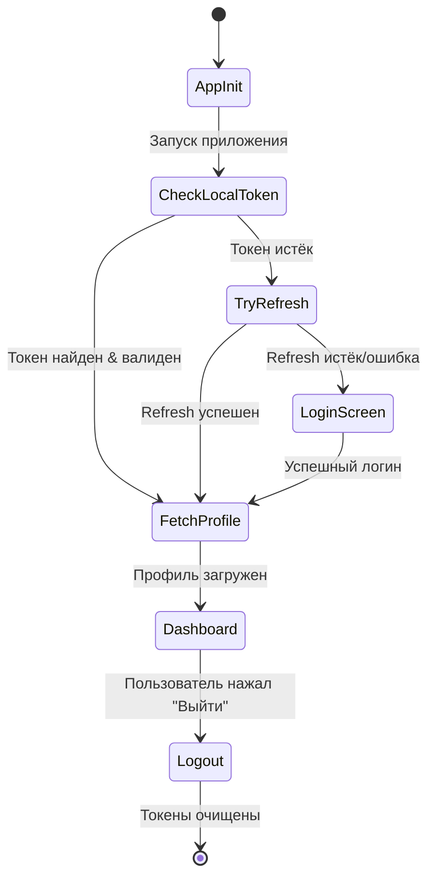
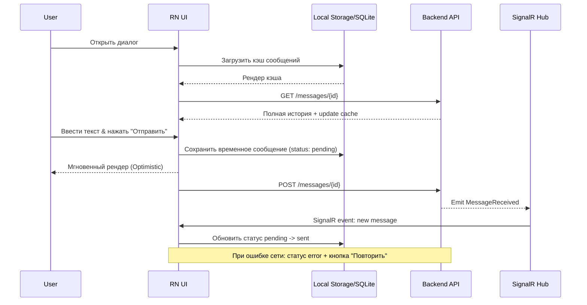
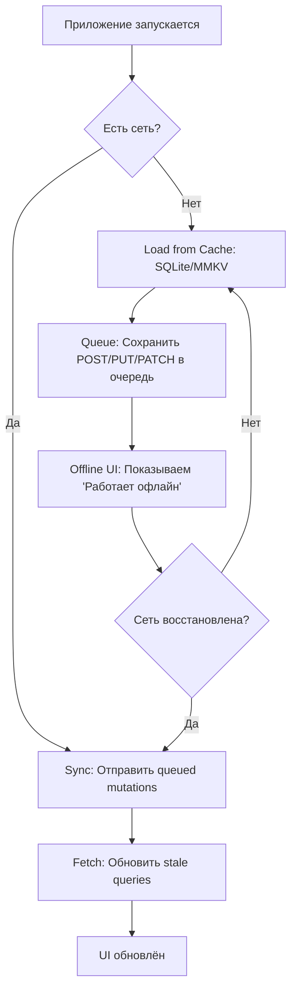

# 📱 ТЕХНИЧЕСКОЕ ЗАДАНИЕ (ТЗ) НА РАЗРАБОТКУ МОБИЛЬНОГО ПРИЛОЖЕНИЯ «Автосервис»
**Версия:** 1.0 | **Дата:** 14.05.2026 | **Статус:** Готово к передаче команде мобильной разработки

---

## 1. ВВЕДЕНИЕ И КОНТЕКСТ
| Параметр | Описание |
|---|---|
| **Проект** | Мобильное приложение для клиентов автосервиса (iOS / Android) |
| **Цель** | Предоставить клиентам удобный мобильный доступ к ЛК: запись, тендеры, чат, история, напоминания, push-уведомления |
| **Существующий бэкенд** | `.NET 8` REST API + `SignalR` + `PostgreSQL` + `JWT` |
| **Архитектура** | Приложение выступает **отдельным клиентом**. Интеграция с веб-версией происходит на уровне **единого API, единой дизайн-системы и общего флоу авторизации**. |
| **Платформа** | Кроссплатформа (рекомендуется  `React Native`), минимум `iOS 14+`, `Android 8.0+` |

---

## 2. ТЕХНИЧЕСКИЕ ТРЕБОВАНИЯ К СТЕКУ
| Компонент | Требование |
|---|---|
| **Язык/Фреймворк** |  TypeScript (React Native) |
| **Архитектура** | Clean Architecture / MVVM, разделение `data`, `domain`, `presentation` |
| **State Management** | `Riverpod`/`Bloc` (Flutter) или `Redux`/`Zustand`/`React Query` (RN) |
| **Сетевой слой** | REST клиент с автоматическим refresh токена, retry, таймаутами |
| **Real-time** | Клиент `SignalR` для чата и live-уведомлений |
| **Push-уведомления** | `Firebase Cloud Messaging` (Android) + `APNs` (iOS) |
| **Хранение** | `Secure Storage` (Keychain/Keystore) для токенов, `SQLite`/`Hive` для кеша |
| **Сборка** | CI/CD (Fastlane/GitHub Actions), автоматическая генерация APK/IPA |

---

## 3. ИНТЕГРАЦИЯ С СУЩЕСТВУЮЩИМ БЭКЕНДОМ
Приложение **не создаёт свой бэкенд**. Оно полностью потребляет существующий API `AvtoServ.Api`.

### 🔑 Ключевые интеграционные точки:
| Функция | Endpoint / Hub | Метод |
|---|---|---|
| **Авторизация** | `/api/auth/login`, `/api/auth/refresh`, `/api/auth/logout` | `POST` |
| **Профиль/Настройки** | `/api/v1/users/me`, `/api/v1/clients/{id}/settings` | `GET`/`PUT` |
| **Автомобили** | `/api/v1/cars` | `GET`/`POST`/`PUT`/`DELETE` |
| **Записи** | `/api/v1/appointments` | `GET`/`POST`/`PATCH` |
| **Тендеры/Калькулятор** | `/api/v1/tenders`, `/api/v1/tenders/{id}/convert` | `GET`/`POST` |
| **Чат** | `/hubs/chat` (SignalR) | Real-time |
| **Уведомления** | `/notificationHub` (SignalR) + FCM/APNs | Real-time / Push |
| **История/Документы** | `/api/v1/service-history`, `/api/v1/clients/{id}/documents` | `GET` |

### 🔄 Логика Auth & Token Refresh:
1. При логине сервер возвращает `accessToken` (15 мин) + `refreshToken` (7 дней).
2. Мобильное приложение сохраняет их в `SecureStorage`.
3. При `401` автоматически вызывает `/api/auth/refresh`. При успехе — обновляет токен и повторяет запрос. При истечении refresh-токена — редирект на экран входа.
4. Все запросы заголовок: `Authorization: Bearer <token>`.

---

## 4. ФУНКЦИОНАЛЬНЫЕ МОДУЛИ (ЭКРАНЫ И СЦЕНАРИИ)

| Экран | Функционал | API/Зависимости |
|---|---|---|
| **Onboarding & Auth** | Вход по email/паролю, регистрация, восстановление пароля, вход по FaceID/TouchID (после 1-го входа), демо-режим (опционально) | `/api/auth/*` |
| **Главная (Dashboard)** | Приветствие, быстрые действия, ближайшие записи, статус бонусов, виджет ТО, пул последних событий | `/api/v1/dashboard`, `/api/v1/appointments` |
| **Мои Авто** | Список авто, добавление/редактирование, сканер VIN через камеру, детали авто, история по авто | `/api/v1/cars` |
| **Записи** | Список/календарь, создание, перенос, отмена с причиной, статусы (цветные бейджи) | `/api/v1/appointments` |
| **Тендеры/Расчёт** | Создание заявки, просмотр предложений от сервиса, кнопки «Принять»/«Отклонить», конвертация в запись | `/api/v1/tenders/*` |
| **История & Документы** | Лента выполненных работ, скачивание актов/чеков (PDF), фильтрация по авто/дате | `/api/v1/service-history` |
| **Чат поддержки** | Real-time диалог, отправка фото/файлов, статусы «печатает…», «доставлено», «прочитано» | `SignalR /hubs/chat` |
| **Напоминания о ТО** | Предустановленные шаблоны, кастомные напоминания, расчёт по пробегу/дате, профиль вождения | `/api/v1/reminders`, `/api/v1/driving-profile` |
| **Бонусы** | Баланс, история операций, реферальный промокод, копирование/шаринг | `/api/v1/bonuses/*` |
| **Профиль & Настройки** | Личные данные, смена пароля, настройки уведомлений, тема, выход | `/api/v1/users/me`, `/api/v1/clients/{id}/settings` |

---

## 5. UI/UX ТРЕБОВАНИЯ
| Требование | Детали |
|---|---|
| **Дизайн-система** | Определить с реферсов Maket/generated_image_1 (7).png Maket/generated_image_1 (8).png Maket/generated_image_2.png 
| **Навигация** | Bottom Tab Bar (5 вкладок: Главная, Записи, Тендеры, Чат, Профиль) + Stack Navigation |
| **Адаптивность** | Поддержка светлой/тёмной темы, динамических шрифтов, планшетов, safe-area (notch) |
| **Состояния** | Обязательны: Loading (скелетоны), Empty (иллюстрация + CTA), Error (retry), Offline (кеш) |
| **Доступность** | VoiceOver / TalkBack, контраст ≥ 4.5:1, минимальный тач-таргет 44×44 pt |
| **Анимации** | Плавные переходы 200–300ms, haptic feedback на критичных действиях, отключаемые через настройки |

---

## 6. БЕЗОПАСНОСТЬ, ПРОИЗВОДИТЕЛЬНОСТЬ, ОФФЛАЙН
| Аспект | Требование |
|---|---|
| **Безопасность** | TLS 1.2+, `SecureStorage` для токенов, валидация всех входных данных, защита от MITM (cert pinning опционально) |
| **Производительность** | UI 60 FPS, lazy loading списков, кеш изображений, API-таймаут ≤ 10с, пагинация/инфинит-скролл |
| **Оффлайн-режим** | Кеш последних записей, авто, бонусов. Операции создания записи/сообщения ставятся в очередь и синхронизируются при возврате сети |
| **Логирование** | Локальные crash-логи (Firebase Crashlytics / Sentry), сетевые логи только в debug |

---

## 7. ПРОЦЕСС СДАЧИ И «СКЛЕЙКИ»
Поскольку веб и мобильная версии будут развиваться параллельно, интеграция обеспечивается через **контракты**, а не общий код.

### 📦 Что передаёт мобильная команда:
1. Исходный код (Git-репозиторий с CI/CD)
2. Сборки: `app-release.apk`, `app-release.ipa` (или TestFlight/Play Store ссылки)
3. Документация API-клиента (какие эндпоинты используются, как обрабатываются ошибки)
4. Гайд по деплою и настройке переменных окружения (`BASE_API_URL`, `SENTRY_DSN`, `FCM_KEY`)
5. Тестовые учётные данные и сценарии тестирования

### 🔗 Как будет происходить «склейка»:
| Уровень | Механизм |
|---|---|
| **API** | Единый `.NET 8` бэкенд. Мобильное приложение использует те же `api/v1/*` маршруты, что и веб. |
| **Авторизация** | Общий JWT-поток. Сессии синхронизированы: выход на одном устройстве → инвалидация на всех. |
| **Дизайн** | Общий Figma-файл с токенами. Мобильная команда адаптирует компоненты под iOS/Android гайдлайны. |
| **Real-time** | Общий SignalR. Сообщения и статусы синхронизируются между веб-ЛК и приложением. |
| **Push vs SignalR** | SignalR работает в фоне приложения. Push (FCM/APNs) используется для доставки, если приложение закрыто. |

---

## 8. КРИТЕРИИ ПРИЁМКИ (DoD)
- [ ] Все экраны из раздела 4 реализованы и соответствуют Figma
- [ ] Авторизация + refresh token flow работают без падений
- [ ] Чат работает в реальном времени (SignalR), сообщения не теряются при сворачивании
- [ ] Push-уведомления приходят в фоновом и закрытом состоянии
- [ ] Оффлайн-кеширование базовых данных работает
- [ ] Нет критических багов (Crash, ANR, блокировка UI)
- [ ] Проходит ревью App Store / Google Play (базовые требования: Privacy Policy, permissions, 64-bit)
- [ ] Переданы артефакты сборки, документация и тест-кейсы

---

## 9. КОНТАКТЫ И СОГЛАСОВАНИЕ
| Роль | Контакт |
|---|---|
| Product Owner / Координатор | [ФИО / Telegram] |
| Backend Lead | [ФИО / Telegram] |
| UI/UX Designer | [Ссылка на Figma] |
| Мобильная команда Lead | [ФИО / Telegram] |

---
 Ниже представлена полная техническая документация для команды мобильной разработки (React Native + Expo), включая точные JSON-схемы, диаграммы состояний, чек-лист CI/CD и таблицу маппинга API → Экраны.

---

## 1️⃣ Точные JSON-схемы запросов/ответов

Схемы составлены на основе текущих `.NET 8` DTO и адаптированы под типизированный `axios/fetch` клиент в React Native.

### 🔐 Авторизация
| Endpoint | Method | Request Body | Response (200) |
|---|---|---|---|
| `/api/auth/login` | `POST` | `{ "email": "string", "password": "string" }` | `{ "token": "string", "refreshToken": "string", "user": { "id": "uuid", "email": "string", "firstName": "string", "lastName": "string", "role": "string", "phone": "string", "avatarUrl": "string\|null" } }` |
| `/api/auth/refresh` | `POST` | `{ "refreshToken": "string" }` | `{ "token": "string", "refreshToken": "string", "user": {...} }` |
| `/api/auth/logout` | `POST` | `{}` | `{ "message": "string" }` |

### 👤 Профиль
| Endpoint | Method | Request/Response |
|---|---|---|
| `GET /api/v1/users/me` | `GET` | `{ "id": "uuid", "firstName": "string", "lastName": "string", "email": "string", "phone": "string", "role": "string", "createdAt": "ISO8601" }` |
| `PUT /api/v1/users/me` | `PUT` | `{ "firstName": "string?", "lastName": "string?", "phone": "string?", "avatarUrl": "string?" }` → `UserDto` |

### 🚗 Автомобили
| Endpoint | Method | Schema |
|---|---|---|
| `GET /api/v1/cars` | `GET` | `{ "cars": [{ "id": "uuid", "brand": "string", "model": "string", "year": "number", "licensePlate": "string", "currentMileage": "number", "color": "string", "isPrimary": "boolean" }] }` |
| `POST /api/v1/cars` | `POST` | `{ "brand": "string", "model": "string", "year": "number", "licensePlate": "string", "vin": "string", "currentMileage": "number", "color": "string", "isPrimary": "boolean" }` |

### 📅 Записи (Appointments)
| Endpoint | Method | Schema |
|---|---|---|
| `GET /api/v1/appointments` | `GET` | Query: `?status=string&carId=uuid` → `{ "appointments": [{ "id": "uuid", "carId": "uuid", "serviceId": "uuid", "scheduledDate": "YYYY-MM-DD", "scheduledTime": "HH:mm:ss", "status": "Draft\|New\|Confirmed\|InProgress\|Completed\|Cancelled", "totalPrice": "number", "description": "string" }] }` |
| `POST /api/v1/appointments` | `POST` | `{ "carId": "uuid", "serviceId": "uuid", "masterId": "uuid?", "scheduledDate": "YYYY-MM-DD", "scheduledTime": "HH:mm:ss", "description": "string?" }` |

### 💬 Чат
| Endpoint | Method | Schema |
|---|---|---|
| `GET /api/v1/chat/conversations` | `GET` | `{ "conversations": [{ "id": "uuid", "subject": "string", "lastMessage": "string", "unreadCount": "number", "updatedAt": "ISO8601" }] }` |
| `GET /api/v1/chat/conversations/{id}/messages` | `GET` | `{ "messages": [{ "id": "uuid", "conversationId": "uuid", "senderId": "uuid", "senderType": "user\|manager", "text": "string", "sentAt": "ISO8601", "status": "Sent\|Delivered\|Read" }] }` |
| `POST /api/v1/chat/conversations/{id}/messages` | `POST` | `{ "text": "string", "attachmentIds": ["uuid"]? }` |

### 📋 Тендеры
| Endpoint | Method | Schema |
|---|---|---|
| `GET /api/v1/tenders/my` | `GET` | `{ "tenders": [{ "id": "uuid", "carId": "uuid", "status": "string", "description": "string", "minBudget": "number", "maxBudget": "number", "expiresAt": "ISO8601", "createdAt": "ISO8601" }] }` |
| `POST /api/v1/tenders` | `POST` | `{ "carId": "uuid", "description": "string", "priority": "Low\|Medium\|High\|Urgent", "minBudget": "number?", "maxBudget": "number?", "allowAlternatives": "boolean", "deadline": "ISO8601" }` |

---

## 2️⃣ Диаграммы состояний (Mermaid)

### 🔑 Auth Flow


### 💬 Chat State (Optimistic UI + SignalR)



### 📶 Offline Sync Flow


---

## 3️⃣ Чек-лист настройки CI/CD для мобильных билдов (Expo + EAS)

### 🛠 Подготовка
- [ ] Установить `eas-cli`: `npm i -g eas-cli`
- [ ] Авторизоваться в Expo: `eas login`
- [ ] Создать проект в Expo Dashboard: `eas init`
- [ ] Настроить `eas.json` с профилями `development`, `preview`, `production`

### 🔐 Безопасность & Секреты
- [ ] Добавить `.env` в `.gitignore`
- [ ] Настроить `EXPO_PUBLIC_API_URL` в EAS: `eas secret:create --scope project --name EXPO_PUBLIC_API_URL --value "https://api.avtoserv.com"`
- [ ] Сгенерировать Android Keystore: `eas credentials` → Android → Keystore → Generate
- [ ] Настроить Apple App-Specific Password & Team ID в EAS

### 🚀 GitHub Actions Pipeline
```yaml
name: EAS Build & Submit
on:
  push:
    branches: [main, develop]
jobs:
  build:
    runs-on: ubuntu-latest
    steps:
      - uses: actions/checkout@v4
      - uses: actions/setup-node@v4
        with: { node-version: 20 }
      - run: npm ci
      - uses: expo/expo-github-action@v8
        with:
          eas-version: latest
          token: ${{ secrets.EXPO_TOKEN }}
      - run: eas build --platform android --profile production --non-interactive
      - run: eas build --platform ios --profile production --non-interactive
```

### 📦 Store Submission & OTA
- [ ] Настроить `eas submit` для автоматической загрузки в App Store Connect / Google Play Console
- [ ] Включить EAS Update для OTA-обновлений: `eas update:configure`
- [ ] Добавить `expo-updates` и настроить `expo.config.js` (`updates.url`, `fallbackToCacheTimeout`)
- [ ] Настроить `expo doctor` и линтинг перед билдом: `npx expo-doctor` + `eslint .`

---

## 4️⃣ Таблица маппинга API Endpoint → Экраны приложения

| Экран (React Native) | API Endpoint | Method | Назначение | React Query Key | Offline/Caching Strategy |
|---|---|---|---|---|---|
| `LoginScreen` | `/api/auth/login` | `POST` | Аутентификация | `['auth', 'login']` | Нет кэша, `retry: 0` |
| `HomeScreen` | `/api/v1/appointments?status=pending` | `GET` | Предстоящие записи | `['appointments', 'upcoming']` | `staleTime: 5*60*1000`, кэш при старте |
| `HomeScreen` | `/api/v1/bonuses/balance` | `GET` | Баланс бонусов | `['bonuses', 'balance']` | `staleTime: 10*60*1000` |
| `CarsScreen` | `/api/v1/cars` | `GET` | Список авто клиента | `['cars', 'my']` | `staleTime: 15*60*1000`, offline fallback |
| `CarDetailScreen` | `/api/v1/cars/{id}` | `GET` | Детали авто | `['cars', id]` | `staleTime: 5*60*1000` |
| `NewAppointmentScreen` | `/api/v1/cars`, `/api/v1/services` | `GET` | Справочники для формы | `['refs', 'cars']`, `['refs', 'services']` | `staleTime: 30*60*1000` |
| `NewAppointmentScreen` | `/api/v1/appointments` | `POST` | Создание записи | `['appointments', 'my']` | `mutation`, invalidateQueries `['appointments']` |
| `AppointmentsScreen` | `/api/v1/appointments` | `GET` | История записей | `['appointments', 'history']` | `staleTime: 3*60*1000`, пагинация |
| `ChatListScreen` | `/api/v1/chat/conversations` | `GET` | Список диалогов | `['chat', 'conversations']` | `staleTime: 2*60*1000` |
| `ChatScreen` | `/api/v1/chat/conversations/{id}/messages` | `GET` | История сообщений | `['chat', 'messages', id]` | `staleTime: 60*1000`, optimistic updates |
| `ChatScreen` | `SignalR Hub: /hubs/chat` | `WS` | Real-time сообщения | N/A (Event-driven) | Queue + retry on reconnect |
| `TendersScreen` | `/api/v1/tenders/my` | `GET` | Мои заявки | `['tenders', 'my']` | `staleTime: 5*60*1000` |
| `TenderDetailScreen` | `/api/v1/tenders/{id}` | `GET` | Детали тендера | `['tenders', id]` | `staleTime: 3*60*1000` |
| `TenderDetailScreen` | `/api/v1/tenders/{id}/convert` | `POST` | Конвертация в запись | `['tenders', id]` | `mutation`, redirect to Appointments |
| `ProfileScreen` | `/api/v1/users/me` | `GET` | Данные профиля | `['user', 'me']` | `staleTime: 30*60*1000` |
| `RemindersScreen` | `/api/v1/reminders` | `GET` | Список напоминаний | `['reminders', 'my']` | `staleTime: 10*60*1000` |
| `NotificationsScreen` | `/api/v1/notifications` | `GET` | Уведомления | `['notifications']` | `staleTime: 2*60*1000`, markRead mutation |

---

## 📝 Рекомендации по реализации
1. **State Management:** Используйте `@tanstack/react-query` для серверного состояния, `zustand` для UI (тема, навигация), `react-native-mmkv` или `expo-sqlite` для офлайн-кэша.
2. **Offline Sync:** Реализуйте `axios` interceptor, который ловит `Network Error`, сохраняет запрос в очередь (MMKV/SQLite) и отправляет при восстановлении сети.
3. **SignalR в RN:** Используйте `@microsoft/signalr` + `expo-background-fetch` для поддержания соединения или переподключения при фокусе приложения.
4. **Typing:** Сгенерируйте типы из Swagger/OpenAPI через `openapi-typescript` или `swagger-typescript-api` для 100% соответствия фронт↔бэк.
5. **Error Handling:** Стандартизируйте ответы ошибок: `{ "error": { "code": "string", "message": "string" } }` и мапьте их в user-friendly toast/alert.

 🌐 ГЛОБАЛЬНЫЕ ЭЛЕМЕНТЫ ИНТЕРФЕЙСА
Верхняя шапка (Header)
Логотип сервиса (клик ведёт на Главную)
Колокольчик уведомлений с цифровым бейджем (количество непрочитанных)
Аватар пользователя с выпадающим меню при наведении: Профиль, Настройки, Разделитель, Кнопка "Выйти"
На мобильных экранах: кнопка "Гамбургер" (открывает боковое меню), аватар свёрнут
Боковое меню (Sidebar)
Список разделов с иконками и названиями
Активный раздел подсвечивается фоном
Кнопка "Клиентский режим / Админ-панель" (отображается только если у пользователя есть права)
На мобильных: выезжает слева, затемняется фон, кнопка закрытия
Нижняя панель (только для мобильных)
4-5 кнопок быстрого перехода: Главная, Записи, Чат, Профиль
Активная кнопка выделена цветом
Системные всплывающие сообщения (Toast)
Успешное действие: зелёная плашка, текст, автоисчезновение через 3 сек, кнопка "Закрыть"
Ошибка: красная плашка, текст ошибки, кнопка "Закрыть"
Информация: синяя плашка (например, "Загрузка...", "Сообщение отправлено")
🔐 СТРАНИЦА АВТОРИЗАЦИИ
Форма входа
Поле "Email" (с проверкой формата)
Поле "Пароль" (с возможностью показать/скрыть символы)
Чекбокс "Запомнить меня"
Кнопка "Войти" (активируется при заполнении, меняет текст на "Вход..." при отправке)
Ссылка "Забыли пароль?" (открывает форму восстановления)
Модальное окно "Восстановление пароля"
Поле "Email"
Кнопка "Отправить ссылку"
Кнопка "Назад ко входу"
После отправки: сообщение "Письмо отправлено", окно закрывается
🏠 ГЛАВНАЯ СТРАНИЦА (ДАШБОРД)
Приветственный текст с именем пользователя
4 информационные карточки: Мои авто, Предстоящие записи, Баланс бонусов, Статус аккаунта
Блок "Быстрые действия": 4 кнопки-плитки (Записаться, Добавить авто, Калькулятор, Перейти в профиль)
Лента последних событий: список последних записей или уведомлений
При отсутствии данных: иконка, текст "Здесь пока пусто", кнопка "Создать первую запись"
🚗 РАЗДЕЛ "МОИ АВТОМОБИЛИ"
Список автомобилей
Карточки с фото, маркой, моделью, годом, гос. номером, пробегом, цветом
На каждой карточке: кнопка "Записаться", кнопка "Изменить", кнопка "Удалить", метка "Основной"
Модальное окно "Добавить / Редактировать автомобиль"
Выпадающий список "Марка" (с поиском)
Поле "Модель"
Поле "Год выпуска" (число, валидация на реалистичность)
Поле "Гос. номер" (маска ввода)
Поле "VIN" (17 символов, автопроверка на допустимые символы)
Поле "Пробег" (в километрах)
Поле "Цвет"
Поля "Номер СТС", "Номер ПТС"
Чекбокс "Сделать основным автомобилем"
Кнопки: "Сохранить", "Отмена"
При редактировании: все поля предзаполнены
Модальное окно "Подтверждение удаления"
Текст: "Вы уверены? Это действие нельзя отменить."
Предупреждение: "Удаление невозможно, если есть активные записи" (появляется динамически)
Кнопки: "Удалить" (красная), "Отмена"
📅 РАЗДЕЛ "ЗАПИСИ НА ОБСЛУЖИВАНИЕ"
Список записей
Табы-фильтры: Все, Предстоящие, Завершённые, Отменённые
Карточки/строки: Дата, Время, Автомобиль, Услуга, Стоимость, Статус (цветной бейдж)
На каждой записи: кнопка "Подробнее", кнопка "Перенести", кнопка "Отменить"
Модальное окно "Создать запись"
Выпадающий список "Выберите автомобиль"
Поле поиска "Выберите услугу" (с выпадающим списком найденных)
Календарь "Дата" (блокировка прошедших дат)
Выпадающий список "Время" (свободные слоты)
Выпадающий список "Мастер" (необязательно)
Текстовое поле "Комментарий или описание проблемы"
Кнопки: "Записаться", "Отмена"
Модальное окно "Перенести запись"
Поля: "Новая дата", "Новое время"
Текстовое поле "Причина переноса" (необязательно)
Кнопки: "Подтвердить", "Отмена"
Модальное окно "Отмена записи"
Выпадающий список "Причина отмены" (Не подходит время, Передумал, Выбрал другой сервис, Другое)
Поле "Дополнительный комментарий" (появляется при выборе "Другое")
Кнопки: "Отменить запись", "Оставить"
🧮 РАЗДЕЛ "КАЛЬКУЛЯТОР / ЗАЯВКА"
Форма заявки
Выпадающий список "Автомобиль" (с автоподстановкой текущего пробега)
Поле "Пробег" (можно изменить вручную)
Поле поиска "Добавить услугу" (при выборе добавляется в список ниже)
Блок "Добавить вручную": кнопка "+ Добавить свою услугу", открывается строка с полями "Название", "Примерная цена"
Блок "Нужные запчасти": кнопка "+ Добавить запчасть", поля "Название", "Количество", "Примерная цена"
Чекбокс "Менеджер сам подберёт запчасти и работы"
Текстовое поле "Комментарий или пожелания"
Блок предпросмотра: список выбранного, итоговая примерная сумма
Кнопка "Отправить заявку" (активируется только если выбрано авто и добавлена хотя бы одна услуга/запчасть или стоит галочка менеджера)
📋 РАЗДЕЛ "МОИ ЗАЯВКИ (ТЕНДЕРЫ)"
Список заявок
Табы: Активные, Архив
Карточки: Номер заявки, Автомобиль, Краткое описание, Статус (бейдж), Срок, Бюджет
Кнопка "Создать новую заявку"
Модальное окно "Детали заявки"
Полное описание, выбранный автомобиль, указанный бюджет
Блок "Предложения от сервиса": таблица с запчастями, работами, ценами, итого
В зависимости от статуса:
Если "На согласовании": кнопки "Принять предложение", "Отклонить"
Если "Одобрено": кнопка "Создать запись на ремонт"
При нажатии "Создать запись": открывается форма записи, где уже автоматически выбраны авто, услуги и запчасти из заявки. Остаётся указать дату, время и мастера.
Кнопка "Закрыть"
🔔 РАЗДЕЛ "НАПОМИНАНИЯ О ТО"
Список напоминаний
Информационный блок вверху: текущий пробег авто, интенсивность эксплуатации (например, "Средне ~1500 км/мес"), кнопка "Настроить"
Табы: Активные, На паузе, Выполненные
Карточки напоминаний: Название работы, оставшиеся дни/км, целевая дата/пробег, кнопки "Пауза", "Выполнено", "Удалить"
Модальное окно "Создать / Изменить напоминание"
Выпадающий список "Автомобиль"
Блок "Тип напоминания": переключатель "Предустановленный шаблон" / "Своё напоминание"
При выборе шаблона: выпадающий список (Масло в АКПП, Замена ГРМ, Тормозные колодки, Воздушный фильтр и т.д.)
При выборе своего: поля "Название", "Тип работ"
Блок "Условие срабатывания": переключатели "По дате", "По пробегу", "Комбинированный"
Поля: "Через N месяцев", "Через N км", "Или конкретная дата"
Блок "Расчёт сроков": автоматически показывает рассчитанную дату и пробег следующего ТО
Блок "Уведомления": поля "Заблаговременно за N дней", "Заблаговременно за N км", "Повторять N раз каждые N дней"
Кнопки: "Сохранить", "Отмена"
Модальное окно "Профиль вождения"
Заголовок: "Укажите средний пробег для точного расчёта"
Переключатель "Упрощённый выбор": кнопки-карточки "Редко (~500 км/мес)", "Средне (~1500 км/мес)", "Часто (~3000+ км/мес)" с пояснениями
Переключатель "Точный ввод": поле "Средний пробег в месяц" + возможность ввести пробег за произвольный период и количество дней для авто расчёта
Кнопки: "Сохранить", "Отмена"
📜 РАЗДЕЛ "ИСТОРИЯ ОБСЛУЖИВАНИЯ"
Список истории
Фильтры сверху: Выбор автомобиля, Выбор типа услуги, Выбор периода (календарь)
Таблица/список записей: Дата, Авто, Услуга, Стоимость, Мастер, Статус оплаты
Кнопка "Подробнее" у каждой записи (раскрывает детали: список запчастей, акты, чеки)
Кнопки в шапке раздела: "Экспорт в PDF", "Экспорт в CSV"
🎁 РАЗДЕЛ "БОНУСЫ"
Верхний блок
Крупная цифра текущего баланса
Прогресс-бар до следующего уровня лояльности
Мелкая статистика: Всего начислено, Всего потрачено, Текущий кэшбэк %
История операций
Список: Дата, Тип (+ начисление / - списание), Сумма, Описание (например, "За запись №123")
Поле "Ввести промокод" + кнопка "Активировать"
Блок "Пригласи друга": ваш промокод, кнопки "Скопировать", "Поделиться ссылкой"
Кнопка "Как повысить уровень?" (открывает всплывающее окно с правилами начисления и таблицей уровней)
👤 РАЗДЕЛ "ПРОФИЛЬ"
Основная информация
Аватар (круглый, при наведении появляется иконка камеры)
Поля: Имя, Фамилия, Email, Телефон, Дата рождения, Город
Кнопка "Редактировать" (превращает текст в поля ввода, меняет себя на "Сохранить" и "Отмена")
При сохранении: проверка формата, кнопка меняет состояние на "Сохранение...", затем возвращается в режим редактирования
Блок "Безопасность"
Поле "Текущий пароль"
Поле "Новый пароль"
Поле "Подтвердите новый пароль"
Индикатор сложности пароля (цветная полоска)
Кнопка "Обновить пароль"
Опасная зона
Кнопка "Выйти из аккаунта"
Кнопка "Удалить аккаунт" (красная, выделена рамкой)
При нажатии "Удалить": открывается модальное окно с полем "Введите пароль для подтверждения", чекбокс "Я понимаю, что данные будут удалены навсегда", кнопки "Удалить навсегда", "Отмена"
⚙️ РАЗДЕЛ "НАСТРОЙКИ"
Вкладка "Уведомления"
Переключатели (вкл/выкл): Push-уведомления, Email-рассылка, SMS-напоминания, Уведомления о смене статуса записи, Маркетинговые акции
Вкладка "Внешний вид"
Три кнопки-переключателя: Светлая тема, Тёмная тема, Как в системе
Вкладка "Язык"
Переключатель: Русский, English
Вкладка "Приватность"
Переключатели: "Скрыть профиль из поиска", "Маскировать VIN в личном кабинете", "Разрешить сбор аналитики использования"
Кнопка сохранения
Фиксированная кнопка "Сохранить изменения" (сохраняет все изменения во всех вкладках)
При успешном сохранении: зелёное уведомление, кнопка временно становится неактивной
💬 РАЗДЕЛ "ЧАТ"
Левая панель (Список диалогов)
Поле поиска по контактам
Список диалогов: Аватар, Имя, Последнее сообщение, Время, Бейдж непрочитанных
Клик по диалогу открывает область переписки
Правая панель (Область переписки)
Верхняя панель: Имя контакта, Статус "Онлайн" или "Был(а) недавно", кнопка "Информация", кнопка "Назад" (на мобильных)
Область сообщений:
Свои сообщения: справа, синий/фирменный фон, время отправки, галочки статуса (отправлено/доставлено/прочитано)
Чужие сообщения: слева, серый/нейтральный фон, время получения
Индикатор "Печатает..." (появляется, когда менеджер отвечает)
Нижняя панель ввода:
Кнопка "Скрепка" (прикрепить файл/фото)
Поле ввода текста (автоувеличение высоты при наборе)
Кнопка "Отправить" (становится активной при вводе текста)
Кнопка "Голосовое сообщение" (опционально, появляется при долгом нажатии)
🔔 РАЗДЕЛ "УВЕДОМЛЕНИЯ"
Список
Переключатели сверху: Все, Непрочитанные
Элемент списка: Иконка типа (запись, бонус, система, чат), Заголовок, Текст, Время получения
При клике на уведомление: открывается связанная страница (например, детали записи)
Кнопки на каждом элементе: "Отметить прочитанным" (крестик или галочка), "Удалить"
Кнопка в шапке: "Прочитать все"
Этот документ описывает каждый видимый элемент, поле ввода, кнопку, модальное окно и сценарий взаимодействия в Личном Кабинете Клиента без привязки к реализации. Если нужно детализировать конкретную модалку, валидацию полей или тексты ошибок для какого-то раздела, укажите раздел, и я распишу его до уровня каждого символа в интерфейсе.


 
 

# 📎 ПРИЛОЖЕНИЕ Б: Модуль "Умные Напоминания" и Новые Фичи
*(Основано на SPEC-MODULE-NOTIFICATIONS.md)*

## 1. Новые Экраны в Навигации
В раздел **"Напоминания"** (или вкладка в Профиле/Авто) добавить:
1.  **Список напоминаний:** Фильтры (Все, Активные, Просроченные).
2.  **Экран "Профиль вождения":** Настройка интенсивности (Пресеты: Редко/Средне/Часто или ручной ввод пробега). *Нужно для расчета сроков.*
3.  **Экран "Конструктор напоминания":** Выбор из каталога шаблонов или создание своего.

## 2. Бизнес-логика: Конструктор Напоминаний
Мобильное приложение должно реализовывать логику создания правила (`ReminderRule`):

### 2.1 Типы триггеров (Срабатывание)
Пользователь выбирает один из трех вариантов:
*   **📅 По дате:** "Напомнить 20.10.2026".
*   **📍 По пробегу:** "Напомнить через 20 000 км" (от текущего пробега авто).
*   **🔄 Комбинированный:** "Напомнить 20.10.2026 ИЛИ через 20 000 км (что наступит раньше)".

### 2.2 Расчет сроков (Калькулятор)
При создании напоминания приложение должно показать предварительный расчет:
*   *Ввод:* Интервал 60 000 км.
*   *Данные:* Текущий пробег авто (берется из профиля авто) + Профиль вождения (например, 1500 км/мес).
*   *Результат:* "Следующее ТО примерно через **40 месяцев** (Дата: 2029 г.)".

### 2.3 Каталог шаблонов (Шаблоны из БД)
При выборе "Из шаблона" подгружать список с бэкенда:
*   `GET /api/v1/notifications/templates`
*   Отображать иконку, название и рекомендуемый интервал (км/мес).
*   *Пример:* "Масло в АКПП" (60к км / 48 мес).

## 3. Бизнес-логика: Углубленная конвертация Тендер -> Запись
В текущей веб-версии это делается через модальное окно. В мобильном приложении реализовать **Пошаговый визард (Wizard)**:

### Шаг 1: Проверка готовности
*   Если у тендера есть запчасти и работы (Parts/Works) → кнопка "Создать запись" активна.
*   Если пусто → кнопка неактивна (или ведет на создание услуг).

### Шаг 2: Экран "Детали записи" (Пре-филл)
Автоматически подтянуть данные из тендера:
*   **Авто:** Выбрано из тендера.
*   **Услуги:** Список работ из тендера (Works) переносится в описание/услуги записи.
*   **Запчасти:** Список запчастей (Parts) переносится в комментарий или список необходимых запчастей.
*   *Действие пользователя:* Выбрать **Дату** и **Время** (через DatePicker/TimePicker).

### Шаг 3: Подтверждение
*   Кнопка "Подтвердить запись".
*   Вызов `POST /api/v1/tenders/{id}/convert`.

## 4. Технические требования к API (Специфика)
Мобильным разработчикам нужно знать нюансы этих эндпоинтов:

### 4.1 Профиль вождения (Driving Profile)
*   **Эндпоинт:** `PUT /api/v1/driving-profile`
*   **Payload:**
    ```json
    {
      "carId": "guid-авто",
      "profileType": "Preset",  // или "Manual"
      "preset": "Medium",       // Low / Medium / High
      "avgKmPerMonth": null
    }
    ```

### 4.2 Создание напоминания (Reminders)
*   **Эндпоинт:** `POST /api/v1/reminders`
*   **Payload (Пример комбинированного):**
    ```json
    {
      "carId": "guid-авто",
      "title": "Замена ГРМ",
      "triggerType": "Combined",
      "intervalKm": 90000,
      "intervalMonths": 48,
      "advanceNoticeDays": 14,
      "advanceNoticeKm": 2000
    }
    ```

 
 

 .